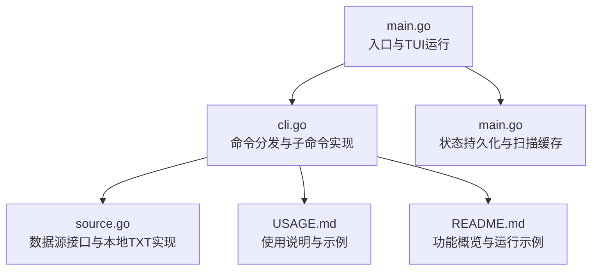
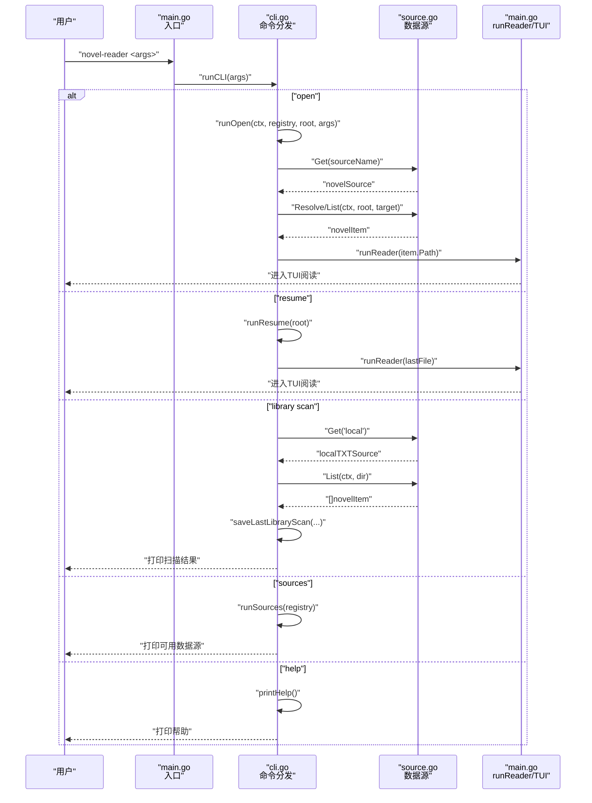
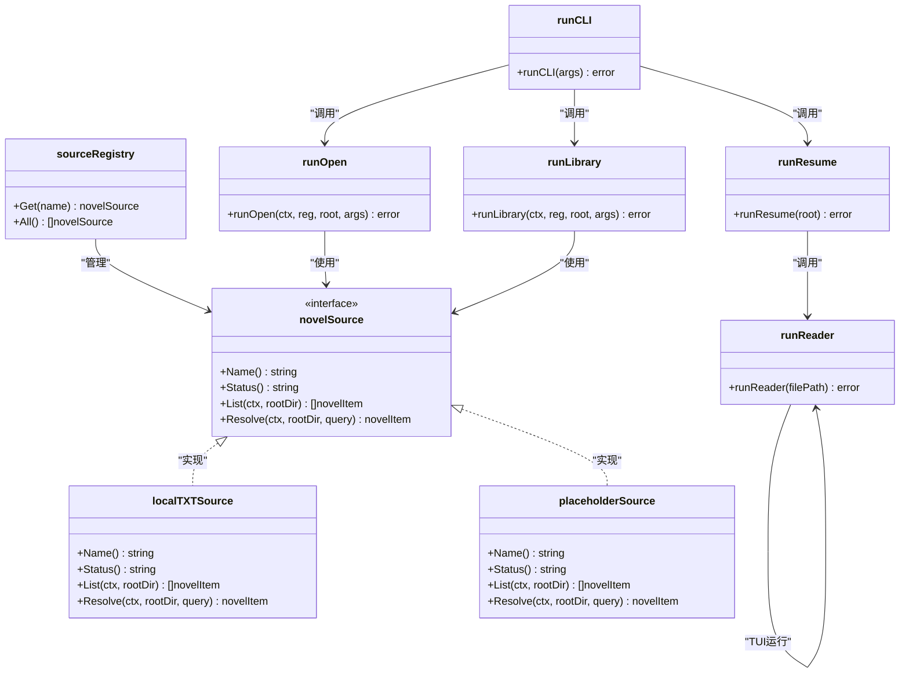

# CLI命令参考

<cite>
**本文引用的文件**
- [main.go](file://main.go)
- [cli.go](file://cli.go)
- [source.go](file://source.go)
- [README.md](file://README.md)
- [USAGE.md](file://USAGE.md)
</cite>

## 目录
1. [简介](#简介)
2. [项目结构](#项目结构)
3. [核心组件](#核心组件)
4. [架构总览](#架构总览)
5. [详细组件分析](#详细组件分析)
6. [依赖关系分析](#依赖关系分析)
7. [性能考量](#性能考量)
8. [故障排查指南](#故障排查指南)
9. [结论](#结论)
10. [附录](#附录)

## 简介
本文件为 novel-reader 的 CLI 命令系统提供权威参考，覆盖所有可用子命令：open、resume、library scan、sources 的功能、参数、选项、执行流程、输入验证规则、错误处理、最佳实践与常见用法模式，并给出完整的命令行示例与预期输出说明。novel-reader 是一个基于 Go 与 Bubble Tea 的命令行小说阅读器，支持本地 TXT 文件阅读、Boss Key 切换、自动恢复与状态持久化。

## 项目结构
novel-reader 的 CLI 命令由入口函数解析参数并分派到各子命令；数据源抽象通过注册表管理，当前默认实现为本地 TXT 源，其他数据源为预留扩展点。

图表来源
- [main.go:1023-1028](file://main.go#L1023-L1028)
- [cli.go:13-44](file://cli.go#L13-L44)
- [source.go:128-138](file://source.go#L128-L138)

章节来源
- [main.go:1023-1028](file://main.go#L1023-L1028)
- [cli.go:13-44](file://cli.go#L13-L44)
- [source.go:128-138](file://source.go#L128-L138)

## 核心组件
- 命令分发器：根据传入参数选择具体子命令，支持 help、sources、resume、open、library 等。
- 数据源注册表：维护可用数据源，当前包含 local（可用）、gutenberg/custom（预留）。
- 本地 TXT 源：扫描项目目录下的 .txt 文件，支持按路径、ID（相对路径）、标题（文件名去扩展名）解析。
- 状态与扫描缓存：持久化最近打开文件、阅读位置、窗口大小等；扫描结果缓存于用户主目录或项目目录。
- TUI 阅读器：加载文件内容，初始化模型，进入 Bubble Tea 程序循环。

章节来源
- [cli.go:13-44](file://cli.go#L13-L44)
- [source.go:128-138](file://source.go#L128-L138)
- [main.go:629-711](file://main.go#L629-L711)
- [main.go:742-845](file://main.go#L742-L845)

## 架构总览
CLI 命令执行链路如下：入口函数接收参数，调用命令分发器；分发器根据子命令调用相应处理函数；处理函数可能访问数据源注册表、扫描缓存或直接运行阅读器；阅读器负责加载文件并进入 TUI。

图表来源
- [main.go:1023-1028](file://main.go#L1023-L1028)
- [cli.go:13-44](file://cli.go#L13-L44)
- [source.go:140-146](file://source.go#L140-L146)
- [main.go:1011-1021](file://main.go#L1011-L1021)

## 详细组件分析

### open 子命令
- 功能：打开指定的 TXT 文件或通过扫描缓存按序号打开。
- 语法：open <txt-path-or-id-or-title> [--source local]
- 参数与选项
  - 目标：支持绝对/相对路径、项目内相对路径、扫描缓存中的序号（从 1 开始）、或文件标题（文件名去扩展名）。
  - 选项：--source local（默认，当前唯一可用）。
- 输入验证与错误处理
  - 缺少目标：返回错误提示。
  - 指定非激活源：返回“仅支持 local”的错误。
  - 目标为数字序号时：
    - 需要存在最近一次扫描缓存；否则提示先执行 library scan。
    - 序号必须在缓存项范围内；否则提示超出范围。
  - 目标为路径/标题时：
    - local 源限定在项目根目录内，若路径越界返回“文件在项目根外”的错误。
    - 无法解析到有效 TXT 文件时返回“未找到”的错误。
- 执行流程
  1) 解析参数，确定目标与源名称。
  2) 获取源实例并校验状态。
  3) 若目标为数字：加载最近扫描缓存，取对应项路径。
  4) 若目标为路径/标题：调用源 Resolve，解析为 novelItem。
  5) 调用 runReader 打开文件进入 TUI。
- 示例
  - 打开绝对/相对路径：novel-reader open examples/demo.txt
  - 使用扫描缓存序号：novel-reader open 1
  - 指定源（当前仅 local 有效）：novel-reader open examples/demo.txt --source local
- 预期输出
  - 成功：进入 TUI 阅读界面。
  - 错误：打印错误信息并退出（例如缺少目标、源无效、缓存缺失、路径越界、未找到等）。

章节来源
- [cli.go:68-122](file://cli.go#L68-L122)
- [source.go:74-111](file://source.go#L74-L111)
- [main.go:1011-1021](file://main.go#L1011-L1021)

### resume 子命令
- 功能：恢复上次阅读的文件。
- 语法：resume
- 输入验证与错误处理
  - 若无快照或快照中无最近文件：返回“无恢复快照”的错误，提示使用 open 打开文件。
  - 若快照记录的文件不存在：返回“恢复文件缺失”的错误。
  - 快照路径优先使用用户主目录下的状态文件，若不可写则回退到项目目录的快照文件。
- 执行流程
  1) 尝试读取用户主目录快照。
  2) 若失败则尝试项目目录快照。
  3) 若均失败：返回错误。
  4) 校验并定位目标文件路径，调用 runReader 进入 TUI。
- 示例
  - novel-reader resume
- 预期输出
  - 成功：进入 TUI 阅读界面。
  - 错误：打印错误信息并退出。

章节来源
- [cli.go:54-66](file://cli.go#L54-L66)
- [main.go:847-856](file://main.go#L847-L856)
- [main.go:713-725](file://main.go#L713-L725)
- [main.go:847-856](file://main.go#L847-L856)

### library scan 子命令
- 功能：扫描项目目录（或指定目录）下的 .txt 文件，生成扫描结果并缓存。
- 语法：library scan [dir]
- 参数与选项
  - dir：可选，扫描目录，默认为项目根目录；若为相对路径则相对于项目根。
- 输入验证与错误处理
  - 无文件：打印“未发现 txt 文件”，返回成功。
  - 扫描失败：返回错误。
- 执行流程
  1) 解析目录（默认项目根）。
  2) 获取 local 源实例。
  3) 调用 List 扫描并排序输出。
  4) 保存扫描缓存（优先用户主目录，失败则回退项目目录）。
  5) 打印提示“使用 open <序号> 直接打开”。
- 示例
  - 扫描项目根：novel-reader library scan
  - 指定目录：novel-reader library scan examples
- 预期输出
  - 成功：打印“发现 N 个 txt 文件”，随后逐行打印序号与 ID；最后打印提示。
  - 错误：打印错误信息并退出。

章节来源
- [cli.go:124-156](file://cli.go#L124-L156)
- [source.go:34-72](file://source.go#L34-L72)
- [main.go:742-764](file://main.go#L742-L764)
- [main.go:766-788](file://main.go#L766-L788)
- [main.go:816-826](file://main.go#L816-L826)

### sources 子命令
- 功能：列出可用数据源及其状态。
- 语法：sources
- 输出格式：每行打印“- 名称（状态）”，当前包含 local、gutenberg、custom。
- 状态说明
  - local：active（可用）
  - gutenberg/custom：reserved（预留，尚未实现）
- 示例
  - novel-reader sources
- 预期输出
  - 打印可用数据源列表。

章节来源
- [cli.go:46-52](file://cli.go#L46-L52)
- [source.go:128-138](file://source.go#L128-L138)

### help 子命令
- 功能：打印帮助信息与常用命令示例。
- 语法：help 或 -h 或 --help
- 输出内容
  - 使用方法与子命令列表。
  - 常见示例：open、library scan、resume、sources。
- 示例
  - novel-reader help
- 预期输出
  - 打印帮助文本。

章节来源
- [cli.go:25-28](file://cli.go#L25-L28)
- [cli.go:158-172](file://cli.go#L158-L172)

### 兼容模式
- 当第一个参数既不是子命令也不是选项时，CLI 会将其视为 open 的目标，保持向后兼容。
- 示例
  - novel-reader examples/demo.txt
- 预期输出
  - 等价于 novel-reader open examples/demo.txt。

章节来源
- [cli.go:37-43](file://cli.go#L37-L43)

## 依赖关系分析
- 命令分发依赖数据源注册表，注册表提供源实例并校验状态。
- open 命令依赖源的 Resolve/List 方法解析目标与扫描缓存。
- library scan 命令依赖源的 List 方法与扫描缓存持久化。
- resume 命令依赖状态快照读取与文件存在性校验。
- runReader 依赖文件加载与 Bubble Tea 程序运行。

图表来源
- [source.go:128-138](file://source.go#L128-L138)
- [source.go:22-27](file://source.go#L22-L27)
- [source.go:29-32](file://source.go#L29-L32)
- [source.go:113-126](file://source.go#L113-L126)
- [cli.go:13-44](file://cli.go#L13-L44)
- [cli.go:68-122](file://cli.go#L68-L122)
- [cli.go:54-66](file://cli.go#L54-L66)
- [cli.go:124-156](file://cli.go#L124-L156)
- [main.go:1011-1021](file://main.go#L1011-L1021)

## 性能考量
- 扫描与解析
  - library scan 使用递归遍历目录，时间复杂度近似 O(N)，其中 N 为文件数量；.git 目录会被跳过。
  - open 对于路径/标题解析会先尝试精确匹配，再回退到全量扫描，建议优先使用序号打开以减少 IO。
- 缓存策略
  - 扫描结果缓存与状态快照采用原子写入（临时文件 + 重命名），降低中断损坏风险。
- TUI 渲染
  - 文本按视觉宽度折行，避免终端渲染异常；滚动与窗口变化时触发状态保存，建议在频繁操作时注意磁盘写入频率。

[本节为通用性能讨论，不直接分析具体文件]

## 故障排查指南
- 无恢复快照
  - 现象：执行 resume 提示“无恢复快照”。
  - 处理：先使用 open 打开任意 txt 文件建立快照。
  - 参考
    - [cli.go:54-66](file://cli.go#L54-L66)
    - [USAGE.md:193-201](file://USAGE.md#L193-L201)
- 恢复文件缺失
  - 现象：resume 提示“恢复文件缺失”。
  - 处理：确认快照记录的文件是否存在，必要时重新扫描并打开。
  - 参考
    - [cli.go:54-66](file://cli.go#L54-L66)
- 指定源无效
  - 现象：open 提示“仅支持 local”。
  - 处理：使用 --source local 或省略该选项。
  - 参考
    - [cli.go:94-100](file://cli.go#L94-L100)
    - [USAGE.md:208-212](file://USAGE.md#L208-L212)
- 扫描缓存缺失
  - 现象：open <序号> 提示“无扫描缓存”。
  - 处理：先执行 library scan，再使用序号打开。
  - 参考
    - [cli.go:106-115](file://cli.go#L106-L115)
    - [USAGE.md:214-222](file://USAGE.md#L214-L222)
- 路径越界（项目根外）
  - 现象：open 提示“文件在项目根外”。
  - 处理：将小说文件放入项目目录或其子目录后再执行 open。
  - 参考
    - [source.go:86-97](file://source.go#L86-L97)
    - [USAGE.md:202-206](file://USAGE.md#L202-L206)
- 未找到 TXT 文件
  - 现象：open 解析失败提示“未找到”。
  - 处理：确认文件扩展名为 .txt，且位于项目根内；或使用正确 ID/标题。
  - 参考
    - [source.go:109-111](file://source.go#L109-L111)
- 终端显示异常
  - 现象：中文乱码或无边框/颜色。
  - 处理：确认文件编码为 UTF-8，更换支持 Unicode 的终端与字体；确保终端支持 256/真彩。
  - 参考
    - [USAGE.md:224-234](file://USAGE.md#L224-L234)

章节来源
- [cli.go:54-66](file://cli.go#L54-L66)
- [cli.go:94-100](file://cli.go#L94-L100)
- [cli.go:106-115](file://cli.go#L106-L115)
- [source.go:86-97](file://source.go#L86-L97)
- [source.go:109-111](file://source.go#L109-L111)
- [USAGE.md:193-234](file://USAGE.md#L193-L234)

## 结论
novel-reader 的 CLI 命令体系简洁清晰：open/resume/library scan/sources 四个核心命令覆盖了从打开文件、恢复阅读、扫描书库到查看数据源的完整工作流。当前版本以本地 TXT 源为主，数据源接口预留了扩展空间。通过扫描缓存与状态快照，用户可以高效地在项目内管理与阅读 TXT 小说。

[本节为总结性内容，不直接分析具体文件]

## 附录

### 命令与参数一览
- open
  - 语法：open <txt-path-or-id-or-title> [--source local]
  - 默认：--source local
  - 说明：支持绝对/相对路径、项目内相对路径、扫描缓存序号、文件标题（不含扩展名）。
- resume
  - 语法：resume
  - 说明：恢复上次打开的文件。
- library scan
  - 语法：library scan [dir]
  - 默认：项目根目录
  - 说明：扫描 .txt 文件并缓存结果，便于后续按序号打开。
- sources
  - 语法：sources
  - 说明：列出可用数据源及其状态。
- help
  - 语法：help 或 -h 或 --help
  - 说明：打印帮助与示例。

章节来源
- [cli.go:158-172](file://cli.go#L158-L172)
- [USAGE.md:57-104](file://USAGE.md#L57-L104)

### 常见用法模式与最佳实践
- 快速打开
  - 直接打开：novel-reader open examples/demo.txt
  - 兼容模式：novel-reader examples/demo.txt
- 书库管理
  - 先扫描：novel-reader library scan
  - 再按序号打开：novel-reader open 1
- 恢复阅读
  - novel-reader resume
- 数据源查看
  - novel-reader sources

章节来源
- [README.md:24-33](file://README.md#L24-L33)
- [USAGE.md:116-127](file://USAGE.md#L116-L127)