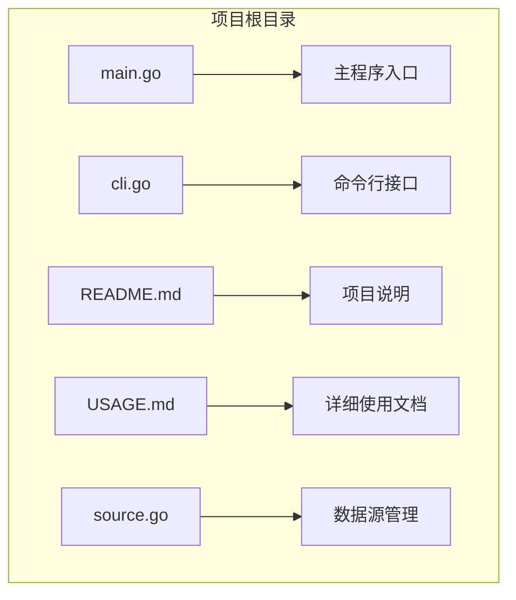
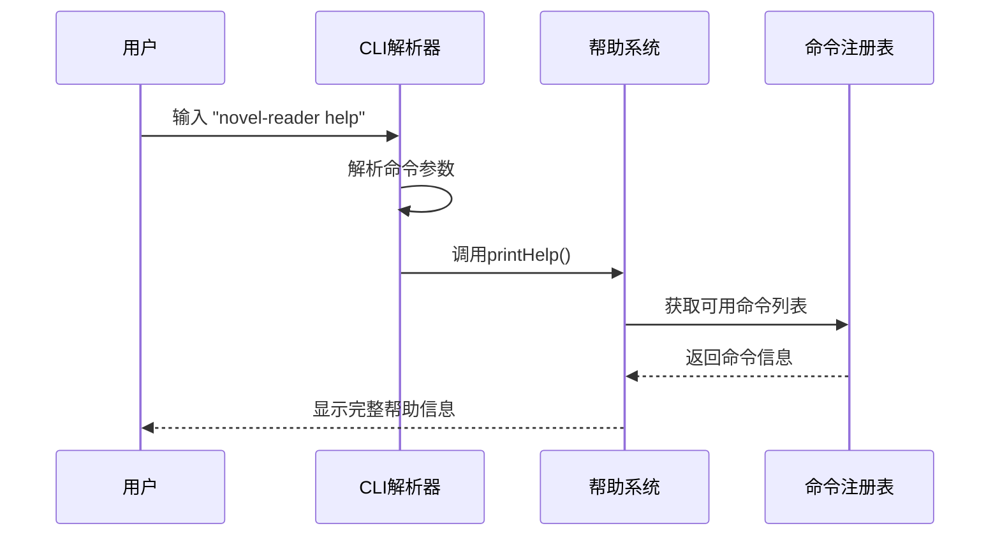
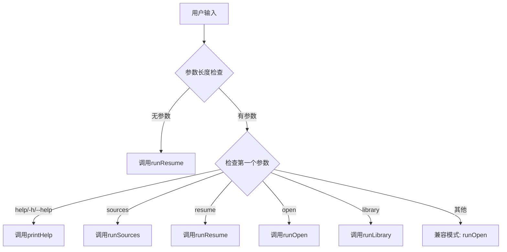
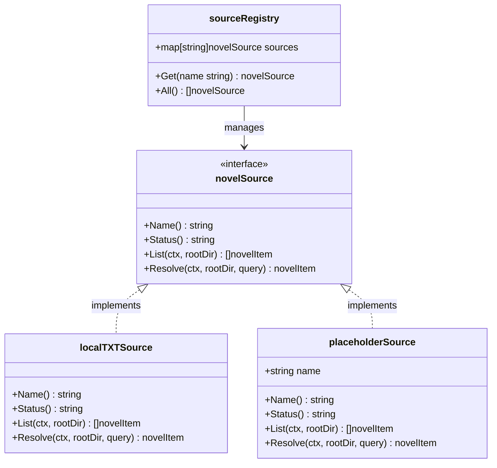
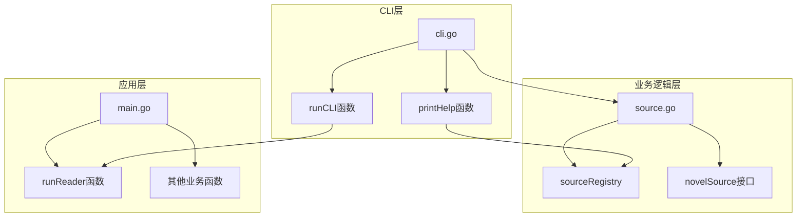

# help命令

<cite>
**本文档引用的文件**
- [main.go](file://main.go)
- [cli.go](file://cli.go)
- [README.md](file://README.md)
- [USAGE.md](file://USAGE.md)
- [source.go](file://source.go)
</cite>

## 目录
1. [简介](#简介)
2. [项目结构](#项目结构)
3. [核心组件](#核心组件)
4. [架构概览](#架构概览)
5. [详细组件分析](#详细组件分析)
6. [依赖关系分析](#依赖关系分析)
7. [性能考虑](#性能考虑)
8. [故障排除指南](#故障排除指南)
9. [结论](#结论)

## 简介

novel-reader的help命令是一个重要的用户交互功能，用于显示完整的命令帮助信息。该命令提供了用户友好的界面，帮助用户了解novel-reader CLI工具的所有可用命令、语法格式和使用示例。

## 项目结构

novel-reader项目采用简洁的Go语言项目结构，主要文件包括：

**图表来源**
- [main.go:1-1056](file://main.go#L1-L1056)
- [cli.go:1-173](file://cli.go#L1-L173)
- [README.md:1-46](file://README.md#L1-L46)
- [USAGE.md:1-248](file://USAGE.md#L1-L248)
- [source.go:1-169](file://source.go#L1-L169)

**章节来源**
- [main.go:1-1056](file://main.go#L1-L1056)
- [cli.go:1-173](file://cli.go#L1-L173)
- [README.md:1-46](file://README.md#L1-L46)
- [USAGE.md:1-248](file://USAGE.md#L1-L248)
- [source.go:1-169](file://source.go#L1-L169)

## 核心组件

novel-reader的help命令主要由以下核心组件构成：

### 命令解析器
- **功能**: 解析用户输入的命令参数
- **实现**: 在cli.go文件中定义的runCLI函数
- **支持的语法**: help、-h、--help三种形式

### 帮助信息生成器
- **功能**: 生成并格式化帮助信息
- **实现**: printHelp函数
- **输出内容**: 包含命令概览、完整语法说明和使用示例

### 命令注册系统
- **功能**: 管理所有可用的命令
- **实现**: source.go中的sourceRegistry结构体
- **当前支持**: open、resume、library、sources、help

**章节来源**
- [cli.go:13-44](file://cli.go#L13-L44)
- [cli.go:158-172](file://cli.go#L158-L172)
- [source.go:128-138](file://source.go#L128-L138)

## 架构概览

novel-reader的help命令采用模块化设计，遵循清晰的职责分离原则：

**图表来源**
- [cli.go:25-28](file://cli.go#L25-L28)
- [cli.go:158-172](file://cli.go#L158-L172)
- [source.go:128-138](file://source.go#L128-L138)

## 详细组件分析

### 命令解析组件

#### runCLI函数分析
runCLI函数是整个CLI系统的入口点，负责解析用户输入并分发到相应的处理函数：

**图表来源**
- [cli.go:13-44](file://cli.go#L13-L44)

#### 参数匹配机制
help命令支持三种等价的语法形式：
- `novel-reader help`
- `novel-reader -h`
- `novel-reader --help`

这种设计遵循了Unix/Linux命令行工具的标准惯例，提高了用户体验的一致性。

**章节来源**
- [cli.go:25-28](file://cli.go#L25-L28)

### 帮助信息生成组件

#### printHelp函数分析
printHelp函数负责生成完整的帮助信息，包含以下三个主要部分：

##### 命令概览
- **标题**: "Novel Reader CLI"
- **用途说明**: 简要介绍novel-reader的功能定位
- **设计理念**: "低存在感"阅读体验

##### 完整语法说明
printHelp函数输出所有可用命令的完整语法格式：
- `novel-reader help` - 显示帮助信息
- `novel-reader sources` - 显示数据源列表
- `novel-reader resume` - 恢复上次阅读
- `novel-reader open <txt-path-or-id> [--source local]` - 打开指定文件
- `novel-reader library scan [dir]` - 扫描本地书库

##### 使用示例
printHelp函数提供三个实用的使用示例：
- `novel-reader open examples/demo.txt` - 直接打开示例文件
- `novel-reader library scan` - 扫描本地书库
- `novel-reader resume` - 恢复上次阅读

**章节来源**
- [cli.go:158-172](file://cli.go#L158-L172)

### 命令注册与管理

#### sourceRegistry结构体
sourceRegistry负责管理所有可用的数据源和命令：

**图表来源**
- [source.go:128-138](file://source.go#L128-L138)
- [source.go:22-27](file://source.go#L22-L27)
- [source.go:29-111](file://source.go#L29-L111)
- [source.go:113-126](file://source.go#L113-L126)

#### 数据源状态管理
- **local**: 当前唯一可用的数据源，状态为"active"
- **gutenberg**: 预留数据源，状态为"reserved"
- **custom**: 预留数据源，状态为"reserved"

**章节来源**
- [source.go:132-138](file://source.go#L132-L138)
- [source.go:31-32](file://source.go#L31-L32)

## 依赖关系分析

novel-reader的help命令与其他组件之间的依赖关系如下：

**图表来源**
- [cli.go:1-173](file://cli.go#L1-L173)
- [source.go:1-169](file://source.go#L1-L169)
- [main.go:1011-1021](file://main.go#L1011-L1021)

### 关键依赖点

1. **命令解析依赖**: runCLI函数依赖于sourceRegistry来验证命令的有效性
2. **帮助信息依赖**: printHelp函数依赖于sourceRegistry来获取当前可用的命令列表
3. **业务逻辑依赖**: runCLI函数最终会调用具体的业务处理函数（如runReader）

**章节来源**
- [cli.go:13-44](file://cli.go#L13-L44)
- [cli.go:158-172](file://cli.go#L158-L172)
- [source.go:128-138](file://source.go#L128-L138)

## 性能考虑

help命令的设计充分考虑了性能和响应速度：

### 内存使用
- 帮助信息在内存中静态生成，不涉及外部资源访问
- 命令解析采用简单的字符串匹配，时间复杂度为O(1)
- 无额外的网络请求或文件系统操作

### 响应时间
- 帮助信息输出通常在毫秒级完成
- 无需等待外部服务响应
- 适合在各种终端环境中快速使用

### 可扩展性
- 帮助信息格式支持动态扩展新的命令
- 通过sourceRegistry可以轻松添加新的命令
- 保持了良好的向后兼容性

## 故障排除指南

### 常见问题及解决方案

#### 问题1: help命令无法识别
**症状**: 输入help命令后出现未知命令错误
**原因**: 参数格式不正确或拼写错误
**解决方案**: 
- 确保使用正确的语法：`novel-reader help`、`novel-reader -h`或`novel-reader --help`
- 检查novel-reader是否正确安装和编译

#### 问题2: 帮助信息显示不完整
**症状**: 帮助信息缺少某些命令或参数说明
**原因**: 新增的命令尚未更新到帮助系统
**解决方案**:
- 检查sourceRegistry中是否包含了新命令
- 确认printHelp函数是否更新了相应的语法说明

#### 问题3: 终端显示异常
**症状**: 帮助信息在某些终端中显示格式混乱
**原因**: 终端不支持ANSI转义序列或字符编码问题
**解决方案**:
- 更换支持ANSI的终端（如iTerm2、Warp、Terminal等）
- 确认终端设置支持UTF-8编码
- 检查终端的颜色配置

**章节来源**
- [cli.go:25-28](file://cli.go#L25-L28)
- [README.md:11-15](file://README.md#L11-L15)

## 结论

novel-reader的help命令是一个设计精良的用户交互组件，具有以下特点：

### 设计优势
- **简洁明了**: 采用标准的Unix命令行约定，易于理解和使用
- **功能完整**: 提供了完整的命令列表、语法说明和使用示例
- **扩展性强**: 通过sourceRegistry实现了良好的模块化设计
- **性能优异**: 无外部依赖，响应速度快

### 用户价值
- **降低学习成本**: 新用户可以通过help命令快速了解所有可用功能
- **提高使用效率**: 提供了准确的语法格式和实际使用示例
- **增强用户体验**: 符合用户期望的命令行工具行为模式

### 技术特色
- **模块化架构**: 清晰的职责分离和依赖关系
- **向后兼容**: 保持了良好的兼容性和可维护性
- **可扩展设计**: 为未来的功能扩展预留了充足的空间

help命令作为novel-reader CLI工具的重要组成部分，不仅满足了基本的帮助需求，还体现了项目整体设计的优秀理念和技术水准。