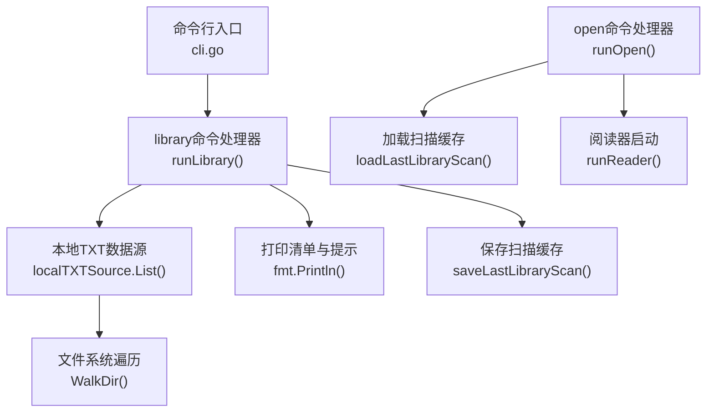
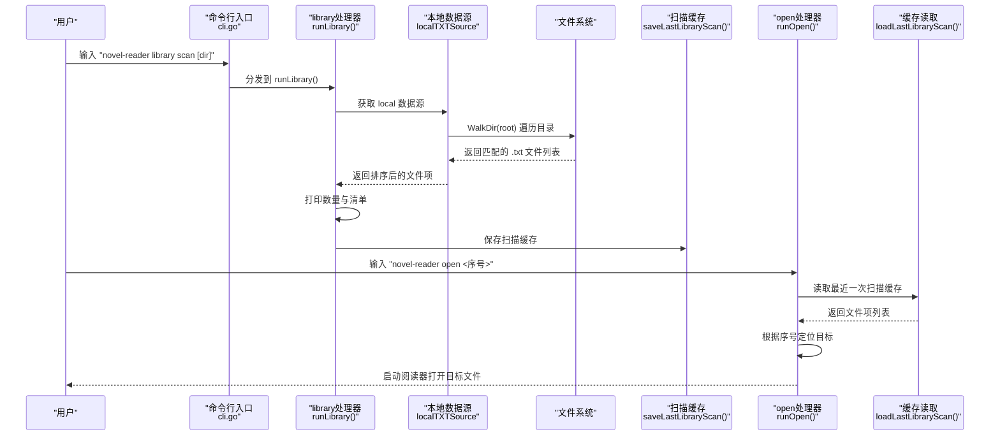
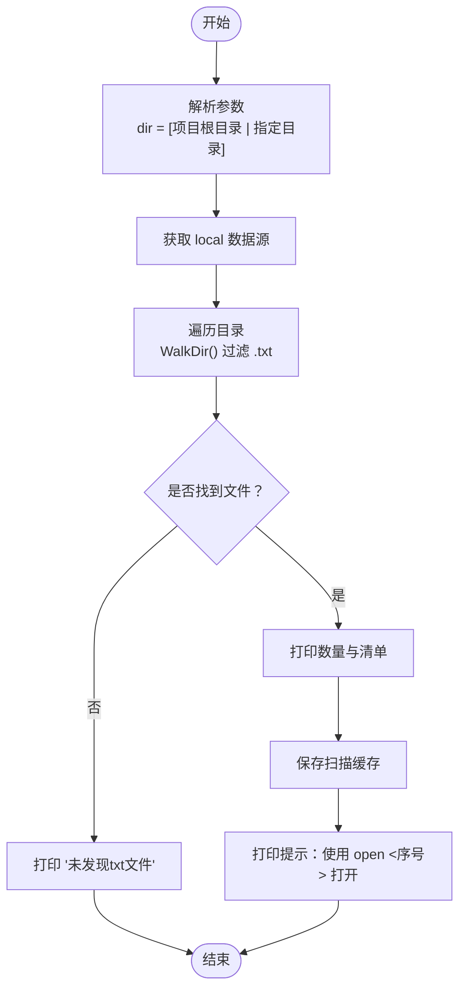
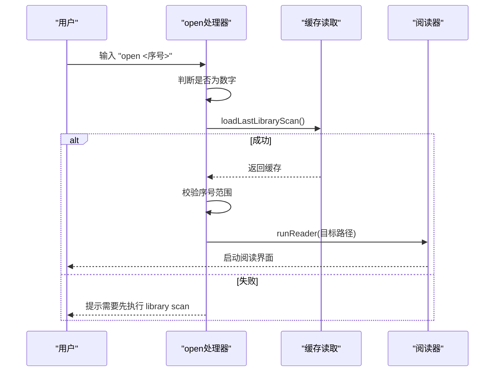
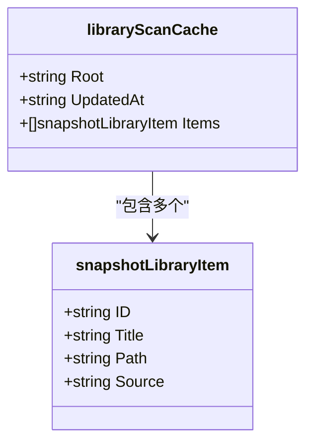
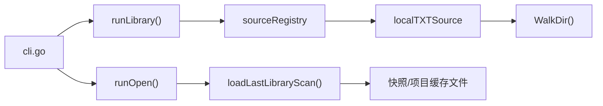

# library命令

<cite>
**本文引用的文件**
- [README.md](file://README.md)
- [USAGE.md](file://USAGE.md)
- [cli.go](file://cli.go)
- [main.go](file://main.go)
- [source.go](file://source.go)
- [examples/demo.txt](file://examples/demo.txt)
</cite>

## 目录
1. [简介](#简介)
2. [项目结构](#项目结构)
3. [核心组件](#核心组件)
4. [架构总览](#架构总览)
5. [详细组件分析](#详细组件分析)
6. [依赖关系分析](#依赖关系分析)
7. [性能考量](#性能考量)
8. [故障排查指南](#故障排查指南)
9. [结论](#结论)
10. [附录](#附录)

## 简介
本篇文档面向novel-reader的library命令，系统性说明其功能与使用方法。library命令用于扫描并管理本地小说库，核心子命令为library scan，支持在当前目录或指定目录下递归扫描所有TXT文件，输出文件清单并保存扫描缓存，便于后续通过open命令配合序号快速打开目标文件。

## 项目结构
围绕library命令的相关文件与职责如下：
- cli.go：命令入口与路由，解析命令行参数，分发至各子命令处理器。
- source.go：数据源抽象与实现，定义novelSource接口与localTXTSource的具体实现，负责扫描与解析TXT文件。
- main.go：状态持久化、扫描缓存的读写、以及open命令对扫描缓存的使用。
- USAGE.md：官方使用文档，包含library scan的使用示例与缓存说明。
- README.md：简要介绍library scan的作用与与open命令的配合使用。
- examples/demo.txt：示例TXT文件，用于演示open命令与library scan的配合。

**图表来源**
- [cli.go:124-156](file://cli.go#L124-L156)
- [source.go:34-72](file://source.go#L34-L72)
- [main.go:742-764](file://main.go#L742-L764)
- [main.go:790-845](file://main.go#L790-L845)

**章节来源**
- [cli.go:124-156](file://cli.go#L124-L156)
- [source.go:34-72](file://source.go#L34-L72)
- [main.go:742-845](file://main.go#L742-L845)

## 核心组件
- library scan子命令
  - 语法：novel-reader library scan [dir]
  - 行为：扫描指定目录下的所有TXT文件，输出发现数量与文件清单；同时保存扫描缓存，供open命令使用。
  - 参数说明：
    - dir：可选参数，默认为项目根目录。若为相对路径，会被转换为相对于项目根目录的绝对路径。
- open命令与扫描缓存
  - open命令支持通过序号打开最近一次扫描到的文件，内部会读取扫描缓存并根据序号定位目标文件。
- 扫描缓存
  - 结构：包含扫描根目录、更新时间、以及文件项列表（含ID、标题、路径、来源）。
  - 存储位置：优先写入用户配置目录的快照文件；若不可写则回退到项目目录的缓存文件。
  - 作用：为open命令按序号打开提供依据，避免重复扫描。

**章节来源**
- [cli.go:124-156](file://cli.go#L124-L156)
- [main.go:43-54](file://main.go#L43-L54)
- [main.go:742-764](file://main.go#L742-L764)
- [main.go:790-845](file://main.go#L790-L845)

## 架构总览
library命令的调用链路如下：
- 命令解析：cli.go根据第一个参数选择分支，命中library时进入runLibrary。
- 扫描执行：runLibrary解析可选目录参数，获取local数据源实例，调用List进行递归扫描。
- 输出与缓存：打印发现数量与清单，随后调用saveLastLibraryScan保存缓存。
- 打开流程：open命令解析参数，若为纯数字序号，读取扫描缓存并启动阅读器。

**图表来源**
- [cli.go:124-156](file://cli.go#L124-L156)
- [source.go:34-72](file://source.go#L34-L72)
- [main.go:742-764](file://main.go#L742-L764)
- [main.go:790-845](file://main.go#L790-L845)

## 详细组件分析

### library scan子命令
- 参数与行为
  - 无参：扫描项目根目录。
  - 有参：扫描指定目录，相对路径会转换为相对于项目根目录的绝对路径。
  - 输出：打印发现的TXT文件数量与按序号排列的文件清单；最后输出提示信息，指导用户使用open命令按序号打开。
- 扫描逻辑
  - 使用local数据源的List方法，递归遍历目录，过滤扩展名为“.txt”的文件，生成文件项列表并按ID排序。
- 缓存保存
  - 将扫描结果封装为libraryScanCache并保存到快照文件；若主路径不可写则回退到项目目录的缓存文件。

**图表来源**
- [cli.go:124-156](file://cli.go#L124-L156)
- [source.go:34-72](file://source.go#L34-L72)
- [main.go:742-764](file://main.go#L742-L764)

**章节来源**
- [cli.go:124-156](file://cli.go#L124-L156)
- [source.go:34-72](file://source.go#L34-L72)
- [main.go:742-764](file://main.go#L742-L764)

### open命令与扫描缓存交互
- 序号打开
  - open命令检测参数是否为纯数字，若是则尝试读取最近一次扫描缓存，按序号定位目标文件并启动阅读器。
- 错误处理
  - 若无扫描缓存，返回提示需要先执行library scan。
  - 若序号越界，返回错误信息。
- 缓存读取顺序
  - 优先从快照文件读取；若失败则回退到项目目录的缓存文件。

**图表来源**
- [cli.go:102-122](file://cli.go#L102-L122)
- [main.go:790-845](file://main.go#L790-L845)

**章节来源**
- [cli.go:102-122](file://cli.go#L102-L122)
- [main.go:790-845](file://main.go#L790-L845)

### 扫描缓存的数据结构与持久化
- 数据结构
  - libraryScanCache：包含root、updated_at、items三项。
  - snapshotLibraryItem：包含id、title、path、source四项。
- 写入策略
  - 优先写入用户配置目录的快照文件；若失败则回退到项目目录的缓存文件。
- 读取策略
  - 优先从快照文件读取；若失败则回退到项目目录的缓存文件。

**图表来源**
- [main.go:43-54](file://main.go#L43-L54)

**章节来源**
- [main.go:43-54](file://main.go#L43-L54)
- [main.go:742-764](file://main.go#L742-L764)
- [main.go:790-845](file://main.go#L790-L845)

## 依赖关系分析
- 命令层依赖
  - runLibrary依赖sourceRegistry获取local数据源，依赖localTXTSource.List执行扫描。
  - runOpen依赖loadLastLibraryScan读取缓存，依赖runReader启动阅读器。
- 数据源依赖
  - localTXTSource.List依赖文件系统遍历函数，过滤“.txt”文件并生成novelItem列表。
- 缓存依赖
  - saveLastLibraryScan与loadLastLibraryScan分别依赖快照文件与项目缓存文件的读写。

**图表来源**
- [cli.go:124-156](file://cli.go#L124-L156)
- [source.go:34-72](file://source.go#L34-L72)
- [main.go:790-845](file://main.go#L790-L845)

**章节来源**
- [cli.go:124-156](file://cli.go#L124-L156)
- [source.go:34-72](file://source.go#L34-L72)
- [main.go:790-845](file://main.go#L790-L845)

## 性能考量
- 扫描复杂度
  - 递归遍历目录的时间复杂度与文件数量成正比；过滤“.txt”文件为常量时间判断。
- 排序成本
  - 对文件项按ID排序，排序复杂度为O(n log n)，其中n为发现的文件数量。
- 缓存命中
  - 通过缓存避免重复扫描，显著降低后续open命令的等待时间。
- I/O策略
  - 快照文件采用原子写入（临时文件+重命名）以减少中断导致的损坏风险。

[本节为通用性能讨论，不直接分析具体文件，故无章节来源]

## 故障排查指南
- 无扫描缓存
  - 现象：open命令提示需要先执行library scan。
  - 处理：先执行library scan，再使用open <序号>打开。
- 序号越界
  - 现象：open命令提示索引超出范围。
  - 处理：重新执行library scan获取最新清单，确认序号范围。
- 未发现TXT文件
  - 现象：library scan输出“未发现txt文件”。
  - 处理：确认扫描目录下存在“.txt”文件，或调整扫描目录。
- 缓存路径不可写
  - 现象：保存扫描缓存失败。
  - 处理：检查用户配置目录权限；程序会自动回退到项目目录缓存文件。

**章节来源**
- [cli.go:102-122](file://cli.go#L102-L122)
- [main.go:742-764](file://main.go#L742-L764)
- [main.go:790-845](file://main.go#L790-L845)

## 结论
library scan子命令提供了便捷的本地TXT小说库扫描与缓存能力，配合open命令的序号打开，形成高效的本地阅读工作流。通过合理的缓存策略与错误处理，用户可以在不同目录间灵活扫描，并稳定地复用扫描结果进行快速访问。

[本节为总结性内容，不直接分析具体文件，故无章节来源]

## 附录

### 使用示例
- 从当前目录扫描
  - 执行：novel-reader library scan
  - 输出：打印发现数量与清单；提示使用open <序号>打开。
- 指定目录扫描
  - 执行：novel-reader library scan examples
  - 输出：打印该目录下发现的数量与清单。
- 结合open命令打开
  - 步骤：
    1) 先执行library scan（或library scan <dir>）。
    2) 根据输出的序号执行open <序号>。
  - 示例：
    - novel-reader library scan
    - novel-reader open 3

**章节来源**
- [USAGE.md:77-93](file://USAGE.md#L77-L93)
- [USAGE.md:116-127](file://USAGE.md#L116-L127)
- [README.md:35](file://README.md#L35)

### 参数与输出说明
- library scan [dir]
  - dir：可选参数，扫描目录；默认为项目根目录。
  - 输出：发现数量、文件清单（序号. 文件ID）、提示信息。
- open <序号>
  - 通过最近一次扫描缓存按序号打开对应TXT文件。
  - 若无缓存，提示先执行library scan。

**章节来源**
- [cli.go:124-156](file://cli.go#L124-L156)
- [cli.go:102-122](file://cli.go#L102-L122)

### 缓存存储机制
- 保存位置
  - 优先：用户配置目录快照文件。
  - 回退：项目目录缓存文件。
- 读取顺序
  - 优先：快照文件。
  - 回退：项目目录缓存文件。
- 数据结构
  - 包含扫描根目录、更新时间、文件项列表（含ID、标题、路径、来源）。

**章节来源**
- [main.go:742-764](file://main.go#L742-L764)
- [main.go:790-845](file://main.go#L790-L845)