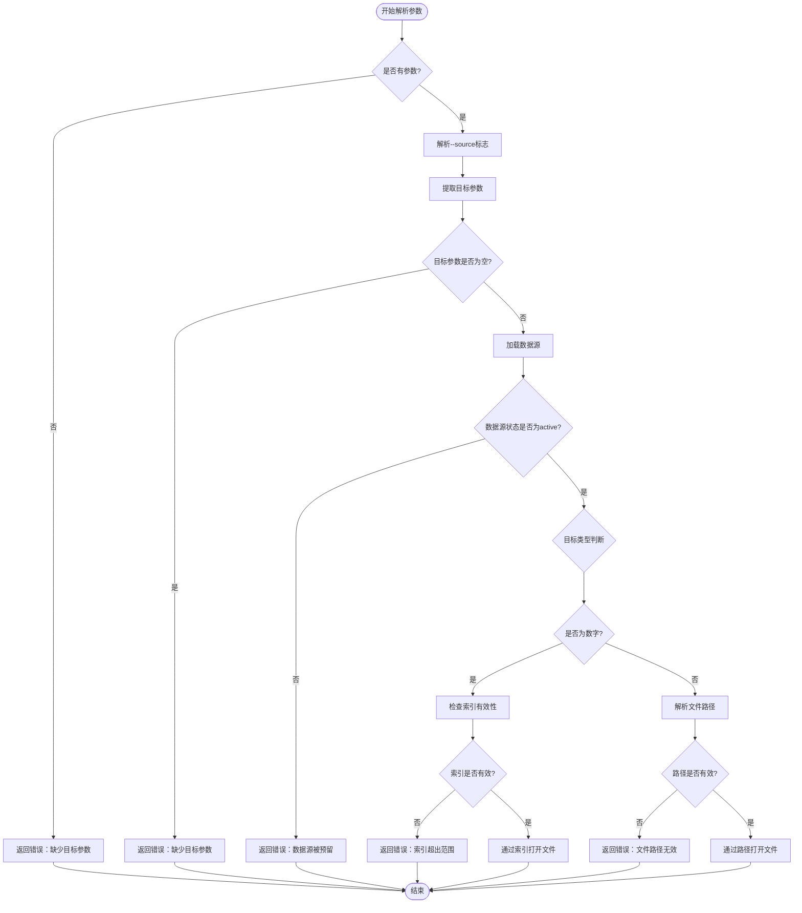
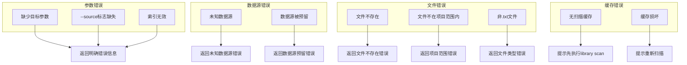
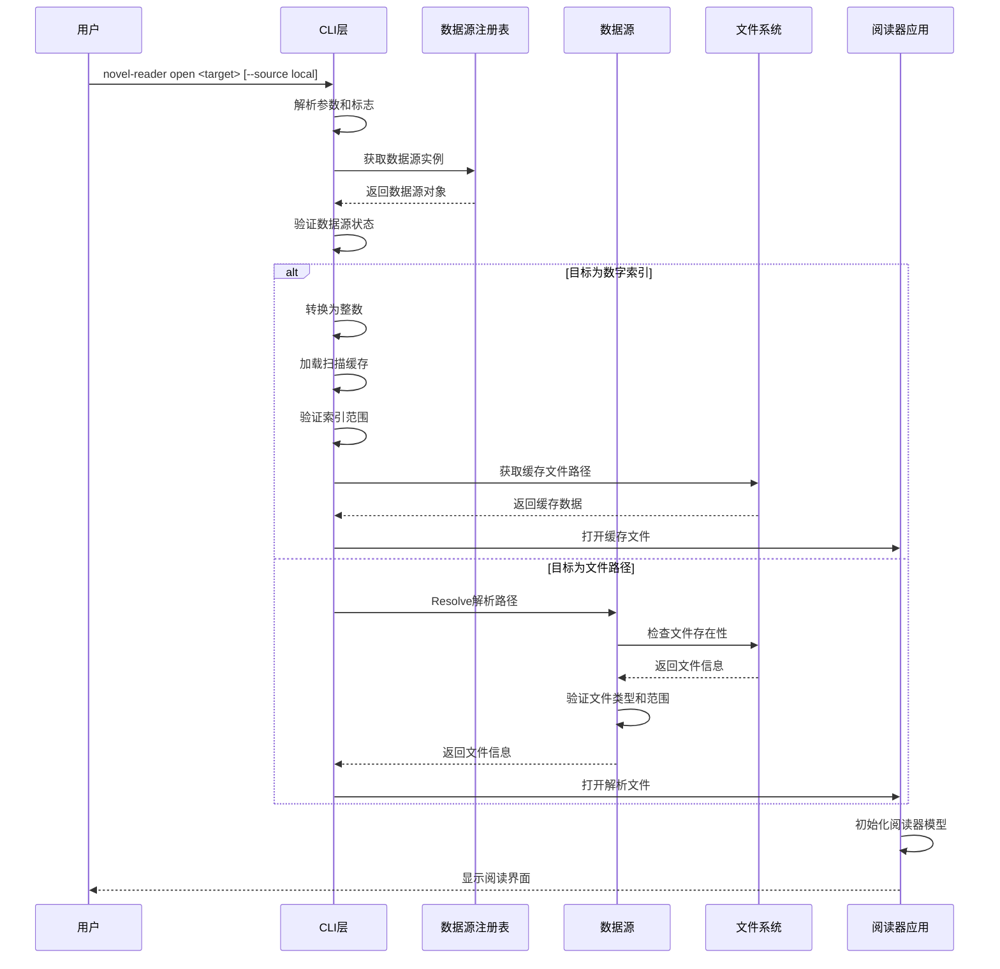
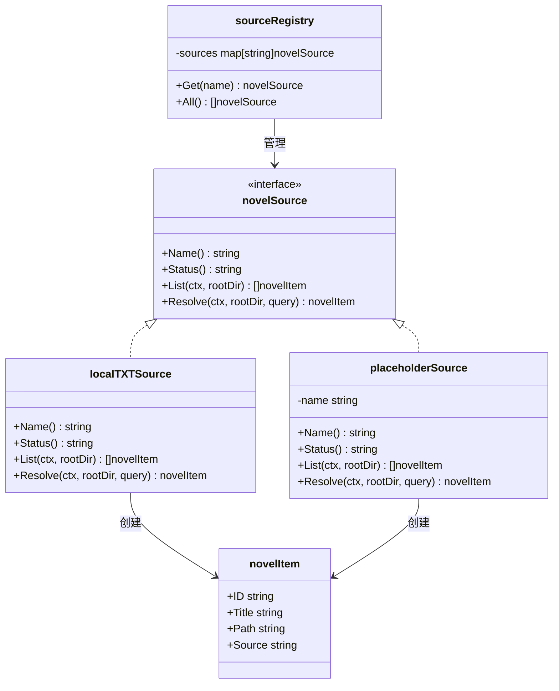

# open命令

<cite>
**本文档引用的文件**
- [main.go](file://main.go)
- [cli.go](file://cli.go)
- [source.go](file://source.go)
- [README.md](file://README.md)
- [USAGE.md](file://USAGE.md)
- [examples/demo.txt](file://examples/demo.txt)
</cite>

## 目录
1. [简介](#简介)
2. [命令语法](#命令语法)
3. [功能概述](#功能概述)
4. [参数详解](#参数详解)
5. [使用场景与示例](#使用场景与示例)
6. [参数验证规则](#参数验证规则)
7. [错误处理机制](#错误处理机制)
8. [常见问题解决](#常见问题解决)
9. [架构流程图](#架构流程图)
10. [结论](#结论)

## 简介
open命令是novel-reader的核心入口命令，用于打开指定的小说文件进行阅读。该命令支持两种目标参数使用方式：直接使用文件路径或使用library scan命令生成的索引编号。open命令基于本地TXT数据源，默认使用local源，当前版本仅支持项目目录内的.txt文件。

## 命令语法
```
novel-reader open <txt-path-or-id> [--source local]
```

**语法说明：**
- `open`：命令关键字
- `<txt-path-or-id>`：必需参数，可以是文件路径或索引编号
- `--source local`：可选参数，指定数据源，默认为local

## 功能概述
open命令的主要功能包括：
- **文件路径解析**：直接接受绝对或相对路径
- **索引编号支持**：通过library scan生成的序号快速打开
- **数据源管理**：支持local、gutenberg、custom等数据源（当前仅local可用）
- **自动恢复**：结合resume功能实现阅读进度恢复

## 参数详解

### 必需参数
- **txt-path-or-id**：目标参数，支持以下格式
  - 绝对路径：`/absolute/path/to/novel.txt`
  - 相对路径：`examples/demo.txt`、`./examples/demo.txt`
  - 序号索引：`1`、`2`、`3`（需要先执行library scan）

### 可选参数
- **--source local**：指定数据源名称，默认值为local
  - 当前版本仅local源可用，其他源为预留状态
  - gutenberg、custom源当前未实现

## 使用场景与示例

### 场景一：直接使用文件路径
```bash
# 使用绝对路径
novel-reader open examples/demo.txt

# 使用相对路径
novel-reader open examples/demo.txt
novel-reader open ./examples/demo.txt

# 使用构建后的二进制
./novel-reader open examples/demo.txt
```

### 场景二：使用索引编号打开
```bash
# 先扫描书库
novel-reader library scan

# 使用序号打开（需要先有扫描缓存）
novel-reader open 1
novel-reader open 2
novel-reader open 3
```

### 场景三：指定数据源
```bash
# 显式指定local源
novel-reader open examples/demo.txt --source local

# 兼容模式（省略--source参数）
novel-reader open examples/demo.txt
```

### 场景四：与其他命令配合使用
```bash
# 查看帮助
novel-reader help

# 查看可用数据源
novel-reader sources

# 恢复上次阅读
novel-reader resume

# 扫描本地书库
novel-reader library scan
```

## 参数验证规则

### 输入验证流程


**图表来源**
- [cli.go:68-122](file://cli.go#L68-L122)

### 验证规则详情
1. **参数完整性检查**
   - 必须提供目标参数
   - --source标志必须跟具体的数据源名称

2. **数据源状态检查**
   - 当前仅local源可用
   - gutenberg、custom源为预留状态，不可用

3. **索引有效性检查**
   - 必须为正整数
   - 不能超过扫描缓存中的文件数量
   - 需要先执行library scan建立缓存

4. **路径有效性检查**
   - 必须指向.txt文件
   - 必须位于项目目录范围内
   - 支持绝对和相对路径

## 错误处理机制

### 错误分类与处理


**图表来源**
- [cli.go:68-122](file://cli.go#L68-L122)
- [source.go:140-146](file://source.go#L140-L146)

### 错误处理流程
1. **参数解析阶段**
   - 检查参数完整性
   - 验证--source标志格式
   - 提取目标参数

2. **数据源验证阶段**
   - 获取数据源实例
   - 检查数据源状态
   - 验证数据源可用性

3. **目标处理阶段**
   - 判断目标类型（路径或索引）
   - 执行相应的解析逻辑
   - 返回适当的错误信息

## 常见问题解决

### 问题一：启动提示"no resume snapshot found"
**原因**：还没有打开过任何文件，或快照文件不存在。

**解决方案**：
```bash
# 先打开一个文件建立快照
novel-reader open examples/demo.txt
# 然后使用resume命令恢复
novel-reader resume
```

### 问题二：open提示"file is outside project root"
**原因**：当前版本的local源只允许读取项目目录内的.txt文件。

**解决方案**：
- 将小说文件移动到项目目录（或其子目录）内
- 确保文件路径相对于项目根目录

### 问题三：open提示"source xxx is reserved only"
**原因**：指定了预留数据源（如gutenberg或custom），当前版本尚未实现。

**解决方案**：
```bash
# 使用local源（默认）
novel-reader open examples/demo.txt
# 或显式指定
novel-reader open examples/demo.txt --source local
```

### 问题四：open提示"no scan cache found"
**原因**：直接使用了`open <序号>`，但当前还没有扫描缓存。

**解决方案**：
```bash
# 先执行扫描
novel-reader library scan
# 再使用序号打开
novel-reader open 1
```

### 问题五：中文显示异常或乱码
**解决方案**：
- 确认文本文件是UTF-8编码
- 更换支持完整Unicode的终端与字体

### 问题六：运行后没有看到边框或颜色
**原因**：终端主题或配色能力差异。

**解决方案**：
- 更换终端主题（如Dracula/Monokai）
- 确认终端支持256色或True Color

## 架构流程图

### open命令执行流程


**图表来源**
- [cli.go:68-122](file://cli.go#L68-L122)
- [source.go:74-111](file://source.go#L74-L111)
- [main.go:1011-1021](file://main.go#L1011-L1021)

### 数据源架构


**图表来源**
- [source.go:22-27](file://source.go#L22-L27)
- [source.go:29-29](file://source.go#L29-L29)
- [source.go:113-126](file://source.go#L113-L126)
- [source.go:128-138](file://source.go#L128-L138)
- [source.go:15-20](file://source.go#L15-L20)

## 结论
open命令作为novel-reader的核心入口，提供了灵活的文件打开方式。通过支持文件路径和索引编号两种目标参数形式，用户可以根据使用习惯选择最适合的方式。当前版本专注于本地TXT文件的支持，未来计划扩展更多数据源和文件格式。建议用户在使用前先了解项目的目录结构和数据源限制，以便获得最佳的使用体验。