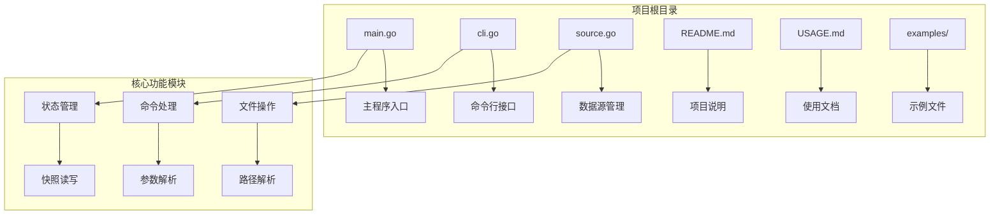
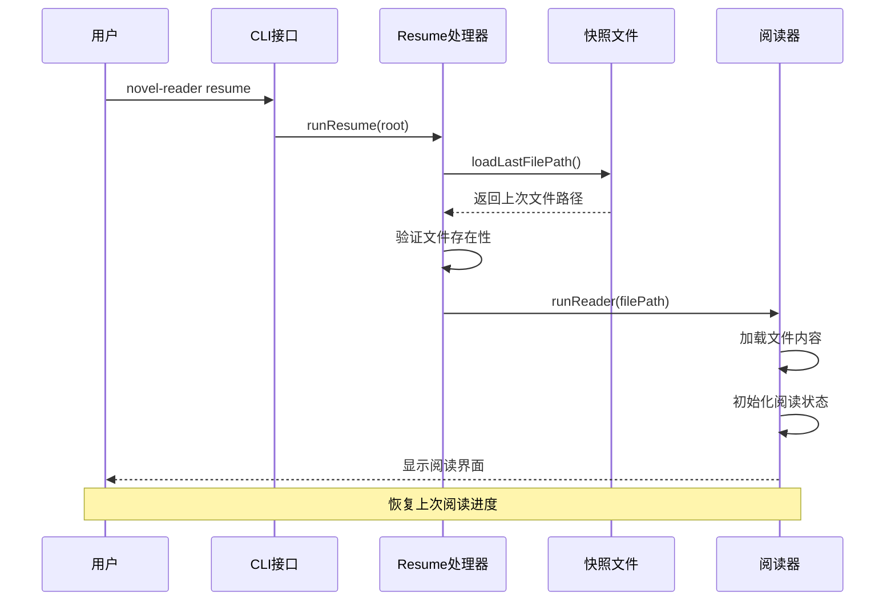
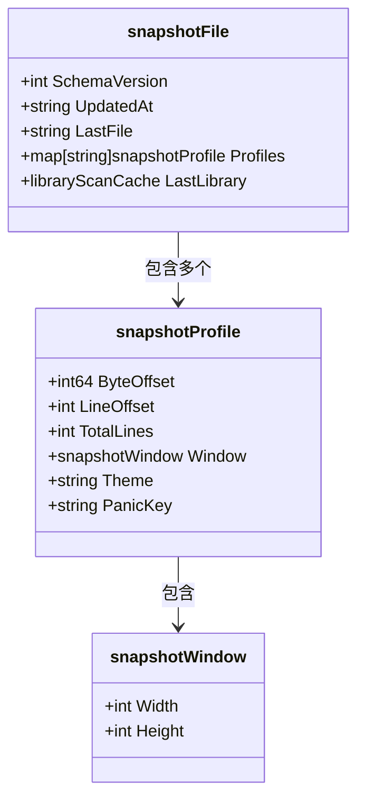
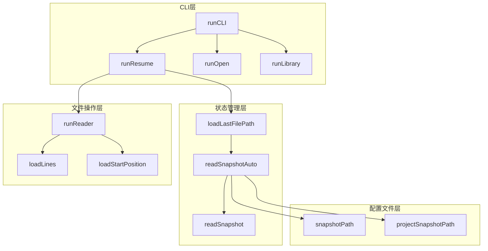

# resume命令

<cite>
**本文档引用的文件**
- [main.go](file://main.go)
- [cli.go](file://cli.go)
- [README.md](file://README.md)
- [USAGE.md](file://USAGE.md)
- [source.go](file://source.go)
- [examples/demo.txt](file://examples/demo.txt)
</cite>

## 目录
1. [简介](#简介)
2. [项目结构](#项目结构)
3. [核心组件](#核心组件)
4. [架构概览](#架构概览)
5. [详细组件分析](#详细组件分析)
6. [依赖关系分析](#依赖关系分析)
7. [性能考虑](#性能考虑)
8. [故障排除指南](#故障排除指南)
9. [结论](#结论)
10. [附录](#附录)

## 简介

novel-reader的resume命令是一个专门用于恢复上次阅读进度的子命令。当用户执行`novel-reader resume`时，系统会自动从配置文件中读取上次打开的小说文件路径，并重新打开该文件，让用户能够无缝地继续之前的阅读体验。

该命令作为默认命令工作，这意味着当用户不提供任何参数时，CLI会自动调用resume功能来恢复上次的阅读状态。这种设计让用户能够快速、便捷地回到之前的阅读位置，无需记住具体的文件路径或手动重新打开文件。

## 项目结构

novel-reader项目采用模块化的Go语言架构，主要包含以下核心文件：



**图表来源**
- [main.go:1-1056](file://main.go#L1-L1056)
- [cli.go:1-173](file://cli.go#L1-L173)
- [source.go:1-169](file://source.go#L1-L169)

**章节来源**
- [main.go:1-1056](file://main.go#L1-L1056)
- [cli.go:1-173](file://cli.go#L1-L173)
- [source.go:1-169](file://source.go#L1-L169)

## 核心组件

resume命令的核心实现涉及以下几个关键组件：

### 命令行接口层
- **runCLI函数**：负责解析命令行参数并分发到相应的处理函数
- **runResume函数**：专门处理resume命令的业务逻辑
- **printHelp函数**：提供帮助信息和使用示例

### 状态管理层
- **loadLastFilePath函数**：从快照文件中读取上次打开的文件路径
- **loadStartPosition函数**：根据文件路径获取上次阅读的起始位置
- **readSnapshotAuto函数**：自动选择主配置文件或回退配置文件进行读取

### 文件操作层
- **runReader函数**：实际启动阅读器并加载文件内容
- **loadLines函数**：读取文件内容并建立行偏移索引

**章节来源**
- [cli.go:13-66](file://cli.go#L13-L66)
- [main.go:847-868](file://main.go#L847-L868)
- [main.go:1011-1021](file://main.go#L1011-L1021)

## 架构概览

resume命令的执行流程遵循清晰的分层架构设计：



**图表来源**
- [cli.go:54-66](file://cli.go#L54-L66)
- [main.go:847-868](file://main.go#L847-L868)
- [main.go:1011-1021](file://main.go#L1011-L1021)

## 详细组件分析

### resume命令实现原理

resume命令的核心工作机制如下：

#### 1. 参数解析与路由
当用户执行`novel-reader resume`时，CLI接口会检测到这是默认命令（无参数）或显式的resume子命令，然后调用`runResume`函数。

#### 2. 快照文件读取
`runResume`函数内部调用`loadLastFilePath`来获取上次打开的文件路径。该函数会：
- 尝试读取主配置文件：`~/.config/dev-env-status.json`
- 如果主配置文件不存在，自动回退到项目级配置文件：`.novel-reader-state.json`
- 验证快照文件的有效性和完整性

#### 3. 文件路径验证与解析
获取到文件路径后，系统会进行以下验证：
- 检查路径是否为绝对路径，如果不是则转换为相对于项目根目录的绝对路径
- 验证目标文件是否存在且可访问
- 确保文件类型为支持的TXT格式

#### 4. 阅读器启动
验证通过后，调用`runReader`函数启动阅读器：
- 读取文件内容并建立行偏移索引
- 根据快照信息确定上次的阅读位置
- 初始化Bubble Tea程序并进入交互模式

### 状态恢复机制

状态恢复是通过快照文件实现的，包含以下关键信息：



**图表来源**
- [main.go:35-68](file://main.go#L35-L68)

**章节来源**
- [main.go:35-68](file://main.go#L35-L68)
- [main.go:629-667](file://main.go#L629-L667)

### 错误处理机制

resume命令实现了完善的错误处理机制：

#### 1. 快照文件缺失处理
当系统无法找到任何快照文件时，会返回明确的错误信息：
- 提示用户使用`novel-reader open <txt-path>`命令打开特定文件
- 指导用户先进行一次正常的文件打开操作来创建快照

#### 2. 文件路径有效性检查
如果快照文件存在但指向的文件不存在，系统会：
- 显示具体的文件路径信息
- 提示用户确认文件是否被移动或删除
- 建议重新打开正确的文件路径

#### 3. 路径解析错误处理
对于相对路径和绝对路径的处理：
- 自动将相对路径转换为绝对路径
- 验证路径的安全性，防止路径遍历攻击
- 提供清晰的错误信息帮助用户诊断问题

**章节来源**
- [cli.go:54-66](file://cli.go#L54-L66)
- [main.go:847-868](file://main.go#L847-L868)

## 依赖关系分析

resume命令的依赖关系体现了清晰的分层设计：



**图表来源**
- [cli.go:13-44](file://cli.go#L13-L44)
- [main.go:847-868](file://main.go#L847-L868)
- [main.go:1011-1021](file://main.go#L1011-L1021)

**章节来源**
- [cli.go:13-44](file://cli.go#L13-L44)
- [main.go:847-868](file://main.go#L847-L868)

## 性能考虑

resume命令在设计时充分考虑了性能和用户体验：

### 快照文件读取优化
- **原子读取**：使用原子操作确保快照文件读取的一致性
- **多路径回退**：优先使用用户级配置文件，失败时自动回退到项目级配置
- **最小化IO**：只在需要时读取快照文件，避免不必要的磁盘访问

### 内存管理
- **延迟加载**：文件内容按需加载，避免一次性读取整个大文件
- **行偏移索引**：建立高效的行偏移索引，支持快速定位阅读位置
- **内存清理**：及时释放不再使用的内存资源

### 用户体验优化
- **快速响应**：命令执行时间极短，通常在毫秒级别
- **错误友好**：提供清晰的错误信息和解决方案指导
- **无缝恢复**：恢复过程对用户完全透明，无需额外操作

## 故障排除指南

### 常见问题及解决方案

#### 1. "no resume snapshot found" 错误
**原因**：系统中没有任何快照文件存在
**解决方案**：
```bash
# 首次打开文件创建快照
novel-reader open examples/demo.txt

# 然后使用resume命令恢复
novel-reader resume
```

#### 2. "resume file missing" 错误
**原因**：快照文件指向的文件已被移动或删除
**解决方案**：
```bash
# 检查当前目录是否有该文件
ls -la /path/to/your/file.txt

# 如果文件已移动，重新打开正确路径
novel-reader open /correct/path/to/file.txt

# 或者使用library功能重新定位文件
novel-reader library scan
novel-reader open 1
```

#### 3. 权限相关问题
**原因**：配置文件所在目录权限不足
**解决方案**：
```bash
# 检查配置文件权限
ls -la ~/.config/dev-env-status.json

# 修复权限问题
chmod 755 ~/.config
chmod 644 ~/.config/dev-env-status.json
```

### 调试技巧

#### 1. 查看快照文件内容
```bash
# 查看用户级快照文件
cat ~/.config/dev-env-status.json

# 查看项目级快照文件
cat .novel-reader-state.json
```

#### 2. 验证文件路径
```bash
# 检查文件是否存在
test -f "/absolute/path/to/file.txt" && echo "文件存在" || echo "文件不存在"

# 获取文件详细信息
stat "/absolute/path/to/file.txt"
```

**章节来源**
- [USAGE.md:191-228](file://USAGE.md#L191-L228)

## 结论

novel-reader的resume命令通过精心设计的状态管理和文件操作机制，为用户提供了无缝的阅读体验。其核心优势包括：

1. **自动化程度高**：无需用户记忆复杂的命令或参数
2. **可靠性强**：多重回退机制确保快照文件读取的稳定性
3. **错误处理完善**：提供清晰的错误信息和解决方案指导
4. **性能优化**：最小化IO操作，快速响应用户需求

通过合理使用resume命令，用户可以显著提升阅读效率，特别是在需要频繁切换阅读位置或忘记具体文件路径的情况下。建议用户养成定期使用open命令的习惯，这样可以确保快照文件始终是最新的，从而获得最佳的恢复体验。

## 附录

### 使用示例

#### 基本使用
```bash
# 恢复上次阅读
novel-reader resume

# 等价于
novel-reader
```

#### 与其他命令结合使用
```bash
# 首次打开文件
novel-reader open examples/demo.txt

# 继续阅读
novel-reader resume

# 列出所有可用命令
novel-reader help
```

### 最佳实践

1. **定期保存进度**：正常退出时会自动保存进度，建议养成良好习惯
2. **保持文件位置稳定**：避免移动或重命名已打开的文件
3. **使用library功能**：配合`library scan`功能更好地管理文件集合
4. **监控快照文件**：定期检查快照文件的存在性和完整性

### 配置选项

虽然resume命令本身不需要特殊配置，但用户可以通过以下方式影响其行为：

- **快照文件位置**：系统会优先使用用户级配置文件，失败时自动回退到项目级配置
- **文件权限**：确保快照文件具有适当的读写权限
- **磁盘空间**：确保有足够的磁盘空间存储快照文件