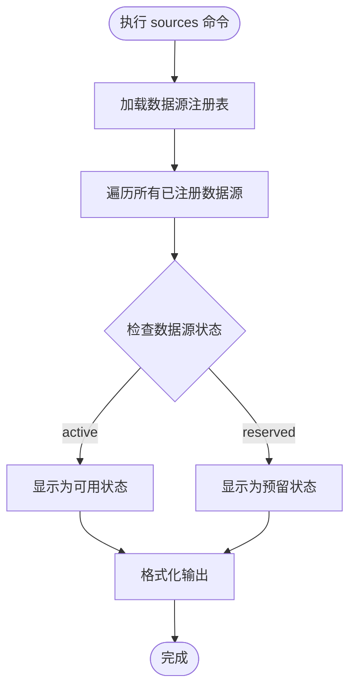
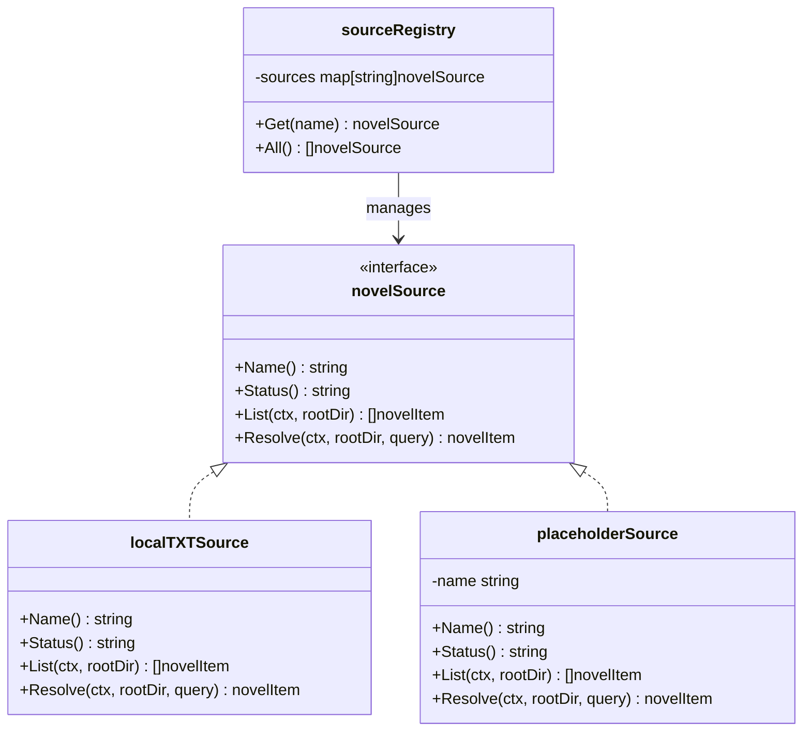

# sources命令

<cite>
**本文档引用的文件**
- [cli.go](file://cli.go)
- [source.go](file://source.go)
- [README.md](file://README.md)
- [USAGE.md](file://USAGE.md)
</cite>

## 目录
1. [简介](#简介)
2. [命令语法](#命令语法)
3. [功能概述](#功能概述)
4. [输出格式](#输出格式)
5. [数据源类型详解](#数据源类型详解)
6. [状态含义说明](#状态含义说明)
7. [使用示例](#使用示例)
8. [状态判断标准](#状态判断标准)
9. [数据源管理概念](#数据源管理概念)
10. [故障排除指南](#故障排除指南)
11. [最佳实践](#最佳实践)

## 简介

novel-reader的`sources`命令是一个专门用于显示系统中可用数据源列表的子命令。它提供了数据源的实时状态概览，帮助用户了解当前系统支持哪些数据源以及它们的可用性状态。

## 命令语法

```bash
novel-reader sources
```

这是最简单的使用方式，无需任何额外参数即可执行。

## 功能概述

`sources`命令的主要功能是：
- 显示系统中所有已注册的数据源
- 展示每个数据源的名称和当前状态
- 提供数据源可用性的即时反馈
- 帮助用户进行数据源选择和故障排查

## 输出格式

`sources`命令的输出采用简洁的一行一行格式：

```
available sources:
  - local (active)
  - gutenberg (reserved)
  - custom (reserved)
```

每行包含两个主要部分：
1. **数据源名称**：显示数据源的标识符
2. **状态信息**：括号内的状态标签，如`(active)`或`(reserved)`

## 数据源类型详解

根据当前实现，系统支持以下三种数据源类型：

### local 数据源
- **状态**：active（可用）
- **功能**：扫描项目目录及其子目录中的`.txt`文件
- **访问范围**：仅限于项目根目录及其子目录
- **默认性**：作为系统的默认数据源

### gutenberg 数据源  
- **状态**：reserved（预留）
- **功能**：计划用于访问古腾堡计划的电子书资源
- **当前状态**：尚未实现，仅作为扩展点预留

### custom 数据源
- **状态**：reserved（预留）
- **功能**：为自定义数据源提供扩展接口
- **当前状态**：尚未实现，仅作为扩展点预留

## 状态含义说明

### active 状态
- **含义**：数据源已完全实现并可以正常使用
- **特点**：可以执行完整的数据源操作，如文件扫描、解析等
- **使用建议**：这是推荐使用的数据源

### reserved 状态  
- **含义**：数据源接口已预留，但功能尚未实现
- **特点**：在当前版本中无法使用
- **未来展望**：将在后续版本中逐步实现

## 使用示例

### 基本使用
```bash
$ novel-reader sources
available sources:
  - local (active)
  - gutenberg (reserved)
  - custom (reserved)
```

### 结合其他命令使用
```bash
# 查看数据源列表后，结合open命令使用
$ novel-reader sources
available sources:
  - local (active)

$ novel-reader open examples/demo.txt --source local
```

## 状态判断标准

### 判断流程图



### 实际判断逻辑

1. **注册表加载**：从`newSourceRegistry()`创建的数据源注册表中获取所有数据源
2. **状态查询**：调用每个数据源的`Status()`方法获取当前状态
3. **格式化输出**：按照"名称 (状态)"的格式进行输出
4. **排序显示**：按数据源名称字母顺序排列

## 数据源管理概念

### 为什么需要查看可用数据源

1. **系统透明度**：让用户了解系统当前支持的功能范围
2. **故障排查**：快速识别数据源问题，如预留状态的数据源
3. **功能选择**：指导用户选择合适的可用数据源
4. **扩展准备**：为未来的数据源扩展做好准备

### 数据源在系统中的作用

1. **内容发现**：负责扫描和发现可用的小说文件
2. **内容解析**：将原始文本文件转换为可阅读的格式
3. **状态管理**：维护数据源的可用性和状态信息
4. **扩展接口**：为未来的新数据源类型提供统一接口

## 故障排除指南

### 常见问题及解决方案

#### 问题：显示的数据源状态不符合预期
- **原因**：可能是数据源注册表配置问题
- **解决**：检查`newSourceRegistry()`函数中的数据源定义

#### 问题：缺少期望的数据源类型
- **原因**：当前版本仅实现了基础数据源
- **解决**：等待后续版本更新，或使用现有的local数据源

#### 问题：所有数据源都显示为reserved状态
- **原因**：数据源实现可能存在问题
- **解决**：检查数据源接口实现和状态返回逻辑

## 最佳实践

### 使用建议

1. **优先使用active状态的数据源**：如local数据源
2. **定期检查数据源状态**：确保系统功能正常
3. **理解预留数据源的意义**：为未来功能做好准备
4. **结合其他命令使用**：将`sources`命令与其他命令配合使用

### 开发者参考

对于开发者而言，`sources`命令展示了以下设计模式：

1. **接口抽象**：通过`novelSource`接口统一不同数据源的行为
2. **注册表模式**：使用`sourceRegistry`集中管理所有数据源
3. **状态管理**：通过`Status()`方法提供数据源状态查询
4. **扩展性设计**：预留接口便于未来功能扩展



**图表来源**
- [source.go:22-27](file://source.go#L22-L27)
- [source.go:29-29](file://source.go#L29-L29)
- [source.go:113-115](file://source.go#L113-L115)
- [source.go:128-137](file://source.go#L128-L137)