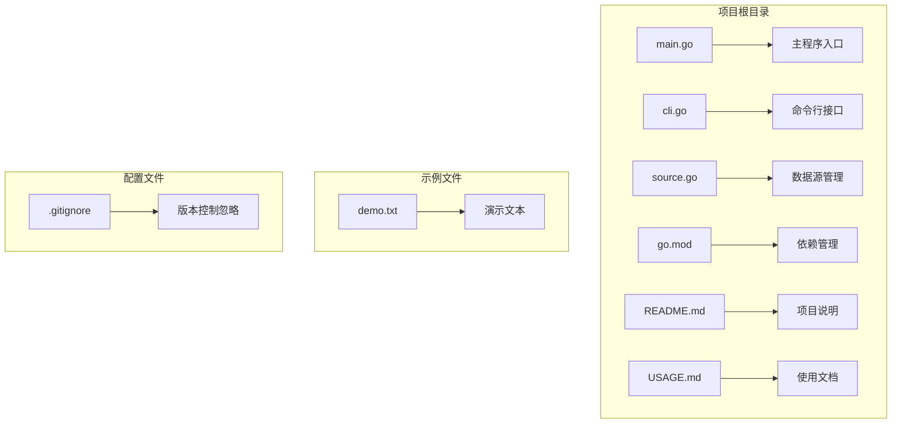
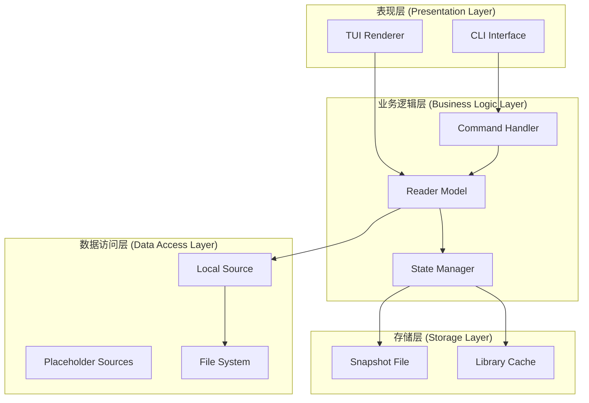
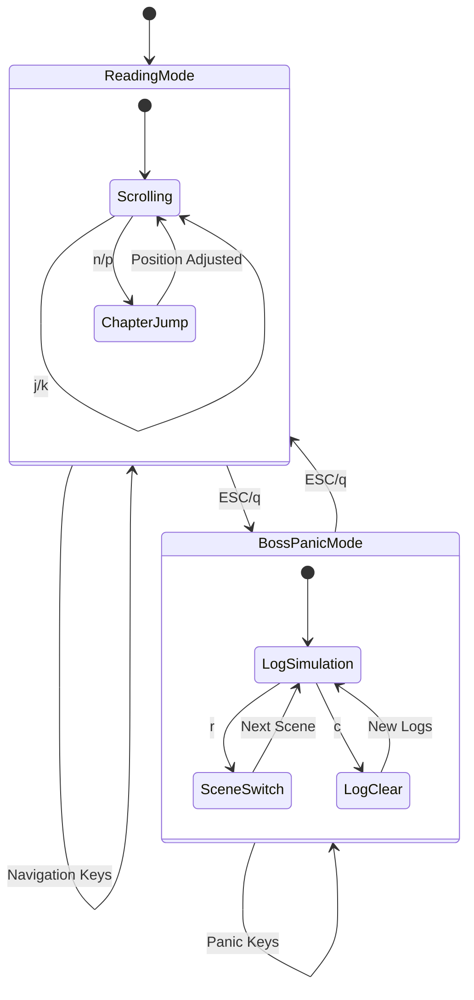
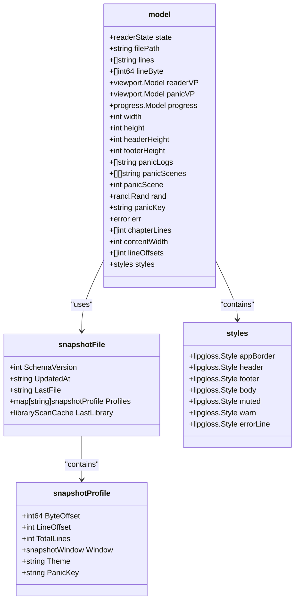
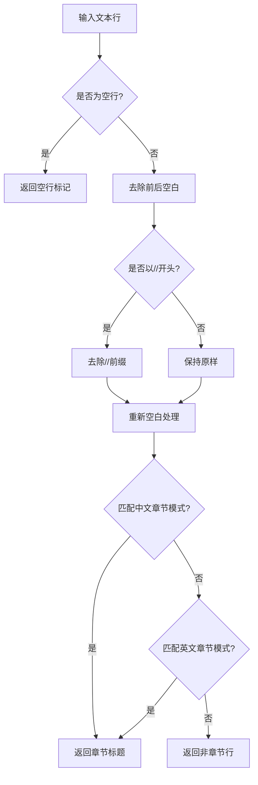
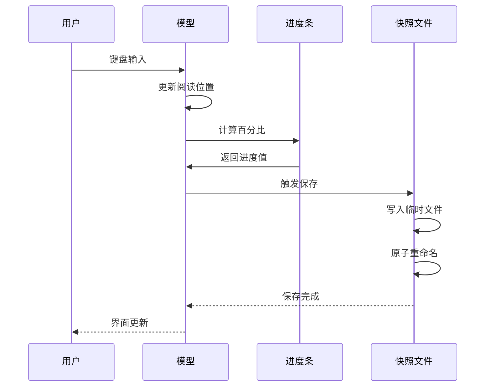
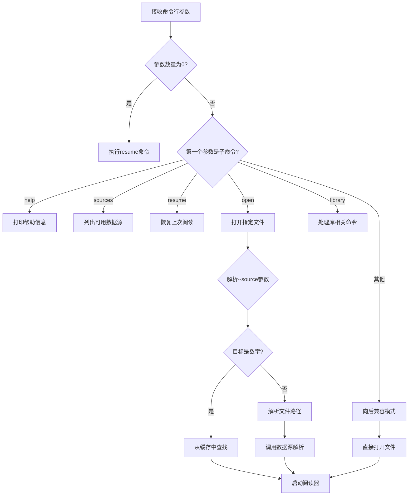
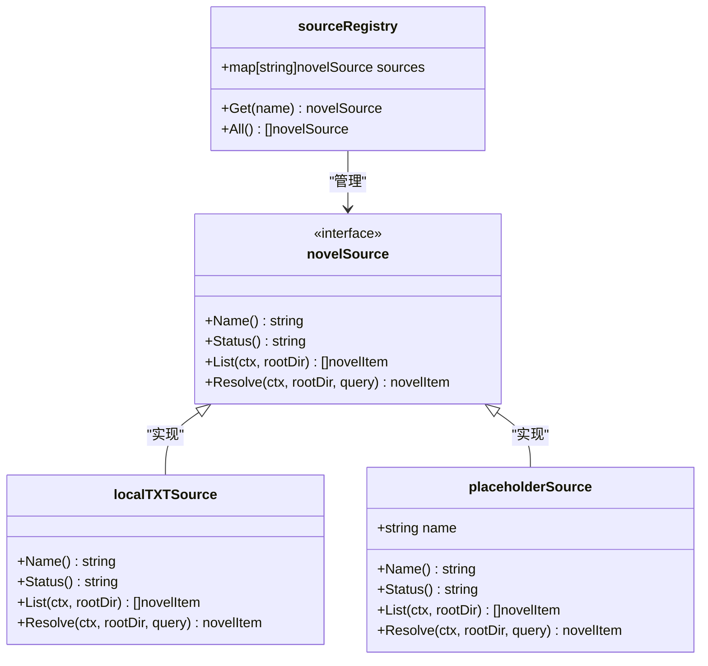
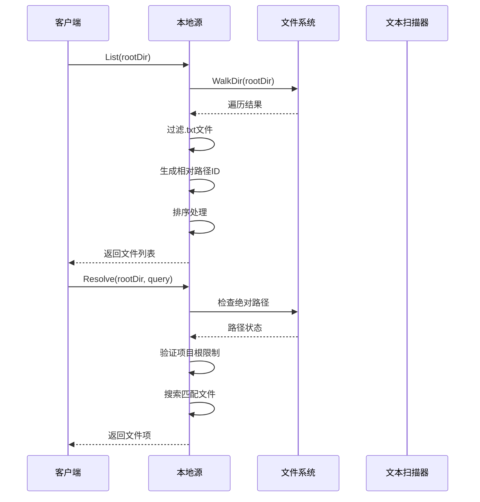
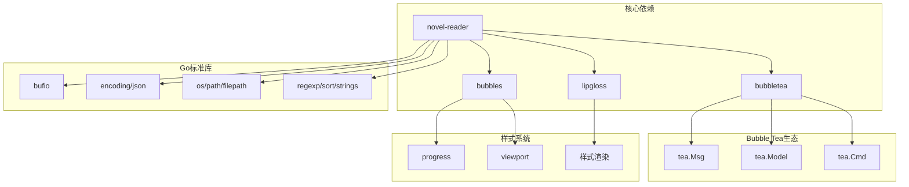

# 开发指南

<cite>
**本文档引用的文件**
- [README.md](file://README.md)
- [USAGE.md](file://USAGE.md)
- [main.go](file://main.go)
- [cli.go](file://cli.go)
- [source.go](file://source.go)
- [go.mod](file://go.mod)
- [demo.txt](file://examples/demo.txt)
</cite>

## 目录
1. [简介](#简介)
2. [项目结构](#项目结构)
3. [核心组件](#核心组件)
4. [架构概览](#架构概览)
5. [详细组件分析](#详细组件分析)
6. [依赖分析](#依赖分析)
7. [性能考虑](#性能考虑)
8. [故障排除指南](#故障排除指南)
9. [结论](#结论)
10. [附录](#附录)

## 简介

novel-reader是一个基于Go语言和Bubble Tea框架的命令行小说阅读器，采用TUI（文本用户界面）设计，提供"低存在感"的阅读体验。该项目的核心特色包括：

- **伪装模式**：阅读界面伪装成开发环境的状态输出，通过Boss Key功能可以快速切换到伪日志模式
- **自动恢复**：智能保存和恢复阅读进度，支持跨会话的连续阅读
- **多数据源支持**：当前支持本地TXT文件源，预留了Gutenberg和自定义源的扩展接口
- **优雅的终端交互**：基于Charm CLI生态，提供流畅的键盘操作体验

## 项目结构

novel-reader项目采用简洁的单模块架构，主要文件分布如下：



**图表来源**
- [main.go:1-50](file://main.go#L1-L50)
- [cli.go:1-30](file://cli.go#L1-L30)
- [source.go:1-30](file://source.go#L1-L30)

### 文件组织原则

项目采用按功能分层的组织方式：

- **入口层**：main.go负责程序启动和主循环
- **接口层**：cli.go处理命令行参数解析和用户交互
- **业务层**：source.go实现数据源抽象和具体实现
- **配置层**：go.mod管理Go模块依赖

**章节来源**
- [main.go:1-1056](file://main.go#L1-L1056)
- [cli.go:1-173](file://cli.go#L1-L173)
- [source.go:1-169](file://source.go#L1-L169)

## 核心组件

novel-reader系统由三个核心组件构成，每个组件都有明确的职责分工：

### 1. 主程序组件 (main.go)

主程序组件是整个应用的核心，负责：
- **状态管理**：维护阅读器状态和用户界面
- **事件处理**：响应键盘输入和窗口大小变化
- **渲染控制**：根据状态切换不同的显示模式
- **数据持久化**：保存和加载阅读进度

### 2. 命令行接口组件 (cli.go)

命令行接口组件提供完整的CLI功能：
- **子命令解析**：支持help、sources、resume、open、library等命令
- **参数验证**：确保用户输入的有效性
- **错误处理**：提供友好的错误信息反馈

### 3. 数据源管理组件 (source.go)

数据源管理组件实现灵活的数据源抽象：
- **接口定义**：统一的数据源访问接口
- **本地源实现**：扫描和解析本地TXT文件
- **扩展支持**：预留Gutenberg和自定义源的扩展点

**章节来源**
- [main.go:74-103](file://main.go#L74-L103)
- [cli.go:13-44](file://cli.go#L13-L44)
- [source.go:22-27](file://source.go#L22-L27)

## 架构概览

novel-reader采用分层架构设计，各层之间职责清晰，耦合度低：



**图表来源**
- [main.go:211-292](file://main.go#L211-L292)
- [cli.go:68-122](file://cli.go#L68-L122)
- [source.go:29-111](file://source.go#L29-L111)

### 状态流转图



**图表来源**
- [main.go:217-266](file://main.go#L217-L266)
- [main.go:226-234](file://main.go#L226-L234)

## 详细组件分析

### 主模型组件 (Model)

主模型组件是novel-reader的核心，实现了完整的阅读器功能：

#### 数据结构设计



**图表来源**
- [main.go:74-103](file://main.go#L74-L103)
- [main.go:35-68](file://main.go#L35-L68)
- [main.go:110-135](file://main.go#L110-L135)

#### 核心功能实现

##### 章节识别算法

novel-reader实现了智能的章节识别功能，支持中英文章节标题：



**图表来源**
- [main.go:523-543](file://main.go#L523-L543)

##### 进度计算机制



**图表来源**
- [main.go:545-551](file://main.go#L545-L551)
- [main.go:629-667](file://main.go#L629-L667)

**章节来源**
- [main.go:523-543](file://main.go#L523-L543)
- [main.go:545-551](file://main.go#L545-L551)
- [main.go:629-667](file://main.go#L629-L667)

### 命令行接口组件 (CLI)

CLI组件提供了完整的命令行交互功能：

#### 命令解析流程



**图表来源**
- [cli.go:13-44](file://cli.go#L13-L44)
- [cli.go:68-122](file://cli.go#L68-L122)

#### 数据源注册机制



**图表来源**
- [cli.go:128-159](file://cli.go#L128-L159)
- [source.go:22-27](file://source.go#L22-L27)
- [source.go:128-137](file://source.go#L128-L137)

**章节来源**
- [cli.go:13-44](file://cli.go#L13-L44)
- [cli.go:128-159](file://cli.go#L128-L159)
- [source.go:128-137](file://source.go#L128-L137)

### 数据源管理组件

数据源管理组件实现了灵活的插件式架构：

#### 本地TXT源实现

本地TXT源提供了完整的文件扫描和解析功能：



**图表来源**
- [source.go:34-72](file://source.go#L34-L72)
- [source.go:74-111](file://source.go#L74-L111)

#### 占位符源设计

占位符源为未来的扩展提供了清晰的接口：

| 源类型 | 状态 | 功能描述 | 实现状态 |
|--------|------|----------|----------|
| local | active | 本地TXT文件扫描 | 已实现 |
| gutenberg | reserved | Gutenberg电子书源 | 预留接口 |
| custom | reserved | 自定义数据源 | 预留接口 |

**章节来源**
- [source.go:34-111](file://source.go#L34-L111)
- [source.go:113-137](file://source.go#L113-L137)

## 依赖分析

novel-reader项目采用最小化依赖策略，主要依赖关系如下：



**图表来源**
- [go.mod:5-9](file://go.mod#L5-L9)
- [main.go:3-19](file://main.go#L3-L19)

### 外部依赖特性

| 依赖包 | 版本 | 用途 | 关键特性 |
|--------|------|------|----------|
| bubbletea | v1.3.10 | TUI框架 | 状态管理、消息循环 |
| bubbles | v1.0.0 | UI组件库 | 进度条、视口组件 |
| lipgloss | v1.1.0 | 样式渲染 | 终端美化、布局控制 |
| osc52 | v2.0.1 | 剪贴板支持 | ANSI OSC52序列 |
| termenv | v0.16.0 | 终端检测 | 颜色支持检测 |

**章节来源**
- [go.mod:5-33](file://go.mod#L5-L33)

## 性能考虑

novel-reader在性能方面采用了多项优化策略：

### 内存管理优化

1. **延迟初始化**：视口组件仅在需要时创建
2. **缓冲区管理**：使用64KB初始缓冲区，最大支持4MB扫描
3. **增量计算**：章节偏移量仅在需要时重建

### I/O性能优化

1. **原子文件写入**：使用.tmp文件和重命名避免部分写入
2. **智能缓存**：库扫描结果缓存到JSON文件
3. **增量更新**：状态变更时才触发保存操作

### 渲染性能优化

1. **虚拟视口**：仅渲染可见区域内容
2. **文本包装**：基于视觉宽度而非字符宽度计算
3. **懒加载**：章节索引在首次需要时构建

## 故障排除指南

### 常见问题诊断

#### 启动问题

| 问题症状 | 可能原因 | 解决方案 |
|----------|----------|----------|
| "no resume snapshot found" | 首次运行或快照文件丢失 | 使用`open`命令打开文件 |
| "file is outside project root" | 文件位于项目根目录外 | 将文件移动到项目目录内 |
| "source xxx is reserved only" | 使用了未实现的数据源 | 使用`--source local` |

#### 显示问题

| 问题症状 | 可能原因 | 解决方案 |
|----------|----------|----------|
| 中文显示乱码 | 文件编码非UTF-8 | 转换为UTF-8编码 |
| 无边框或颜色 | 终端主题不支持 | 更换支持256色的终端主题 |
| 进度条异常 | 终端宽度检测失败 | 调整终端窗口大小 |

#### 性能问题

| 问题症状 | 可能原因 | 解决方案 |
|----------|----------|----------|
| 启动缓慢 | 大文件扫描 | 使用库扫描功能预处理 |
| 内存占用高 | 大文件加载 | 分割大文件或使用外部编辑器 |
| 响应迟缓 | 终端渲染卡顿 | 关闭不必要的终端特效 |

**章节来源**
- [USAGE.md:191-247](file://USAGE.md#L191-L247)

## 结论

novel-reader项目展现了优秀的软件工程实践：

### 设计优势

1. **清晰的架构分离**：三层架构确保了良好的可维护性
2. **优雅的用户体验**：Boss Key功能提供了独特的隐私保护
3. **完善的错误处理**：友好的错误信息和回退机制
4. **可扩展的设计**：预留的扩展点为未来功能奠定了基础

### 技术亮点

1. **高效的TUI实现**：基于Bubble Tea框架的现代化终端应用
2. **智能的文本处理**：精确的章节识别和进度计算
3. **可靠的持久化**：原子文件写入确保数据安全
4. **灵活的配置**：环境变量驱动的功能开关

### 发展建议

1. **增加配置文件支持**：提供JSON/TOML配置文件
2. **扩展数据源**：实现Gutenberg和自定义源
3. **引入测试框架**：建立单元测试和集成测试
4. **性能监控**：添加性能指标和内存使用报告

## 附录

### 开发环境设置

#### 系统要求
- macOS/Linux（Windows建议WSL）
- Go 1.24.2或更高版本
- 支持ANSI的终端（iTerm2、Warp、Terminal等）

#### 安装步骤
```bash
# 获取源码
git clone <repository-url>
cd novel-reader

# 安装依赖
go mod tidy

# 编译运行
go run . open examples/demo.txt
```

#### 构建选项
```bash
# 构建可执行文件
go build -o novel-reader .

# 交叉编译
GOOS=linux GOARCH=amd64 go build -o novel-reader-linux .
GOOS=windows GOARCH=amd64 go build -o novel-reader.exe .
```

### API参考

#### 命令行接口

| 命令 | 参数 | 描述 | 示例 |
|------|------|------|------|
| help | 无 | 显示帮助信息 | `novel-reader help` |
| sources | 无 | 列出可用数据源 | `novel-reader sources` |
| resume | 无 | 恢复上次阅读 | `novel-reader resume` |
| open | `<txt-path-or-id>` [--source local] | 打开指定文件 | `novel-reader open demo.txt` |
| library scan | `[dir]` | 扫描本地库 | `novel-reader library scan` |

#### 键盘快捷键

| 功能 | 快捷键 | 说明 |
|------|--------|------|
| 向下滚动 | j/Down | 按行滚动 |
| 向上滚动 | k/Up | 按行滚动 |
| 下一章 | n/]| 跳转到下一章 |
| 上一章 | p/[ | 跳转到上一章 |
| 下一页 | Space | 按页滚动 |
| 上一页 | b | 按页滚动 |
| 顶部 | g | 跳转到文件顶部 |
| 底部 | G | 跳转到文件底部 |
| Boss键 | Esc/q | 切换到伪日志模式 |
| 场景切换 | r | 在日志场景间切换 |
| 清空日志 | c | 清空当前日志缓冲 |

### 扩展开发指南

#### 添加新的数据源

1. **实现novelSource接口**
```go
type newSource struct{}

func (s newSource) Name() string { return "new-source" }
func (s newSource) Status() string { return "active" }
func (s newSource) List(ctx context.Context, rootDir string) ([]novelItem, error) {
    // 实现文件扫描逻辑
}
func (s newSource) Resolve(ctx context.Context, rootDir, query string) (novelItem, error) {
    // 实现文件解析逻辑
}
```

2. **注册新数据源**
```go
func newSourceRegistry() sourceRegistry {
    return sourceRegistry{sources: map[string]novelSource{
        "local": localTXTSource{},
        "new-source": newSource{},
        // ... 其他源
    }}
}
```

#### 修改现有功能

1. **状态管理**：通过tea.Msg和tea.Cmd扩展消息类型
2. **UI组件**：利用bubbles库的现有组件进行定制
3. **样式系统**：通过lipgloss的样式组合实现视觉效果

#### 调试技巧

1. **日志输出**：使用tea.WithAltScreen()启用调试模式
2. **状态检查**：通过renderFooter()查看内部状态
3. **性能分析**：使用Go的pprof工具分析性能瓶颈

### 测试策略

#### 单元测试

```go
func TestChapterDetection(t *testing.T) {
    lines := []string{"第一章", "第二章", "普通行"}
    chapterLines := buildChapterLineIndex(lines)
    
    if len(chapterLines) != 2 {
        t.Errorf("Expected 2 chapters, got %d", len(chapterLines))
    }
}

func TestSnapshotPersistence(t *testing.T) {
    // 测试快照文件的读写
}
```

#### 集成测试

```go
func TestFullWorkflow(t *testing.T) {
    // 测试完整的打开-阅读-保存流程
}
```

#### 性能测试

```go
func BenchmarkLargeFileLoading(b *testing.B) {
    for i := 0; i < b.N; i++ {
        loadLines("large-test-file.txt")
    }
}
```