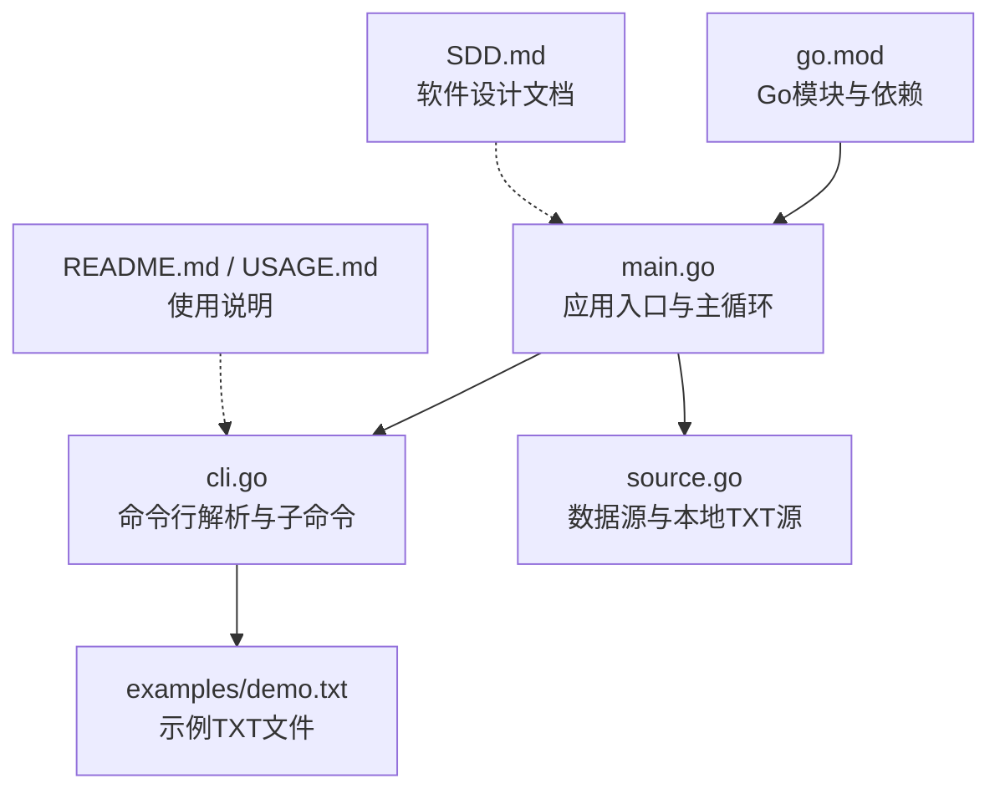
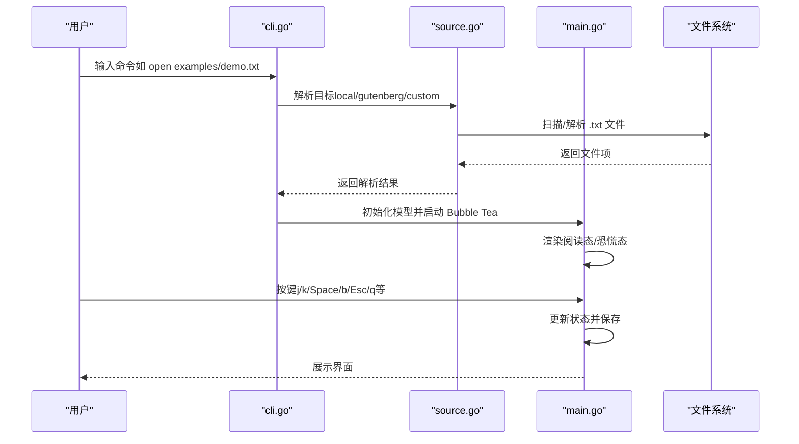
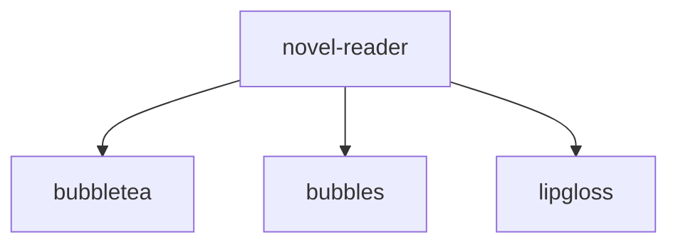

# 快速开始

<cite>
**本文引用的文件**
- [README.md](file://README.md)
- [USAGE.md](file://USAGE.md)
- [main.go](file://main.go)
- [cli.go](file://cli.go)
- [source.go](file://source.go)
- [examples/demo.txt](file://examples/demo.txt)
- [go.mod](file://go.mod)
- [SDD.md](file://SDD.md)
</cite>

## 目录
1. [简介](#简介)
2. [项目结构](#项目结构)
3. [核心组件](#核心组件)
4. [架构概览](#架构概览)
5. [详细组件分析](#详细组件分析)
6. [依赖分析](#依赖分析)
7. [性能考虑](#性能考虑)
8. [故障排除指南](#故障排除指南)
9. [结论](#结论)
10. [附录](#附录)

## 简介
novel-reader 是一个基于 Go + Bubble Tea 的命令行小说阅读器（CLI + TUI）。它的核心特色是“低存在感”的阅读体验：阅读界面伪装为开发环境的注释/状态输出，支持 Boss Key（恐慌键）一键切换到伪日志模式，自动保存并恢复阅读进度，支持本地 TXT 文件阅读与章节跳转。

本快速开始指南将带你从零开始安装、编译、运行项目，并通过第一个示例文件体验核心功能。同时提供常见问题的排查方法，确保你在最短时间内成功运行并享受阅读体验。

## 项目结构
novel-reader 采用简洁的分层结构，主要文件与职责如下：
- main.go：应用入口与 Bubble Tea 主循环，负责渲染、按键处理、状态持久化与章节跳转。
- cli.go：命令行解析与子命令路由，支持 open、resume、library scan、sources 等命令。
- source.go：数据源接口与本地 TXT 源实现，负责扫描项目目录中的 .txt 文件并解析查询参数。
- examples/demo.txt：示例 TXT 小说文件，包含章节标题与正文，适合初次体验。
- go.mod：Go 模块与依赖声明，明确 Go 版本要求。
- README.md / USAGE.md：使用说明与安装构建指南。
- SDD.md：软件设计文档，描述系统架构、状态机与性能策略。

**图表来源**
- [main.go](file://main.go)
- [cli.go](file://cli.go)
- [source.go](file://source.go)
- [examples/demo.txt](file://examples/demo.txt)
- [go.mod](file://go.mod)
- [README.md](file://README.md)
- [USAGE.md](file://USAGE.md)
- [SDD.md](file://SDD.md)

**章节来源**
- [README.md](file://README.md)
- [USAGE.md](file://USAGE.md)
- [main.go](file://main.go)
- [cli.go](file://cli.go)
- [source.go](file://source.go)
- [examples/demo.txt](file://examples/demo.txt)
- [go.mod](file://go.mod)
- [SDD.md](file://SDD.md)

## 核心组件
- 应用入口与主循环（main.go）
  - 负责初始化 Bubble Tea 程序、处理键盘与窗口事件、渲染阅读态与恐慌态界面、保存状态与章节跳转。
  - 关键特性：阅读进度伪装为“编译资产”进度条、Boss Key 切换到伪日志流、章节标题识别与跳转、状态持久化。
- 命令行解析与子命令（cli.go）
  - 支持 help、sources、resume、open、library scan 等子命令；兼容旧用法将首个非标志参数视为 open 目标。
  - 提供扫描本地书库、按序号打开、恢复上次阅读等功能。
- 数据源与本地 TXT 源（source.go）
  - 实现 novelSource 接口，提供 local、gutenberg、custom 三种数据源注册；当前仅 local 可用，其余为预留状态。
  - 本地源扫描项目目录及子目录中的 .txt 文件，支持通过绝对/相对路径、ID 或书名（不含扩展名）解析目标。

**章节来源**
- [main.go](file://main.go)
- [cli.go](file://cli.go)
- [source.go](file://source.go)

## 架构概览
novel-reader 采用 Bubble Tea 的 Elm 架构（Model-Update-View），结合 Lip Gloss 进行样式渲染与 viewport 控制。整体流程如下：
- CLI 解析参数，路由到相应子命令。
- 子命令加载本地状态或扫描书库，解析目标文件。
- 初始化主模型（包含阅读视口、进度条、样式、章节索引等），进入 Bubble Tea 事件循环。
- 根据状态渲染阅读态或恐慌态界面，处理键盘与窗口事件，保存状态并退出。

**图表来源**
- [cli.go](file://cli.go)
- [source.go](file://source.go)
- [main.go](file://main.go)

## 详细组件分析

### 安装与编译
- 环境要求
  - Go 版本：1.24.2 或更高（以 go.mod 为准）。
  - 支持 ANSI 的终端（如 iTerm2、Warp、Terminal、Alacritty 等）。
  - macOS / Linux（Windows 建议在 WSL 或兼容终端中使用）。
- 依赖安装与构建
  - 获取依赖：执行 go mod tidy。
  - 构建二进制：执行 go build ./... 或 go build -o novel-reader .。
- 运行方式
  - 直接运行：go run . open examples/demo.txt。
  - 使用构建产物：./novel-reader open examples/demo.txt。

**章节来源**
- [USAGE.md](file://USAGE.md)
- [go.mod](file://go.mod)

### 第一个示例：阅读 demo.txt
- 步骤
  - 打开终端，进入项目根目录。
  - 执行 go mod tidy 获取依赖。
  - 执行 go run . open examples/demo.txt。
- 预期效果
  - 进入阅读界面，显示 demo.txt 的内容。
  - 底部进度条显示“编译资产”进度，章节标题被识别并高亮。
  - 可通过 j/k 行滚动、Space/b 翻页、n/p 或 ]/[ 跳转章节。
  - 按 Esc 或 q 进入/退出恐慌模式（伪日志流），再次 Esc/q 返回阅读。

**章节来源**
- [README.md](file://README.md)
- [USAGE.md](file://USAGE.md)
- [examples/demo.txt](file://examples/demo.txt)

### 常用命令与使用场景
- 查看帮助：go run . help。
- 查看数据源：go run . sources。
- 扫描本地书库：go run . library scan。
- 按序号打开：先 library scan，再 go run . open <序号>。
- 恢复上次阅读：go run . resume。
- 直接打开文件：go run . open examples/demo.txt 或 go run . examples/demo.txt（兼容旧用法）。

**章节来源**
- [USAGE.md](file://USAGE.md)
- [README.md](file://README.md)

### 按键与操作说明
- 阅读模式（默认）
  - j/k：下/上滚动一行。
  - n/p 或 ]/[：下一章/上一章。
  - Space/b：下/上翻页。
  - g/G：跳到开头/末尾。
- 恐慌模式（Boss Key）
  - Esc 或 q：进入/退出恐慌模式。
  - r：切换伪日志场景（npm/go test/docker）。
  - c：清空当前伪日志缓冲。
- 退出
  - Ctrl+C：退出程序并保存状态。

**章节来源**
- [README.md](file://README.md)
- [USAGE.md](file://USAGE.md)

### 状态持久化与恢复
- 状态文件路径
  - 主路径：~/.config/dev-env-status.json。
  - 回退路径：项目目录下的 .novel-reader-state.json（当主路径不可写时自动使用）。
- 保存内容
  - 最近文件路径、当前行偏移与字节偏移、窗口尺寸、主题与恐慌键信息（预留字段）。
- 恢复机制
  - 使用 resume 命令从状态文件恢复上次打开的文件与阅读位置。

**章节来源**
- [USAGE.md](file://USAGE.md)
- [main.go](file://main.go)

### 数据源与本地扫描
- 数据源接口
  - novelSource 接口包含 Name、Status、List、Resolve 方法。
  - 注册表包含 local、gutenberg、custom 三种源；当前仅 local 可用，其余为预留状态。
- 本地扫描
  - 扫描项目目录及子目录中的 .txt 文件，按 ID 排序输出。
  - 支持通过绝对/相对路径、ID 或书名（不含扩展名）解析目标。
- 权限与路径限制
  - local 源仅允许读取项目目录内的 .txt 文件，超出项目根目录会报错。

**章节来源**
- [source.go](file://source.go)
- [cli.go](file://cli.go)

## 依赖分析
novel-reader 的依赖主要来自 Charm 生态，用于构建 TUI 界面与终端渲染：
- github.com/charmbracelet/bubbletea：主程序框架。
- github.com/charmbracelet/bubbles：提供 viewport、progress 等 UI 组件。
- github.com/charmbracelet/lipgloss：样式与布局渲染。

**图表来源**
- [go.mod](file://go.mod)

**章节来源**
- [go.mod](file://go.mod)

## 性能考虑
- 阅读态渲染
  - 使用 viewport 控制正文滚动，避免一次性渲染全部内容。
  - 进度条伪装为“编译资产”进度，不出现阅读相关词汇。
- 恐慌态日志
  - 伪日志以周期性 tick 注入，使用轻量随机抖动，模拟真实构建输出节奏。
- 状态保存
  - 采用临时文件 + 重命名的原子写入策略，尽量避免中断导致的文件损坏。
  - 阅读滚动、窗口变化、状态切换时触发保存，减少频繁落盘。

**章节来源**
- [main.go](file://main.go)
- [SDD.md](file://SDD.md)

## 故障排除指南
- 启动提示 no resume snapshot found
  - 原因：还没有打开过任何文件，或快照文件不存在。
  - 处理：先打开一个 TXT 文件，如 go run . open examples/demo.txt。
- open 提示 file is outside project root
  - 原因：当前版本的 local 源只允许读取项目目录内的 .txt 文件。
  - 处理：把小说文件放到项目目录（或其子目录）后再执行 open。
- open 提示 source xxx is reserved only
  - 原因：你指定了预留数据源（如 gutenberg 或 custom），当前版本尚未实现。
  - 处理：使用 --source local 或省略 --source。
- open 提示 no scan cache found
  - 原因：你直接用了 open <序号>，但当前还没有扫描缓存。
  - 处理：先执行 library scan，再执行 open <序号>。
- 中文显示异常或乱码
  - 建议：确认文本文件是 UTF-8 编码；更换支持完整 Unicode 的终端与字体。
- 运行后没有看到边框或颜色
  - 原因：终端主题或配色能力差异。
  - 处理：更换终端主题（如 Dracula/Monokai）；确认终端支持 256 色或 True Color。

**章节来源**
- [USAGE.md](file://USAGE.md)
- [README.md](file://README.md)

## 结论
通过本快速开始指南，你已经完成了 novel-reader 的安装、编译与运行，并成功体验了第一个示例文件的阅读过程。novel-reader 以“低存在感”的界面设计、Boss Key 切换与自动恢复等特性，提供了沉浸式的阅读体验。遇到问题时，可参考故障排除指南进行快速定位与修复。建议在日常使用中配合 library scan 与 resume 命令，提升阅读效率与便捷性。

## 附录
- 常用命令清单
  - 查看帮助：go run . help
  - 查看数据源：go run . sources
  - 扫描本地书库：go run . library scan
  - 按序号打开：go run . open <序号>
  - 直接打开文件：go run . open examples/demo.txt
  - 恢复上次阅读：go run . resume
- 环境要求
  - Go 1.24.2 或更高
  - 支持 ANSI 的终端
  - macOS / Linux（Windows 建议在 WSL 或兼容终端中使用）