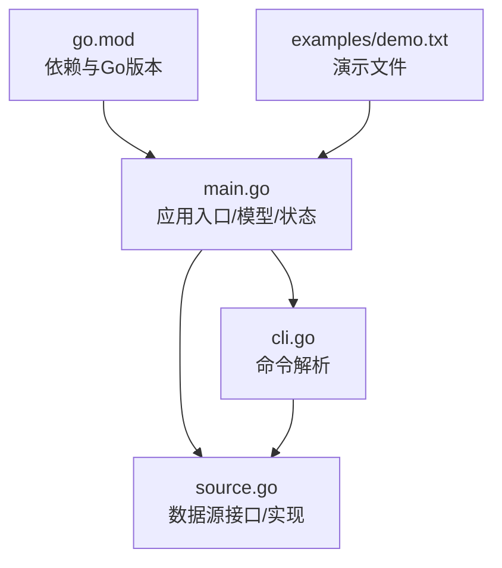
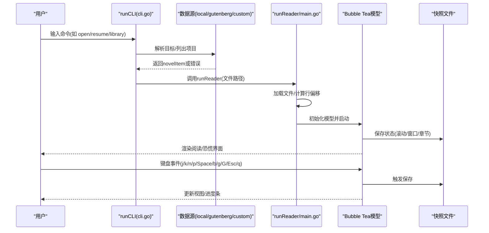
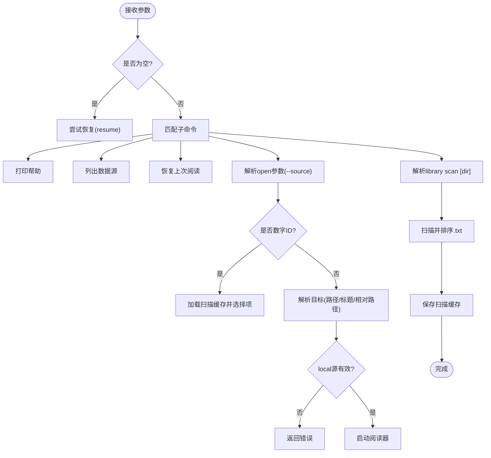
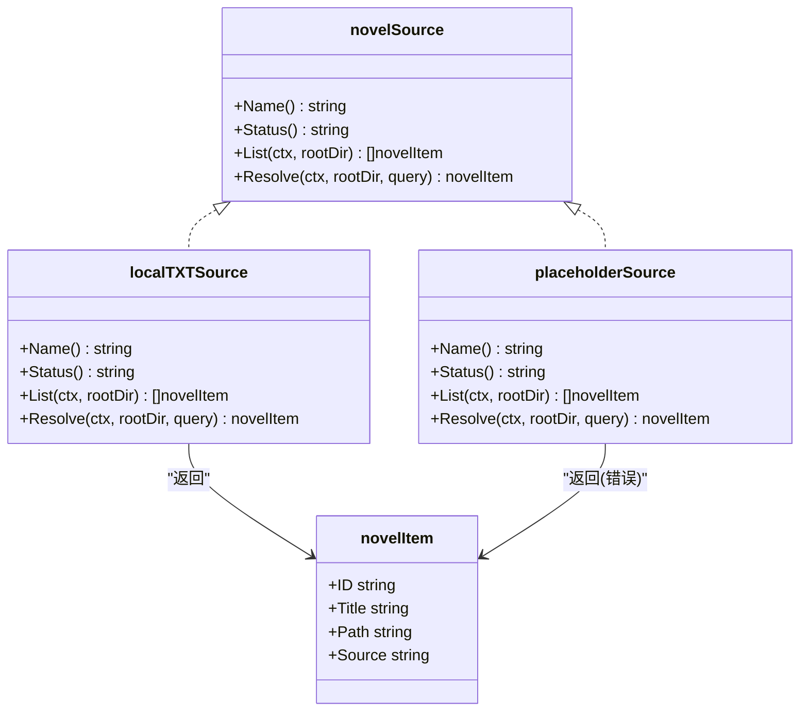
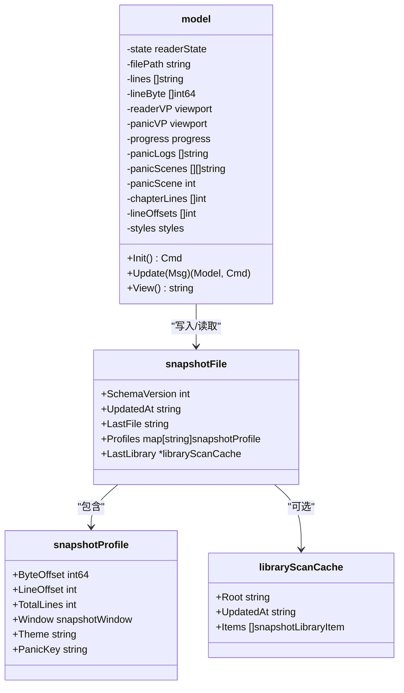
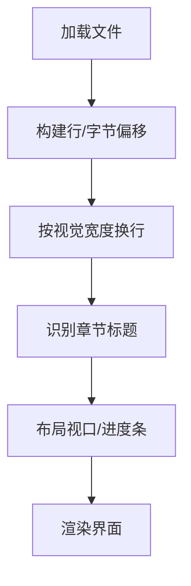
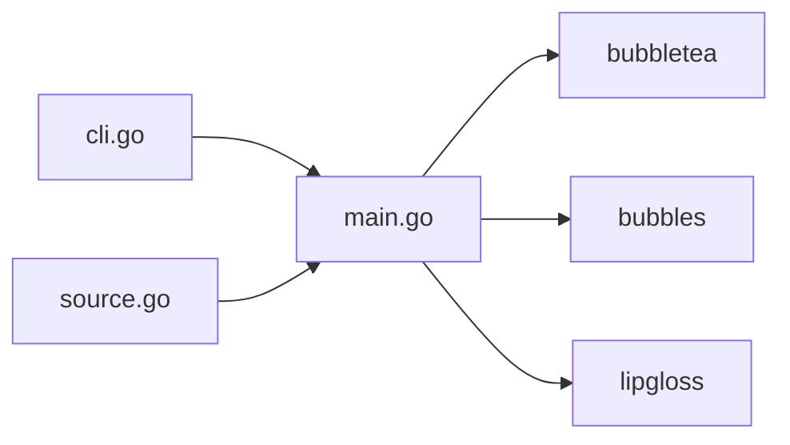

# 故障排除

<cite>
**本文引用的文件**
- [README.md](file://README.md)
- [USAGE.md](file://USAGE.md)
- [main.go](file://main.go)
- [cli.go](file://cli.go)
- [source.go](file://source.go)
- [go.mod](file://go.mod)
- [examples/demo.txt](file://examples/demo.txt)
</cite>

## 目录
1. [简介](#简介)
2. [项目结构](#项目结构)
3. [核心组件](#核心组件)
4. [架构总览](#架构总览)
5. [详细组件分析](#详细组件分析)
6. [依赖关系分析](#依赖关系分析)
7. [性能考虑](#性能考虑)
8. [故障排除指南](#故障排除指南)
9. [结论](#结论)
10. [附录](#附录)

## 简介
本指南面向novel-reader用户与维护者，系统性地梳理安装、运行、功能使用中的常见问题与解决方案，并提供调试方法、日志分析与性能优化建议。novel-reader是一个基于Go与Bubble Tea的命令行小说阅读器，具备本地TXT文件阅读、Boss Key（恐慌模式）、进度恢复与状态持久化等功能。

## 项目结构
项目采用简洁的单模块设计，主要文件与职责如下：
- main.go：应用入口、TUI模型、状态管理、文件加载、快照读写、章节识别与视口布局
- cli.go：命令解析与路由（help/sources/resume/open/library）
- source.go：数据源抽象与实现（local/gutenberg/custom占位）
- go.mod：Go版本与依赖声明
- examples/demo.txt：演示文本，用于验证基本功能
- README.md/USAGE.md：使用说明与常见问题

图表来源
- [main.go:1023-1028](file://main.go#L1023-L1028)
- [cli.go:13-44](file://cli.go#L13-L44)
- [source.go:132-138](file://source.go#L132-L138)
- [go.mod:1-34](file://go.mod#L1-34)

章节来源
- [main.go:1023-1028](file://main.go#L1023-L1028)
- [cli.go:13-44](file://cli.go#L13-L44)
- [source.go:132-138](file://source.go#L132-L138)
- [go.mod:1-34](file://go.mod#L1-34)

## 核心组件
- CLI命令层：负责解析用户输入，路由到具体功能（sources/resume/open/library）
- 数据源层：抽象novelSource接口，当前实现local，预留gutenberg/custom
- TUI模型层：基于Bubble Tea的状态机，管理阅读/恐慌两种模式、视口、进度条与样式
- 状态持久化层：快照文件（用户主目录优先，项目目录回退），记录最后文件、章节位置、窗口大小等
- 文本处理层：行偏移计算、视觉宽度换行、章节标题识别

章节来源
- [cli.go:13-44](file://cli.go#L13-L44)
- [source.go:22-27](file://source.go#L22-L27)
- [main.go:74-103](file://main.go#L74-L103)
- [main.go:629-711](file://main.go#L629-L711)

## 架构总览
下面的序列图展示了从命令行到TUI渲染的关键流程，以及错误处理与状态恢复路径。

图表来源
- [cli.go:68-122](file://cli.go#L68-L122)
- [source.go:34-111](file://source.go#L34-L111)
- [main.go:1011-1021](file://main.go#L1011-L1021)
- [main.go:629-711](file://main.go#L629-L711)

## 详细组件分析

### CLI命令与路由
- 命令类型：help/sources/resume/open/library
- 兼容模式：首个非子命令参数被视为open目标（向后兼容）
- 参数解析：支持--source local；其他预留源会返回“保留但未实现”的错误

图表来源
- [cli.go:13-44](file://cli.go#L13-L44)
- [cli.go:68-122](file://cli.go#L68-L122)
- [cli.go:124-156](file://cli.go#L124-L156)

章节来源
- [cli.go:13-44](file://cli.go#L13-L44)
- [cli.go:68-122](file://cli.go#L68-L122)
- [cli.go:124-156](file://cli.go#L124-L156)

### 数据源接口与实现
- novelSource接口：Name/Status/List/Resolve
- local实现：遍历目录，过滤.txt，相对路径ID，校验项目根范围
- 占位实现：gutenberg/custom返回“保留但未实现”错误

图表来源
- [source.go:22-27](file://source.go#L22-L27)
- [source.go:29-111](file://source.go#L29-L111)
- [source.go:113-126](file://source.go#L113-L126)
- [source.go:15-20](file://source.go#L15-L20)

章节来源
- [source.go:22-27](file://source.go#L22-L27)
- [source.go:29-111](file://source.go#L29-L111)
- [source.go:113-126](file://source.go#L113-L126)
- [source.go:15-20](file://source.go#L15-L20)

### TUI模型与状态持久化
- 模型状态：reading/panic两种模式
- 关键字段：文件路径、行内容与字节偏移、视口、进度条、章节索引、样式
- 快照结构：schema_version、updated_at、last_file、profiles、last_library_scan
- 写入策略：优先用户主目录，失败则回退到项目目录；原子写入避免损坏

图表来源
- [main.go:74-103](file://main.go#L74-L103)
- [main.go:35-68](file://main.go#L35-L68)
- [main.go:629-711](file://main.go#L629-L711)

章节来源
- [main.go:74-103](file://main.go#L74-L103)
- [main.go:35-68](file://main.go#L35-L68)
- [main.go:629-711](file://main.go#L629-L711)

### 文本处理与章节识别
- 行偏移与字节偏移：加载时计算，用于恢复精确位置
- 视觉宽度换行：根据终端字符宽度进行换行，避免截断
- 章节识别：支持中文“第X章”与英文“Chapter X”，去除注释前缀干扰

图表来源
- [main.go:870-897](file://main.go#L870-L897)
- [main.go:926-967](file://main.go#L926-L967)
- [main.go:523-543](file://main.go#L523-L543)

章节来源
- [main.go:870-897](file://main.go#L870-L897)
- [main.go:926-967](file://main.go#L926-L967)
- [main.go:523-543](file://main.go#L523-L543)

## 依赖关系分析
- Go版本：1.24.2
- 关键依赖：bubbletea、bubbles、lipgloss
- 间接依赖：term/ansi相关库，用于终端交互与颜色处理

图表来源
- [go.mod:5-9](file://go.mod#L5-L9)
- [main.go:3-19](file://main.go#L3-L19)

章节来源
- [go.mod:1-34](file://go.mod#L1-L34)
- [main.go:3-19](file://main.go#L3-L19)

## 性能考虑
- I/O缓冲：Scanner使用较大缓冲，适合大文件
- 视口计算：按需重建行偏移数组，避免重复计算
- 保存策略：滚动/窗口变化/状态切换时触发保存，减少频繁落盘
- 恐慌模式日志：随机间隔更新，避免过度刷新

章节来源
- [main.go:877-896](file://main.go#L877-L896)
- [main.go:576-585](file://main.go#L576-L585)
- [main.go:622-627](file://main.go#L622-L627)
- [main.go:614-620](file://main.go#L614-L620)

## 故障排除指南

### 一、安装与构建问题
- 症状：构建失败或找不到依赖
  - 检查Go版本是否满足要求（1.24.2）
  - 执行依赖清理与重新拉取：go mod tidy
  - 如网络受限，可配置代理或更换镜像源
- 症状：找不到novel-reader命令
  - 使用go run . <命令>直接运行
  - 或执行go build生成可执行文件后使用

章节来源
- [go.mod:3](file://go.mod#L3)
- [USAGE.md:16-28](file://USAGE.md#L16-L28)

### 二、运行时错误
- 症状：启动提示“no resume snapshot found”
  - 说明：尚未打开过任何文件或快照文件不存在
  - 处理：先使用open命令打开一个txt文件
- 症状：open提示“file is outside project root”
  - 说明：local源仅允许项目目录内的txt文件
  - 处理：将小说文件放入项目目录或其子目录后再执行open
- 症状：open提示“source xxx is reserved only”
  - 说明：当前版本尚未实现预留数据源（如gutenberg/custom）
  - 处理：使用--source local或省略--source参数
- 症状：open提示“no scan cache found”
  - 说明：直接使用open <序号>但没有扫描缓存
  - 处理：先执行library scan，再使用open <序号>

章节来源
- [USAGE.md:191-223](file://USAGE.md#L191-L223)
- [cli.go:54-66](file://cli.go#L54-L66)
- [cli.go:102-115](file://cli.go#L102-L115)
- [source.go:87-96](file://source.go#L87-L96)
- [source.go:120-126](file://source.go#L120-L126)

### 三、功能异常
- 症状：中文显示异常或乱码
  - 建议：确认文本文件为UTF-8编码；更换支持完整Unicode的终端与字体
- 症状：运行后没有看到边框或颜色
  - 原因：终端主题或配色能力差异
  - 处理：更换终端主题（如Dracula/Monokai）；确认终端支持256色或True Color
- 症状：章节跳转不准确
  - 说明：章节识别依赖标题行格式
  - 处理：确保章节标题符合“第X章”或“Chapter X”格式；必要时调整NOVEL_READER_CHAPTER_ALIGN

章节来源
- [USAGE.md:224-235](file://USAGE.md#L224-L235)
- [USAGE.md:148-156](file://USAGE.md#L148-L156)
- [main.go:523-543](file://main.go#L523-L543)

### 四、状态持久化与恢复
- 症状：恢复失败或文件缺失
  - 检查快照文件路径：优先~/.config/dev-env-status.json，失败回退至项目目录的.novel-reader-state.json
  - 确保快照文件可读；若被破坏，删除后重新打开文件即可重建
- 症状：恢复位置不正确
  - 检查profiles中记录的LineOffset/ByteOffset是否合理
  - 小文件或换行符差异可能导致偏移误差，属于正常现象

章节来源
- [USAGE.md:168-189](file://USAGE.md#L168-L189)
- [main.go:677-711](file://main.go#L677-L711)
- [main.go:847-868](file://main.go#L847-L868)

### 五、日志分析与问题定位
- 日志位置：快照文件与项目扫描缓存文件
  - 用户主目录快照：~/.config/dev-env-status.json
  - 项目目录快照：.novel-reader-state.json
  - 扫描缓存：~/.config/.novel-reader-scan.json（优先）或项目目录下的.novel-reader-scan.json
- 分析要点：
  - LastFile：最后一次打开的文件路径
  - Profiles[file].LineOffset/ByteOffset：恢复位置
  - LastLibrary：最近一次扫描的目录与条目
- 定位步骤：
  1) 确认快照文件是否存在且可读
  2) 检查LastFile是否指向有效路径
  3) 校验Profiles中记录的偏移是否在文件范围内
  4) 对于library scan问题，检查.novel-reader-scan.json内容与扫描目录权限

章节来源
- [USAGE.md:168-189](file://USAGE.md#L168-L189)
- [main.go:677-711](file://main.go#L677-L711)
- [main.go:808-845](file://main.go#L808-L845)

### 六、性能问题诊断与优化
- 症状：大文件打开缓慢
  - 现象：Scanner缓冲已设置较大值，但仍可能受磁盘I/O影响
  - 优化：尽量使用SSD；减少同时打开的文件数量
- 症状：滚动卡顿
  - 现象：视口重算与换行计算开销
  - 优化：适当增大终端宽度；避免过窄视口导致频繁换行
- 症状：频繁保存导致磁盘占用高
  - 现象：滚动/窗口变化/状态切换均会触发保存
  - 优化：减少不必要的操作；等待程序稳定后再关闭

章节来源
- [main.go:877-896](file://main.go#L877-L896)
- [main.go:576-585](file://main.go#L576-L585)
- [main.go:622-627](file://main.go#L622-L627)

### 七、用户反馈与常见问题
- 问：如何查看可用数据源？
  - 答：执行novel-reader sources
- 问：如何恢复上次阅读？
  - 答：执行novel-reader resume；若无快照，先open一个文件
- 问：如何扫描项目中的txt文件？
  - 答：执行novel-reader library scan；随后可用open <序号>打开
- 问：如何兼容旧用法直接打开文件？
  - 答：novel-reader examples/demo.txt等价于open examples/demo.txt

章节来源
- [USAGE.md:95-114](file://USAGE.md#L95-L114)
- [USAGE.md:68-72](file://USAGE.md#L68-L72)
- [USAGE.md:77-94](file://USAGE.md#L77-L94)
- [USAGE.md:105-114](file://USAGE.md#L105-L114)

### 八、技术支持与社区资源
- 获取途径：
  - 仓库：项目根目录README.md与USAGE.md提供了完整的使用说明与常见问题
  - 依赖：bubbletea、bubbles、lipgloss等官方文档与社区讨论
- 建议：
  - 提交问题前先确认版本与环境（Go版本、终端类型）
  - 提供最小可复现步骤与相关日志文件路径

章节来源
- [README.md:1-46](file://README.md#L1-L46)
- [USAGE.md:1-248](file://USAGE.md#L1-L248)
- [go.mod:5-9](file://go.mod#L5-L9)

## 结论
本指南围绕novel-reader的安装、运行、功能使用与故障排查进行了系统性梳理。通过理解CLI路由、数据源接口、TUI模型与状态持久化机制，用户可以更高效地定位问题并采取针对性措施。对于性能问题，建议从I/O、视口计算与保存频率三个维度进行优化。遇到疑难问题时，请参考日志与快照文件，结合本文提供的诊断步骤逐步排查。

## 附录
- 快照文件结构概览
  - schema_version：快照版本
  - updated_at：更新时间
  - last_file：最后打开的文件路径
  - profiles：每个文件的行/字节偏移、窗口大小、主题与恐慌键
  - last_library_scan：最近一次扫描的根目录与条目列表

章节来源
- [main.go:35-68](file://main.go#L35-L68)
- [main.go:629-711](file://main.go#L629-L711)