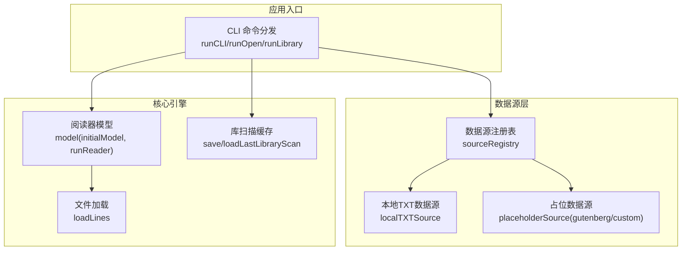
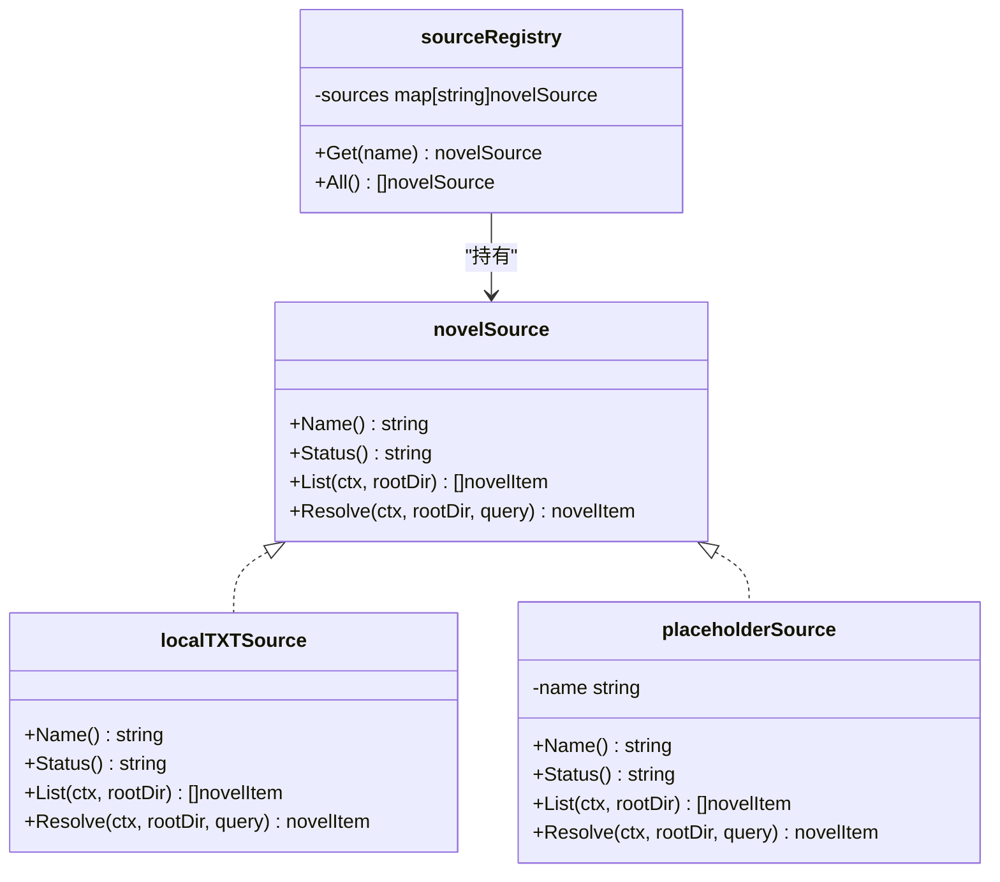
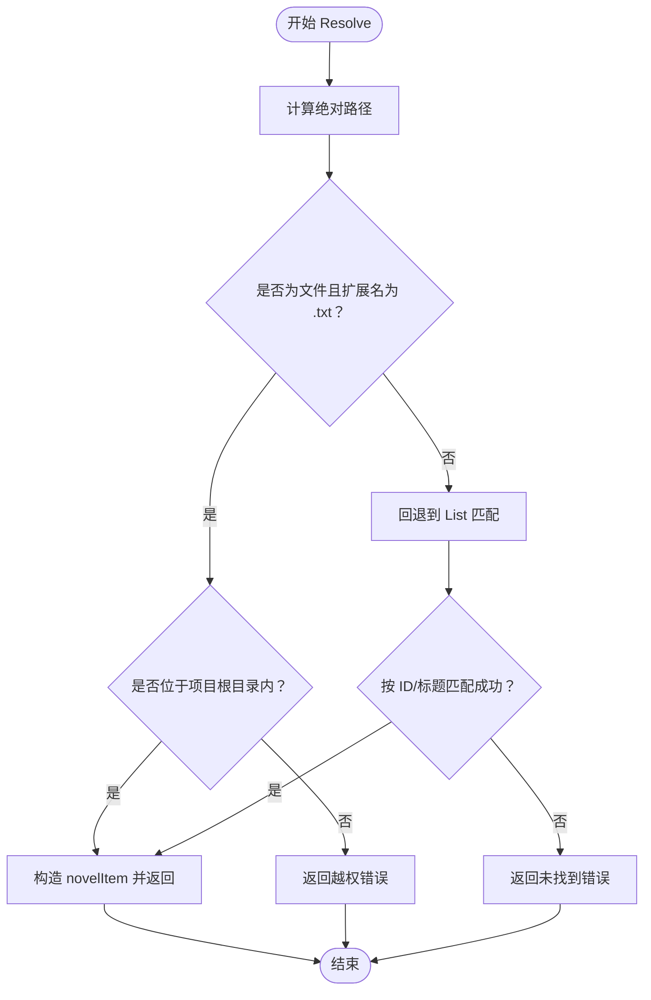
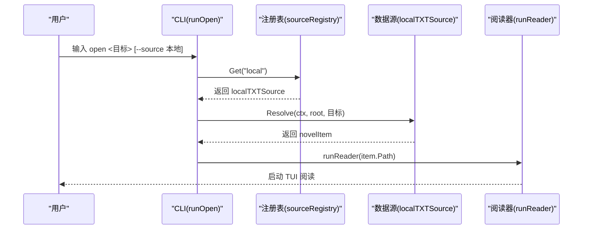
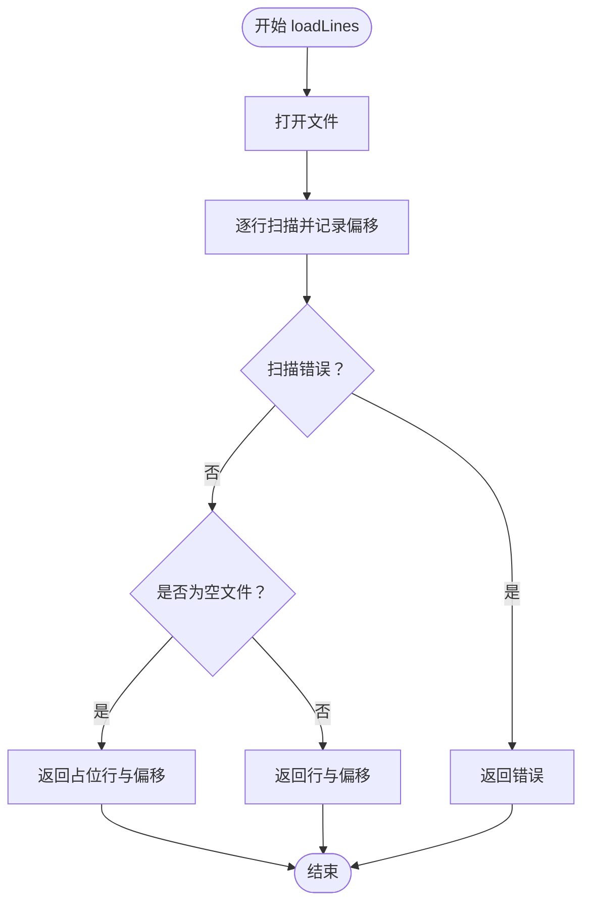
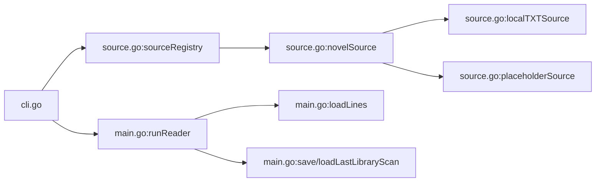

# 数据源管理

<cite>
**本文引用的文件**
- [main.go](file://main.go)
- [source.go](file://source.go)
- [cli.go](file://cli.go)
- [README.md](file://README.md)
- [USAGE.md](file://USAGE.md)
- [examples/demo.txt](file://examples/demo.txt)
</cite>

## 目录
1. [简介](#简介)
2. [项目结构](#项目结构)
3. [核心组件](#核心组件)
4. [架构总览](#架构总览)
5. [详细组件分析](#详细组件分析)
6. [依赖关系分析](#依赖关系分析)
7. [性能考量](#性能考量)
8. [故障排查指南](#故障排查指南)
9. [结论](#结论)
10. [附录](#附录)

## 简介
本文件面向 novel-reader 的数据源管理系统，系统性阐述数据源接口设计模式与抽象层实现，深入解析本地 TXT 文件数据源的文件扫描、内容解析与缓存机制；并提供扩展新数据源的开发指南（接口实现、注册机制与集成模式）、生命周期管理与错误处理策略，以及最佳实践与实际示例路径。

novel-reader 当前实现聚焦于本地 TXT 数据源，同时预留了 Gutenberg 与自定义数据源的扩展点，采用“接口 + 注册表”的模式实现多数据源解耦与可插拔扩展。

## 项目结构
- main.go：TUI 阅读器主流程、状态持久化、行与可视行映射、内容包装与渲染、库扫描缓存读写等核心逻辑。
- source.go：数据源接口定义、本地 TXT 实现、占位实现与注册表。
- cli.go：命令行入口与子命令分发，负责解析用户输入、调用数据源与运行阅读器。
- examples/demo.txt：示例 TXT 文档，用于演示章节识别与阅读。
- README.md / USAGE.md：功能概览与使用说明。

图表来源
- [cli.go:13-44](file://cli.go#L13-L44)
- [source.go:128-159](file://source.go#L128-L159)
- [source.go:29-111](file://source.go#L29-L111)
- [main.go:1011-1021](file://main.go#L1011-L1021)
- [main.go:870-897](file://main.go#L870-L897)
- [main.go:742-795](file://main.go#L742-L795)

章节来源
- [README.md:1-46](file://README.md#L1-L46)
- [USAGE.md:1-248](file://USAGE.md#L1-L248)

## 核心组件
- 数据源接口 novelSource：统一抽象，包含名称、状态、列举与解析方法。
- 本地 TXT 数据源 localTXTSource：实现文件扫描、路径解析与安全校验。
- 占位数据源 placeholderSource：为预留扩展点提供占位实现。
- 数据源注册表 sourceRegistry：集中注册与查询数据源实例。
- CLI 子命令：sources、open、library、resume 等，驱动数据源工作流。
- 阅读器与缓存：读取 TXT 内容、建立行偏移索引、持久化阅读状态与库扫描缓存。

章节来源
- [source.go:22-27](file://source.go#L22-L27)
- [source.go:29-111](file://source.go#L29-L111)
- [source.go:113-126](file://source.go#L113-L126)
- [source.go:128-159](file://source.go#L128-L159)
- [cli.go:13-44](file://cli.go#L13-L44)
- [main.go:870-897](file://main.go#L870-L897)
- [main.go:742-795](file://main.go#L742-L795)

## 架构总览
数据源管理采用“接口 + 注册表 + CLI 驱动”的分层架构：
- 接口层：定义统一规范，屏蔽具体实现差异。
- 实现层：本地 TXT 与预留占位实现。
- 注册层：集中管理可用数据源，提供按名称检索。
- 驱动层：CLI 子命令根据用户意图选择数据源并调用。
- 核心层：阅读器与缓存模块负责内容加载与状态持久化。

图表来源
- [source.go:22-27](file://source.go#L22-L27)
- [source.go:29-111](file://source.go#L29-L111)
- [source.go:113-126](file://source.go#L113-L126)
- [source.go:128-159](file://source.go#L128-L159)

## 详细组件分析

### 数据源接口与抽象层
- 设计要点
  - 统一方法签名：Name、Status、List、Resolve，便于 CLI 与核心引擎以一致方式调用。
  - 状态区分：active 与 reserved，用于标识可用与预留扩展。
  - 返回值 novelItem：包含唯一 ID、标题、绝对路径与来源标识，便于后续缓存与定位。
- 错误处理
  - 占位实现返回统一错误，提示“保留但未实现”，避免误用。
  - 注册表查询未知名称时返回错误，便于 CLI 提示用户。

章节来源
- [source.go:15-27](file://source.go#L15-L27)
- [source.go:113-126](file://source.go#L113-L126)
- [source.go:140-146](file://source.go#L140-L146)

### 本地 TXT 数据源实现
- 文件扫描（List）
  - 绝对路径规范化，遍历目录树，忽略 .git 目录。
  - 仅收集 .txt 文件，生成 novelItem 列表，按相对路径排序。
- 资源解析（Resolve）
  - 支持绝对路径与相对路径两种输入，均转换为绝对路径进行校验。
  - 严格限制在项目根目录内，防止越权访问。
  - 若直接路径无效，回退到按 ID 或标题匹配的模糊查找。
- 安全与边界
  - isWithinRoot 校验路径合法性，避免目录穿越。
  - 统一使用 ToSlash 规范化路径分隔符，提升跨平台一致性。

图表来源
- [source.go:74-111](file://source.go#L74-L111)
- [source.go:161-168](file://source.go#L161-L168)

章节来源
- [source.go:34-72](file://source.go#L34-L72)
- [source.go:74-111](file://source.go#L74-L111)
- [source.go:161-168](file://source.go#L161-L168)

### 数据源注册表与 CLI 集成
- 注册表
  - 默认注册 local、gutenberg、custom 三类数据源。
  - Get 返回具体实现，All 返回按名称排序的列表。
- CLI 集成
  - sources：打印可用数据源及其状态。
  - open：解析 --source 参数，默认 local；支持按序号、路径或标题打开。
  - library：扫描本地 TXT 并输出序号列表，保存扫描缓存以便后续按序号打开。
  - resume：从快照恢复上次阅读文件。

图表来源
- [cli.go:68-122](file://cli.go#L68-L122)
- [source.go:140-146](file://source.go#L140-L146)
- [source.go:74-111](file://source.go#L74-L111)
- [main.go:1011-1021](file://main.go#L1011-L1021)

章节来源
- [cli.go:46-52](file://cli.go#L46-L52)
- [cli.go:68-122](file://cli.go#L68-L122)
- [cli.go:124-156](file://cli.go#L124-L156)
- [source.go:128-159](file://source.go#L128-L159)

### 内容加载与缓存机制
- 内容加载（loadLines）
  - 使用带缓冲的 Scanner 逐行读取，记录每行字节偏移，便于快速定位与进度计算。
  - 空文件返回占位行，保证 UI 正常显示。
- 可视行映射
  - 字符宽度按终端样式计算，实现准确的可视行数统计与双向映射。
- 库扫描缓存
  - 优先写入用户配置目录快照文件，失败则回退到项目目录缓存文件。
  - 支持按根目录与更新时间缓存，便于后续 open <序号> 直接打开。

图表来源
- [main.go:870-897](file://main.go#L870-L897)

章节来源
- [main.go:870-897](file://main.go#L870-L897)
- [main.go:742-795](file://main.go#L742-L795)
- [main.go:797-845](file://main.go#L797-L845)

### 生命周期管理与错误处理策略
- 生命周期
  - 初始化：CLI 解析参数 -> 获取数据源 -> 解析资源 -> 加载内容 -> 创建阅读器模型 -> 启动 TUI。
  - 运行期：按键事件驱动阅读器视口滚动与章节跳转，周期性保存状态。
  - 结束：退出时保存快照与库扫描缓存。
- 错误处理
  - 保留数据源：统一返回“保留但未实现”错误，避免误导。
  - 路径越权：明确提示“文件在项目根目录外”，引导用户调整文件位置。
  - 未找到：按 ID/标题匹配失败时返回“未找到”错误，CLI 提示用户重新输入。
  - 缓存缺失：按序号打开前若无扫描缓存，提示先执行 library scan。

章节来源
- [source.go:13-13](file://source.go#L13)
- [source.go:86-97](file://source.go#L86-L97)
- [cli.go:98-100](file://cli.go#L98-L100)
- [cli.go:106-115](file://cli.go#L106-L115)
- [main.go:622-667](file://main.go#L622-L667)
- [main.go:742-795](file://main.go#L742-L795)

## 依赖关系分析
- 组件耦合
  - CLI 依赖注册表与数据源接口，不直接依赖具体实现，保持高内聚低耦合。
  - 阅读器依赖内容加载与缓存模块，负责 UI 渲染与状态持久化。
- 外部依赖
  - Bubble Tea TUI 框架、lipgloss 样式库、标准库（os、path/filepath、bufio、json 等）。
- 循环依赖
  - 未发现循环导入；接口与实现分离清晰。

图表来源
- [cli.go:13-44](file://cli.go#L13-L44)
- [source.go:128-159](file://source.go#L128-L159)
- [source.go:22-27](file://source.go#L22-L27)
- [main.go:1011-1021](file://main.go#L1011-L1021)
- [main.go:870-897](file://main.go#L870-L897)
- [main.go:742-795](file://main.go#L742-L795)

## 性能考量
- I/O 与内存
  - Scanner 带缓冲读取，减少系统调用次数；行偏移数组按需构建，避免重复计算。
  - 可视行映射采用预计算与二分搜索，提高滚动与跳章效率。
- 缓存策略
  - 库扫描缓存按根目录与更新时间缓存，避免重复扫描。
  - 快照文件采用原子写（临时文件 + 重命名），降低损坏风险。
- UI 渲染
  - 内容包装按可视宽度计算，避免超宽行导致的重排成本。

章节来源
- [main.go:870-897](file://main.go#L870-L897)
- [main.go:742-795](file://main.go#L742-L795)
- [main.go:622-667](file://main.go#L622-L667)

## 故障排查指南
- “无恢复快照”或“恢复文件缺失”
  - 原因：尚未打开过任何文件或快照文件不存在。
  - 处理：先使用 open 指定 TXT 文件，再执行 resume。
- “文件在项目根目录外”
  - 原因：local 源限制只能读取项目目录内的 txt 文件。
  - 处理：将小说文件放入项目目录或其子目录后再 open。
- “数据源保留仅限”
  - 原因：使用了 gutenberg/custom 等预留数据源。
  - 处理：改用 --source local 或省略 --source。
- “无扫描缓存”
  - 原因：直接使用 open <序号> 但未执行 library scan。
  - 处理：先执行 library scan，再使用序号打开。
- “中文显示异常或乱码”
  - 建议：确认文件为 UTF-8 编码，更换支持完整 Unicode 的终端与字体。
- “运行后没有边框或颜色”
  - 原因：终端主题或配色能力差异。
  - 处理：更换终端主题（如 Dracula/Monokai），确认终端支持 256 色或 True Color。

章节来源
- [USAGE.md:191-248](file://USAGE.md#L191-L248)

## 结论
novel-reader 的数据源管理以接口抽象为核心，结合注册表实现多数据源解耦与可扩展性。本地 TXT 数据源提供了稳健的文件扫描、安全解析与缓存机制，CLI 层通过统一的命令语义驱动数据源工作流。未来可在保留接口不变的前提下，无缝接入更多数据源类型（如 EPUB、网络源等），并持续完善缓存与错误处理策略。

## 附录

### 扩展新数据源开发指南
- 实现 novelSource 接口
  - Name/Status：返回数据源标识与状态字符串。
  - List：扫描并返回 novelItem 列表，注意排序与路径规范化。
  - Resolve：支持多种查询方式（ID/标题/路径），并进行安全校验。
- 注册新数据源
  - 在注册表中添加新条目，确保名称唯一且与 CLI 使用一致。
- 集成模式
  - CLI 通过 --source 参数选择数据源，或默认使用 local。
  - open 命令支持按序号、路径或标题打开，Resolve 优先精确匹配，失败回退模糊匹配。
- 最佳实践
  - 严格限制路径范围，避免越权访问。
  - 对外部输入进行标准化（大小写、分隔符、编码）。
  - 提供清晰的错误消息，便于用户自助修复。
  - 保持 List/Resolve 的幂等性与可预测性，利于缓存与调试。

章节来源
- [source.go:22-27](file://source.go#L22-L27)
- [source.go:128-159](file://source.go#L128-L159)
- [cli.go:68-122](file://cli.go#L68-L122)

### 示例与用法
- 直接打开示例 TXT
  - 使用 open 子命令打开 examples/demo.txt。
- 恢复上次阅读
  - 使用 resume 子命令恢复上次打开的文件。
- 扫描本地书库并按序号打开
  - 先执行 library scan，再使用 open <序号>。
- 查看数据源列表
  - 使用 sources 子命令查看可用数据源及其状态。

章节来源
- [USAGE.md:38-128](file://USAGE.md#L38-L128)
- [examples/demo.txt:1-15](file://examples/demo.txt#L1-L15)