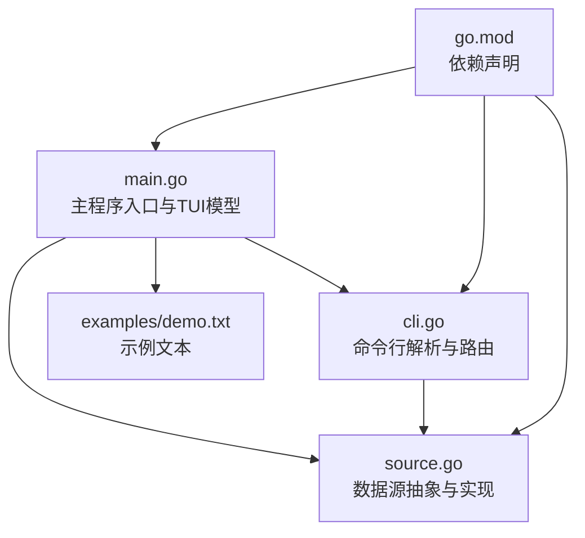
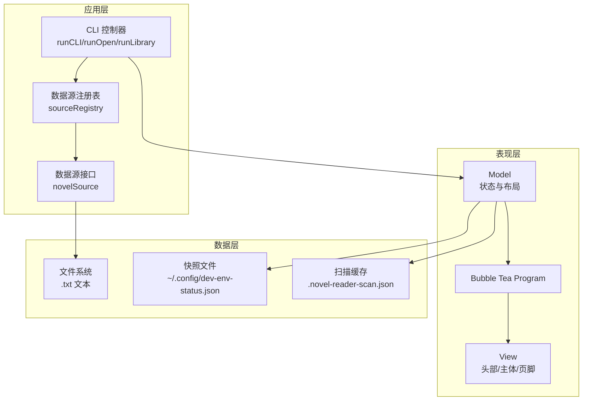
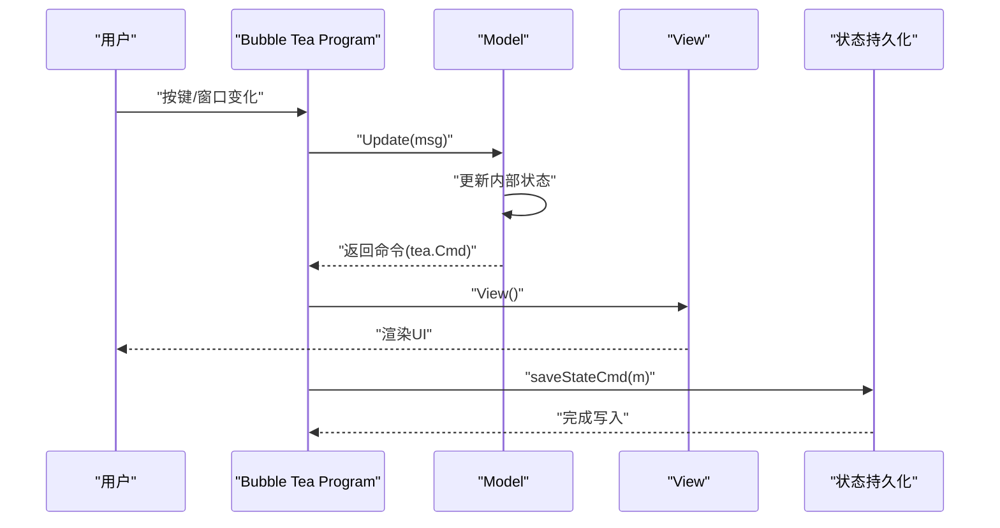
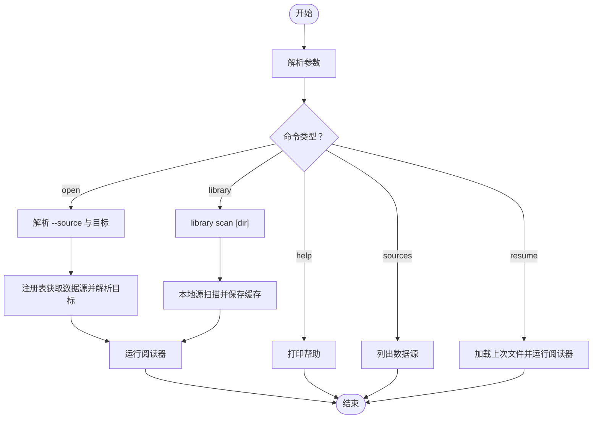
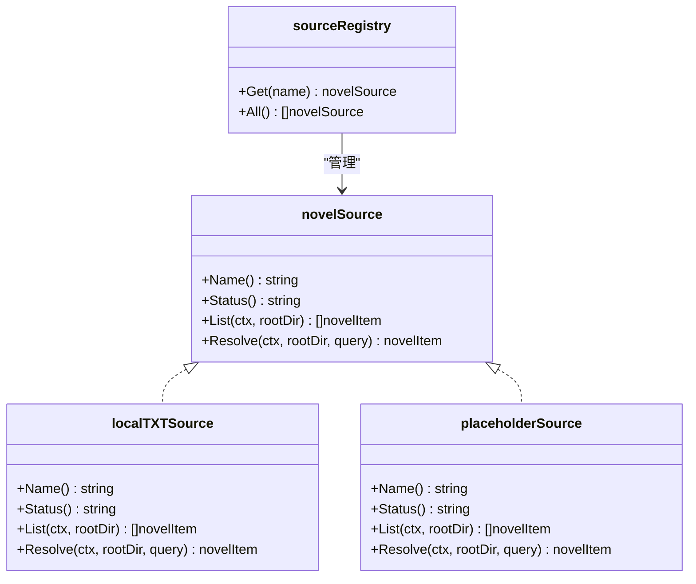
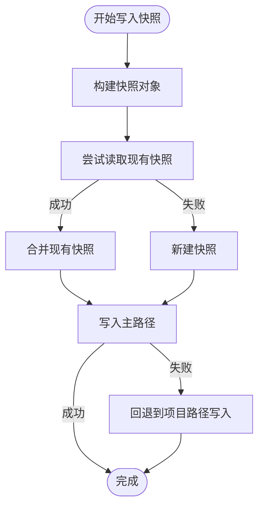
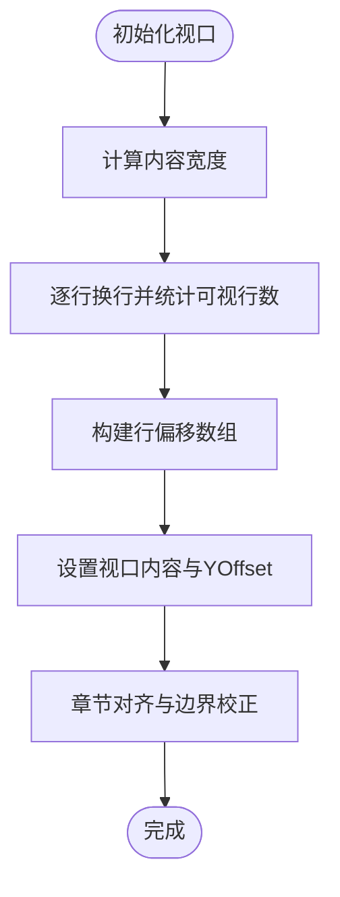
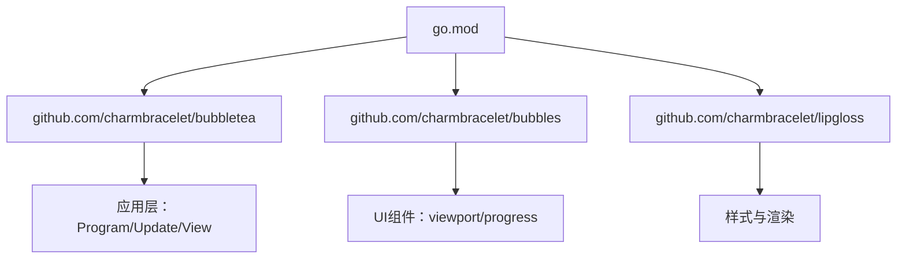

# 架构设计

<cite>
**本文引用的文件**
- [README.md](file://README.md)
- [USAGE.md](file://USAGE.md)
- [main.go](file://main.go)
- [cli.go](file://cli.go)
- [source.go](file://source.go)
- [go.mod](file://go.mod)
- [examples/demo.txt](file://examples/demo.txt)
</cite>

## 目录
1. [简介](#简介)
2. [项目结构](#项目结构)
3. [核心组件](#核心组件)
4. [架构总览](#架构总览)
5. [详细组件分析](#详细组件分析)
6. [依赖分析](#依赖分析)
7. [性能考虑](#性能考虑)
8. [故障排查指南](#故障排查指南)
9. [结论](#结论)
10. [附录](#附录)

## 简介
本项目是一个基于 Go 语言与 Bubble Tea 的命令行小说阅读器（CLI + TUI）。其目标是在终端中提供“低存在感”的阅读体验：阅读界面伪装为开发环境的状态输出，支持 Boss Key（Esc/q）快速切换到伪日志模式，并具备自动保存与恢复阅读进度的能力。系统采用子命令式 CLI，支持本地 TXT 文本源，默认扫描项目目录及其子目录中的 .txt 文件；同时预留了 gutenberg/custom 数据源扩展点。

本架构文档将从系统架构、分层设计、模块化组织、组件交互关系、Elm 架构模式的应用（Model-Update-View 分离与状态管理）、设计模式（工厂/注册表、观察者等）、技术决策权衡与约束条件、系统边界、数据流向与集成模式等方面进行深入解析，并提供相应的架构图与组件关系图。

## 项目结构
项目采用扁平化的单模块组织，核心入口位于根目录，主要由以下文件构成：
- CLI 入口与主程序：main.go
- 命令行解析与路由：cli.go
- 数据源抽象与实现：source.go
- 依赖声明：go.mod
- 示例文本：examples/demo.txt
- 项目说明与使用文档：README.md、USAGE.md

**图表来源**
- [main.go:1023-1028](file://main.go#L1023-L1028)
- [cli.go:13-44](file://cli.go#L13-L44)
- [source.go:1-169](file://source.go#L1-L169)

**章节来源**
- [README.md:1-46](file://README.md#L1-L46)
- [USAGE.md:1-248](file://USAGE.md#L1-L248)
- [go.mod:1-34](file://go.mod#L1-L34)

## 核心组件
- CLI 控制器：负责解析用户输入、路由到具体命令、调用数据源与运行器。
- 模型（Model）：封装阅读状态、视口布局、章节索引、样式、恐慌模式日志等。
- 更新函数（Update）：处理键盘事件、窗口大小变化、恐慌模式日志更新、状态保存等。
- 视图（View）：根据当前状态渲染头部、主体与页脚，支持阅读与恐慌两种模式。
- 数据源（novelSource）：抽象本地 TXT 源与预留扩展源，提供 List/Resolve 能力。
- 注册表（sourceRegistry）：集中管理数据源实例，提供获取与列举能力。
- 状态持久化：读写快照文件，支持主路径与回退路径，原子写入避免损坏。
- 视口与排版：计算可视行数、行偏移映射、文本换行宽度，保证阅读体验。

**章节来源**
- [main.go:74-103](file://main.go#L74-L103)
- [main.go:211-292](file://main.go#L211-L292)
- [main.go:352-412](file://main.go#L352-L412)
- [source.go:22-27](file://source.go#L22-L27)
- [source.go:128-138](file://source.go#L128-L138)
- [main.go:629-711](file://main.go#L629-L711)

## 架构总览
系统采用“命令行入口 + Bubble Tea TUI + 数据源抽象 + 状态持久化”的分层架构：
- 表现层：Bubble Tea Program 驱动 Model-Update-View 渲染，支持 Alt Screen 与视口滚动。
- 应用层：CLI 解析与路由，调用数据源解析与运行阅读器。
- 数据层：本地 TXT 文件读取与扫描缓存，支持项目级与用户级快照。
- 扩展层：数据源接口与注册表，预留 gutenberg/custom 扩展点。

**图表来源**
- [main.go:1011-1021](file://main.go#L1011-L1021)
- [cli.go:68-122](file://cli.go#L68-L122)
- [source.go:128-138](file://source.go#L128-L138)
- [main.go:629-711](file://main.go#L629-L711)

## 详细组件分析

### Elm 架构模式在项目中的应用
本项目严格遵循 Elm 架构的核心思想：Model-Update-View 分离与纯函数式的状态管理。
- Model：封装所有状态，包括文件路径、行内容与字节偏移、视口、章节索引、样式、恐慌模式日志、窗口尺寸等。
- Update：接收消息（键盘、窗口大小、恐慌 tick、保存状态），在纯函数中更新 Model 并返回副作用命令（tea.Cmd）。
- View：根据 Model 渲染 UI，区分阅读模式与恐慌模式，动态生成进度条与元信息。

**图表来源**
- [main.go:211-292](file://main.go#L211-L292)
- [main.go:352-412](file://main.go#L352-L412)
- [main.go:622-627](file://main.go#L622-L627)

**章节来源**
- [main.go:74-103](file://main.go#L74-L103)
- [main.go:211-292](file://main.go#L211-L292)
- [main.go:352-412](file://main.go#L352-L412)

### CLI 组件与命令路由
CLI 采用子命令式设计，支持 help/sources/resume/open/library 等命令。核心流程如下：
- 解析参数，识别是否为帮助、数据源列表、恢复、打开文件或扫描库。
- 对于 open 命令，解析 --source 参数与目标（路径/ID/标题），通过注册表获取数据源并解析目标。
- 对于 library scan，调用本地源扫描并保存扫描缓存，后续可通过 open <序号> 快速打开。

**图表来源**
- [cli.go:13-44](file://cli.go#L13-L44)
- [cli.go:68-122](file://cli.go#L68-L122)
- [cli.go:124-156](file://cli.go#L124-L156)

**章节来源**
- [cli.go:13-44](file://cli.go#L13-L44)
- [cli.go:68-122](file://cli.go#L68-L122)
- [cli.go:124-156](file://cli.go#L124-L156)

### 数据源抽象与注册表
系统定义了统一的数据源接口 novelSource，包含名称、状态、List 与 Resolve 方法。当前实现包括：
- local：活跃状态，扫描项目目录中的 .txt 文件，支持绝对/相对路径与 ID/标题解析。
- gutenberg/custom：占位状态，预留扩展点，尚未实现。

注册表 sourceRegistry 提供按名称获取与列举所有数据源的能力，采用 map 结构存储，便于扩展新源。

**图表来源**
- [source.go:22-27](file://source.go#L22-L27)
- [source.go:29-111](file://source.go#L29-L111)
- [source.go:113-126](file://source.go#L113-L126)
- [source.go:128-138](file://source.go#L128-L138)

**章节来源**
- [source.go:22-27](file://source.go#L22-L27)
- [source.go:29-111](file://source.go#L29-L111)
- [source.go:113-126](file://source.go#L113-L126)
- [source.go:128-138](file://source.go#L128-L138)

### 状态持久化与快照
系统通过快照文件记录阅读进度、窗口尺寸、主题与恐慌键等信息。写入采用原子操作（临时文件写入后重命名），优先写入用户配置目录，失败时回退到项目目录。扫描缓存同样支持用户级与项目级回退路径。

**图表来源**
- [main.go:629-667](file://main.go#L629-L667)
- [main.go:669-711](file://main.go#L669-L711)
- [main.go:742-788](file://main.go#L742-L788)
- [main.go:789-845](file://main.go#L789-L845)

**章节来源**
- [main.go:629-667](file://main.go#L629-L667)
- [main.go:669-711](file://main.go#L669-L711)
- [main.go:742-788](file://main.go#L742-L788)
- [main.go:789-845](file://main.go#L789-L845)

### 视口与排版算法
阅读器通过视口（viewport）实现高效的滚动与换行。核心算法包括：
- 计算可视宽度与内容宽度，避免 ANSI 前缀影响视觉宽度。
- 将原始行按视觉宽度进行换行，统计每行的可视高度。
- 维护行偏移数组，实现源行与可视偏移之间的双向映射。
- 根据当前可视偏移计算当前源行，确保章节跳转与进度条准确。

**图表来源**
- [main.go:294-329](file://main.go#L294-L329)
- [main.go:576-585](file://main.go#L576-L585)
- [main.go:587-597](file://main.go#L587-L597)
- [main.go:922-959](file://main.go#L922-L959)

**章节来源**
- [main.go:294-329](file://main.go#L294-L329)
- [main.go:576-585](file://main.go#L576-L585)
- [main.go:587-597](file://main.go#L587-L597)
- [main.go:922-959](file://main.go#L922-L959)

### 设计模式应用
- 工厂/注册表模式：通过 sourceRegistry 集中管理数据源实例，新增数据源只需实现 novelSource 接口并注册即可，符合开闭原则。
- 观察者模式：Bubble Tea 的 Update/View 流程天然体现观察者思想，外部事件（键盘、窗口变化）通过消息驱动模型更新与视图刷新。
- 策略模式：不同数据源（local/gutenberg/custom）以相同接口提供 List/Resolve 能力，调用方无需感知具体实现差异。
- 原子写入：状态持久化采用临时文件写入后重命名的方式，避免部分写入导致的文件损坏，提升可靠性。

**章节来源**
- [source.go:128-138](file://source.go#L128-L138)
- [main.go:669-711](file://main.go#L669-L711)

## 依赖分析
系统依赖 Bubble Tea 生态组件，包括 bubbles（viewport、progress）、bubbletea（Program）、lipgloss（样式渲染）。这些依赖为 TUI 的交互与渲染提供了基础能力。

**图表来源**
- [go.mod:5-9](file://go.mod#L5-L9)

**章节来源**
- [go.mod:5-9](file://go.mod#L5-L9)

## 性能考虑
- 文本扫描与缓冲：使用 bufio.Scanner 并设置较大的初始缓冲区，提高大文件读取效率。
- 可视行映射：预构建行偏移数组，降低每次滚动时的计算成本。
- 换行宽度计算：使用 lipgloss 的宽度计算，避免 ANSI 前缀干扰，保证换行准确性。
- 状态保存：采用异步保存命令（saveStateCmd），在用户交互间隙触发，减少阻塞。
- 恐慌模式日志：使用随机间隔的 tick 命令控制日志更新频率，避免过度刷新。

**章节来源**
- [main.go:870-897](file://main.go#L870-L897)
- [main.go:576-585](file://main.go#L576-L585)
- [main.go:614-620](file://main.go#L614-L620)
- [main.go:622-627](file://main.go#L622-L627)

## 故障排查指南
- 无恢复快照：当执行 resume 时提示“no resume snapshot found”，需先使用 open 打开任意文件。
- open 提示“file is outside project root”：当前版本 local 源仅允许读取项目目录内的 .txt 文件，请将文件放入项目目录或其子目录。
- open 提示“source xxx is reserved only”：当前版本 gutenberg/custom 仅为预留接口，使用 --source local 或省略该参数。
- open 提示“no scan cache found”：当你直接使用 open <序号> 时，需要先执行 library scan 生成缓存。
- 中文显示异常或乱码：确认文本文件为 UTF-8 编码，并更换支持完整 Unicode 的终端与字体。
- 运行后没有边框或颜色：更换终端主题（如 Dracula/Monokai），确认终端支持 256 色或 True Color。

**章节来源**
- [USAGE.md:191-235](file://USAGE.md#L191-L235)

## 结论
novel-reader 通过清晰的分层设计与 Elm 架构模式，实现了简洁而强大的命令行小说阅读体验。CLI 层负责命令解析与路由，应用层通过数据源抽象与注册表实现可扩展性，表现层利用 Bubble Tea 的响应式模型与视口组件提供流畅的阅读与恐慌模式切换。状态持久化采用原子写入策略，提升了可靠性。未来可在配置文件、EPUB 支持、异步保存与测试覆盖等方面进一步完善。

## 附录
- 示例文本：examples/demo.txt
- 项目说明与使用文档：README.md、USAGE.md