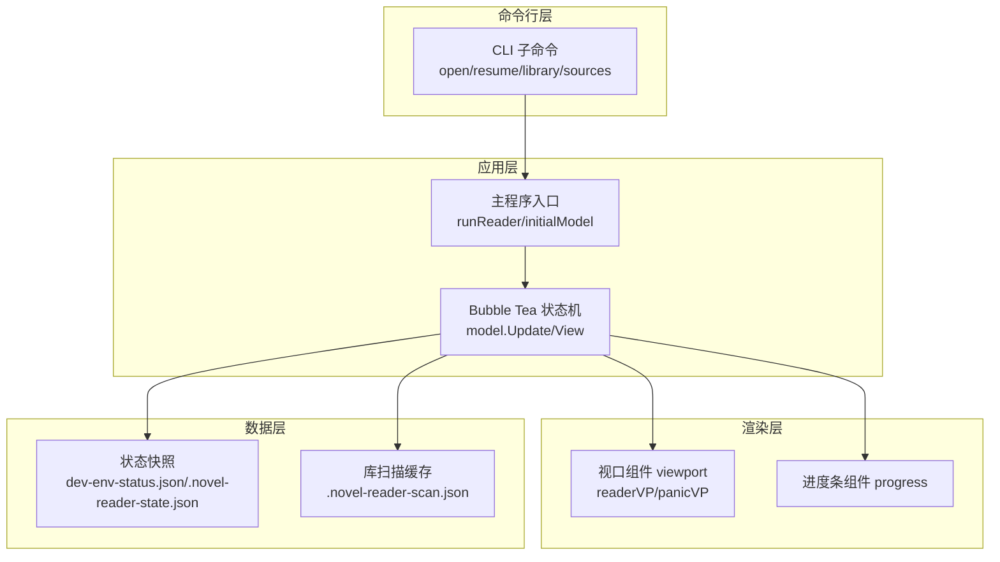
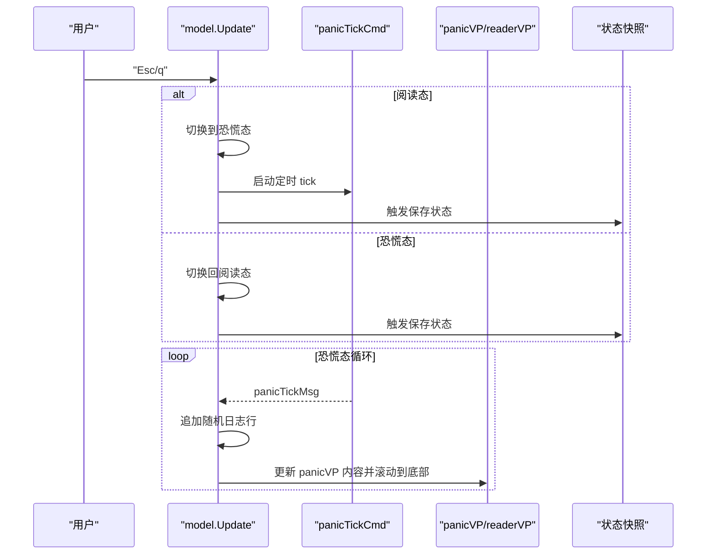
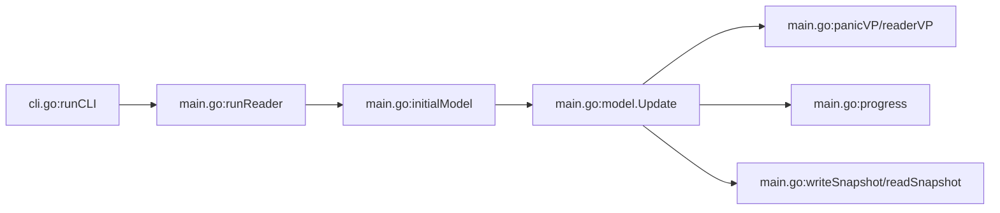

# Boss Key 功能

<cite>
**本文引用的文件**
- [main.go](file://main.go)
- [cli.go](file://cli.go)
- [source.go](file://source.go)
- [README.md](file://README.md)
- [USAGE.md](file://USAGE.md)
- [demo.txt](file://examples/demo.txt)
</cite>

## 目录
1. [简介](#简介)
2. [项目结构](#项目结构)
3. [核心组件](#核心组件)
4. [架构总览](#架构总览)
5. [详细组件分析](#详细组件分析)
6. [依赖关系分析](#依赖关系分析)
7. [性能考量](#性能考量)
8. [故障排查指南](#故障排查指南)
9. [结论](#结论)
10. [附录](#附录)

## 简介
本文件聚焦 novel-reader 的 Boss Key（恐慌键）功能，系统性阐述伪装日志系统的设计与实现，包括：
- 日志场景模板设计与多场景切换
- 随机日志生成算法与时间间隔控制
- 实时更新机制与 UI 渲染
- 状态切换逻辑（阅读态 ↔ 恐慌态）
- 多种日志场景的实现（npm 警告、测试运行、Docker 构建）
- 动态生成算法与用户体验优化
- 扩展新场景的方法与最佳实践

## 项目结构
novel-reader 采用命令行 + TUI 的架构，Boss Key 功能位于主程序入口与 Bubble Tea 状态机中，结合 CLI 子命令完成文件打开、恢复与库扫描。

图表来源
- [main.go:1011-1021](file://main.go#L1011-L1021)
- [main.go:137-180](file://main.go#L137-L180)
- [main.go:211-292](file://main.go#L211-L292)
- [main.go:294-329](file://main.go#L294-L329)
- [main.go:629-667](file://main.go#L629-L667)
- [main.go:742-764](file://main.go#L742-L764)

章节来源
- [main.go:1011-1021](file://main.go#L1011-L1021)
- [main.go:137-180](file://main.go#L137-L180)
- [main.go:211-292](file://main.go#L211-L292)
- [main.go:294-329](file://main.go#L294-L329)
- [main.go:629-667](file://main.go#L629-L667)
- [main.go:742-764](file://main.go#L742-L764)

## 核心组件
- 状态枚举与模型
  - 状态：阅读态、恐慌态
  - 模型字段：文件路径、行内容、视口、进度条、恐慌日志缓冲、场景集合、当前场景索引、随机数生成器、样式集等
- 恐慌场景模板
  - 内置三类场景：npm 警告、Go 测试、Docker 构建
- 实时更新机制
  - 定时消息 panicTickMsg 驱动日志追加
  - 随机时间间隔控制日志刷新节奏
- UI 渲染
  - 阅读态：伪装注释文本（双斜杠前缀 + 文本换行）
  - 恐慌态：实时日志流 + 伪装进度条（“Compiling assets”）

章节来源
- [main.go:21-26](file://main.go#L21-L26)
- [main.go:74-103](file://main.go#L74-L103)
- [main.go:182-205](file://main.go#L182-L205)
- [main.go:274-280](file://main.go#L274-L280)
- [main.go:337-350](file://main.go#L337-L350)
- [main.go:352-412](file://main.go#L352-L412)

## 架构总览
Boss Key 的工作流由按键事件驱动，通过状态机在阅读态与恐慌态之间切换；恐慌态启用定时器持续追加日志，同时渲染为终端伪日志界面。

图表来源
- [main.go:211-292](file://main.go#L211-L292)
- [main.go:614-620](file://main.go#L614-L620)
- [main.go:337-350](file://main.go#L337-L350)

## 详细组件分析

### 状态机与按键处理
- 初始状态：阅读态
- 切换条件：
  - 阅读态按 Esc/q → 进入恐慌态，启动定时 tick
  - 恐慌态按 Esc/q → 返回阅读态
- 恐慌态额外按键：
  - r：切换下一个日志场景
  - c：清空当前日志缓冲
- 状态保存：
  - 任意状态切换、窗口大小变化、滚动操作均触发状态保存

章节来源
- [main.go:211-235](file://main.go#L211-L235)
- [main.go:274-292](file://main.go#L274-L292)
- [main.go:622-627](file://main.go#L622-L627)

### 日志场景模板与随机生成
- 场景集合：buildPanicScenes 返回三类场景
  - npm 警告：包含弃用警告、安装包、审计结果等
  - Go 测试：包含测试用例运行与通过信息
  - Docker 构建：包含构建阶段、完成与导出信息
- 随机生成算法：
  - 从当前场景中随机选择一行基础日志
  - 以当前时间戳格式化为“[HH:mm:ss] 基础日志”
  - 追加至日志缓冲，超过上限截断保留最新记录
  - 更新 panicVP 内容并滚动到底部
- 时间间隔控制：
  - nextPanicTickCmd 生成 220–480ms 的随机间隔，降低日志刷新的突兀感

章节来源
- [main.go:182-205](file://main.go#L182-L205)
- [main.go:337-350](file://main.go#L337-L350)
- [main.go:614-620](file://main.go#L614-L620)

### 实时更新机制与 UI 渲染
- 阅读态渲染：
  - 将原始文本按终端宽度进行视觉换行，添加“// ”前缀，伪装为注释
  - 计算视觉行偏移，保证滚动与真实行号一致
- 恐慌态渲染：
  - 渲染 panicVP 的日志流
  - 底部进度条标签根据状态切换为“Compiling assets”或“Running verification pipeline”，百分比随日志行数变化
- 头部与页脚：
  - 头部模式随状态切换
  - 页脚显示按键提示、文件与章节信息、当前进度

章节来源
- [main.go:294-329](file://main.go#L294-L329)
- [main.go:899-920](file://main.go#L899-L920)
- [main.go:352-412](file://main.go#L352-L412)

### 状态切换逻辑与保持/恢复策略
- 切换条件与流程：
  - 阅读态 → 恐慌态：按键触发，启动定时 tick，保存状态
  - 恐慌态 → 阅读态：按键触发，停止定时 tick，保存状态
- 状态保持与恢复：
  - 状态快照保存文件路径、行偏移、字节偏移、窗口尺寸、主题与恐慌键信息
  - 启动时从用户目录或项目目录加载快照，恢复阅读位置
- 章节跳转与对齐：
  - 阅读态支持章节跳转，章节标题识别支持中英文
  - 章节对齐策略可配置，保证章节标题出现在可视区域顶部

章节来源
- [main.go:629-667](file://main.go#L629-L667)
- [main.go:713-740](file://main.go#L713-L740)
- [main.go:459-505](file://main.go#L459-L505)
- [main.go:523-543](file://main.go#L523-L543)

### 多种日志场景实现
- npm 警告场景
  - 模拟弃用模块、安装包、审计结果等典型输出
- Go 测试场景
  - 模拟测试用例运行、通过信息与整体耗时
- Docker 构建场景
  - 模拟构建阶段、完成与镜像导出过程

章节来源
- [main.go:182-205](file://main.go#L182-L205)

### 动态生成算法与用户体验优化
- 动态生成算法
  - 从场景集合中随机选择基础日志行
  - 以当前时间戳拼接，形成“实时日志”效果
  - 控制日志缓冲上限，避免内存膨胀
- 用户体验优化
  - 随机时间间隔降低日志刷新的机械感
  - 恐慌态底部进度条与标签提示，增强沉浸感
  - 头部模式切换与页脚元信息，提升可读性

章节来源
- [main.go:337-350](file://main.go#L337-L350)
- [main.go:614-620](file://main.go#L614-L620)
- [main.go:387-391](file://main.go#L387-L391)

### 扩展新场景的方法
- 新增场景步骤
  - 在场景集合中添加新的场景数组（字符串切片）
  - 在恐慌态按键处理中增加场景切换逻辑（如 r 键）
  - 如需清空日志，可在现有 c 键逻辑基础上扩展
- 最佳实践
  - 场景内容应贴近真实开发工具输出，提高可信度
  - 控制场景数量与长度，避免过度冗长影响性能
  - 保持时间戳一致性，增强真实感

章节来源
- [main.go:182-205](file://main.go#L182-L205)
- [main.go:226-235](file://main.go#L226-L235)

## 依赖关系分析
- 组件耦合
  - model 对 panicVP、readerVP、progress 的依赖清晰，职责单一
  - 状态保存与库扫描缓存通过独立函数解耦
- 外部依赖
  - Bubble Tea（tea）用于状态机与渲染
  - Charm Bubbles（viewport、progress）用于视口与进度条
  - Lipgloss 用于样式与文本换行计算
- 关键依赖链
  - CLI 子命令 → runReader → initialModel → Bubble Tea 程序 → model.Update/View

图表来源
- [cli.go:13-44](file://cli.go#L13-L44)
- [main.go:1011-1021](file://main.go#L1011-L1021)
- [main.go:137-180](file://main.go#L137-L180)
- [main.go:211-292](file://main.go#L211-L292)
- [main.go:629-667](file://main.go#L629-L667)

章节来源
- [cli.go:13-44](file://cli.go#L13-L44)
- [main.go:1011-1021](file://main.go#L1011-L1021)
- [main.go:137-180](file://main.go#L137-L180)
- [main.go:211-292](file://main.go#L211-L292)
- [main.go:629-667](file://main.go#L629-L667)

## 性能考量
- 日志缓冲上限
  - 通过 maxPanicLogLines 控制日志行数，避免无限增长
- 视觉换行与偏移
  - 通过 lineOffsets 与 wrappedVisualLineCount 减少滚动计算复杂度
- 随机时间间隔
  - nextPanicTickCmd 使用随机间隔，降低 CPU 占用峰值
- 状态保存
  - 采用原子写入（临时文件 + 重命名）减少文件损坏风险

章节来源
- [main.go:30-33](file://main.go#L30-L33)
- [main.go:576-585](file://main.go#L576-L585)
- [main.go:961-967](file://main.go#L961-L967)
- [main.go:669-675](file://main.go#L669-L675)

## 故障排查指南
- 无法进入恐慌态
  - 检查按键是否为 Esc 或 q
  - 确认当前状态为阅读态
- 日志不更新
  - 检查是否处于恐慌态
  - 确认定时 tick 是否正常触发
- 日志过多导致卡顿
  - 调整 maxPanicLogLines 或使用 c 清空日志
- 状态无法恢复
  - 检查快照文件是否存在与可读
  - 确认 resume 命令指向的文件路径有效

章节来源
- [main.go:211-235](file://main.go#L211-L235)
- [main.go:274-280](file://main.go#L274-L280)
- [main.go:629-667](file://main.go#L629-L667)
- [main.go:847-856](file://main.go#L847-L856)

## 结论
novel-reader 的 Boss Key 功能通过简洁的状态机与高效的渲染机制，实现了从阅读态到恐慌态的无缝切换。伪装日志系统以场景模板为基础，结合随机生成与时间间隔控制，营造出真实的开发工具输出效果。配合状态快照与章节跳转，既保证了用户体验，也提供了良好的可扩展性。未来可进一步引入配置文件与更多场景模板，以满足不同使用场景的需求。

## 附录
- 示例文件
  - [demo.txt](file://examples/demo.txt) 展示了章节标题与 Boss Key 的交互效果
- CLI 与数据源
  - CLI 子命令 open/resume/library/sources 完成文件打开与恢复
  - 数据源接口预留 gutenberg/custom，当前仅 local 可用

章节来源
- [demo.txt:1-15](file://examples/demo.txt#L1-L15)
- [cli.go:13-44](file://cli.go#L13-L44)
- [source.go:128-138](file://source.go#L128-L138)