# 小说阅读引擎

<cite>
**本文档引用的文件**
- [main.go](file://main.go)
- [cli.go](file://cli.go)
- [source.go](file://source.go)
- [README.md](file://README.md)
- [USAGE.md](file://USAGE.md)
- [examples/demo.txt](file://examples/demo.txt)
</cite>

## 目录
1. [简介](#简介)
2. [项目结构](#项目结构)
3. [核心组件](#核心组件)
4. [架构概览](#架构概览)
5. [详细组件分析](#详细组件分析)
6. [依赖关系分析](#依赖关系分析)
7. [性能考虑](#性能考虑)
8. [故障排除指南](#故障排除指南)
9. [结论](#结论)
10. [附录](#附录)

## 简介

novel-reader是一个基于Go语言和Bubble Tea框架的命令行小说阅读器。该项目采用"低存在感"的设计理念，将阅读界面伪装成开发环境的状态输出，提供沉浸式的阅读体验。系统支持章节识别与导航、进度保存与恢复、键盘快捷键系统等功能。

该系统的核心特点包括：
- 基于Bubble Tea的TUI界面框架
- 智能的章节识别算法
- 实时的进度保存机制
- Boss Key恐慌模式
- 多种数据源支持

## 项目结构

项目采用简洁的模块化设计，主要包含以下核心文件：

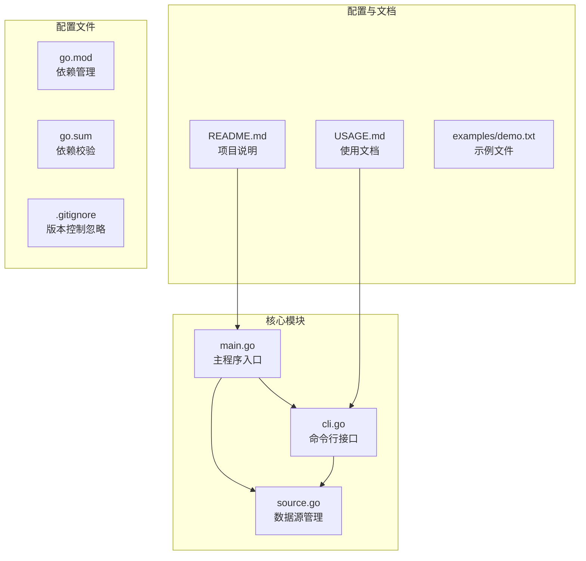

**图表来源**
- [main.go:1-50](file://main.go#L1-L50)
- [cli.go:1-30](file://cli.go#L1-L30)
- [source.go:1-30](file://source.go#L1-L30)

**章节来源**
- [main.go:1-50](file://main.go#L1-L50)
- [README.md:1-46](file://README.md#L1-L46)

## 核心组件

novel-reader系统由多个相互协作的核心组件构成，每个组件都有明确的职责分工：

### 主要组件架构

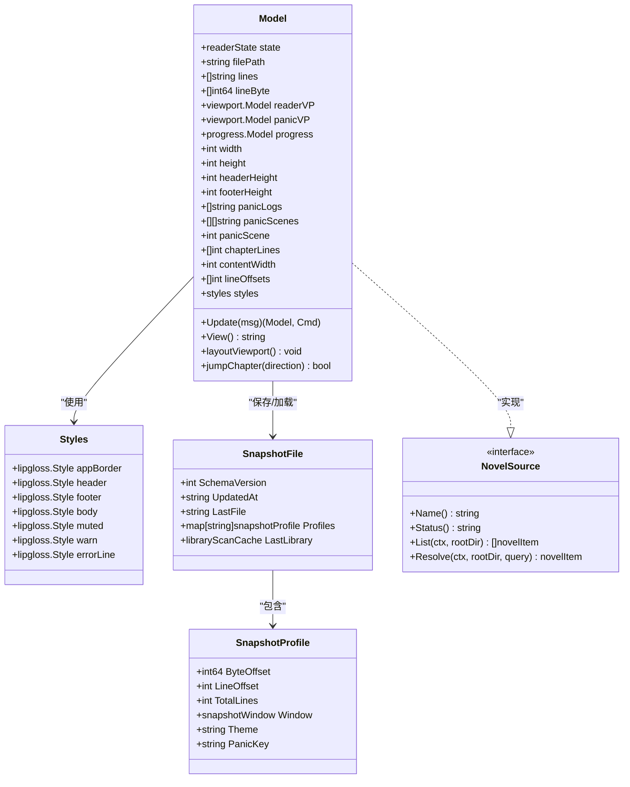

**图表来源**
- [main.go:74-103](file://main.go#L74-L103)
- [main.go:110-135](file://main.go#L110-L135)
- [main.go:35-68](file://main.go#L35-L68)
- [source.go:22-27](file://source.go#L22-L27)

### 组件职责分配

1. **Model组件**：负责整个应用的状态管理和业务逻辑
2. **Styles组件**：管理UI样式和外观
3. **SnapshotFile组件**：处理进度保存和恢复
4. **novelSource接口**：定义数据源抽象层
5. **CLI组件**：提供命令行交互接口

**章节来源**
- [main.go:74-103](file://main.go#L74-L103)
- [source.go:22-27](file://source.go#L22-L27)

## 架构概览

novel-reader采用分层架构设计，从底层到顶层依次为：数据层、业务逻辑层、界面层和交互层。

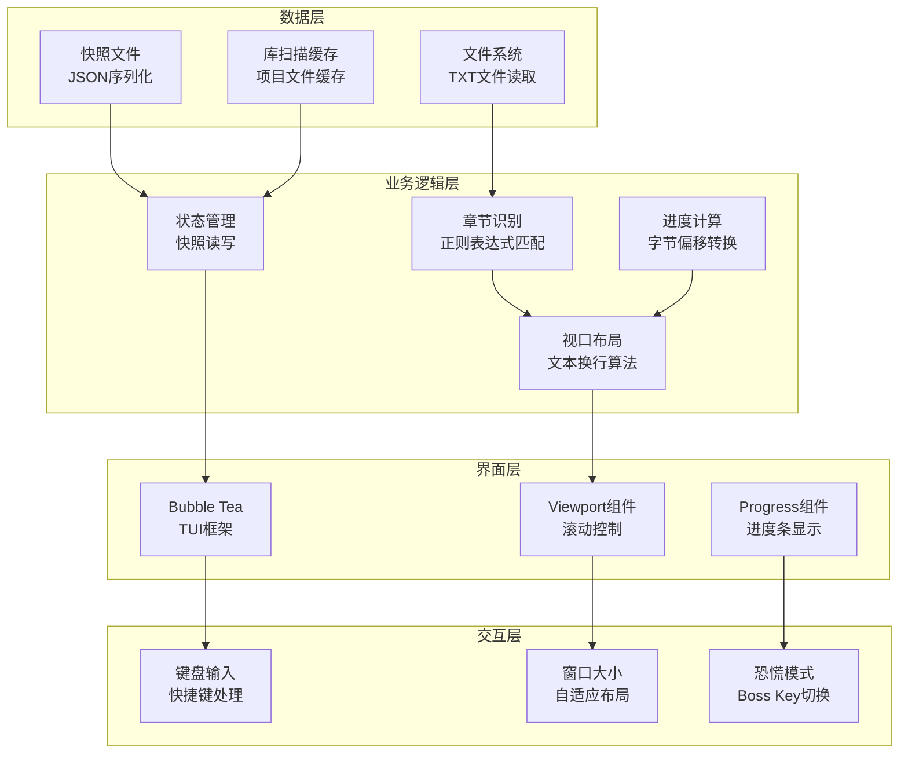

**图表来源**
- [main.go:870-897](file://main.go#L870-L897)
- [main.go:1011-1021](file://main.go#L1011-L1021)
- [main.go:207-292](file://main.go#L207-L292)

## 详细组件分析

### 文本渲染与显示机制

novel-reader实现了复杂的文本渲染系统，包括viewport模型、智能换行算法和视觉行偏移计算。

#### Viewport模型实现

Viewport模型是novel-reader的核心渲染组件，负责处理文本的滚动显示和布局计算。

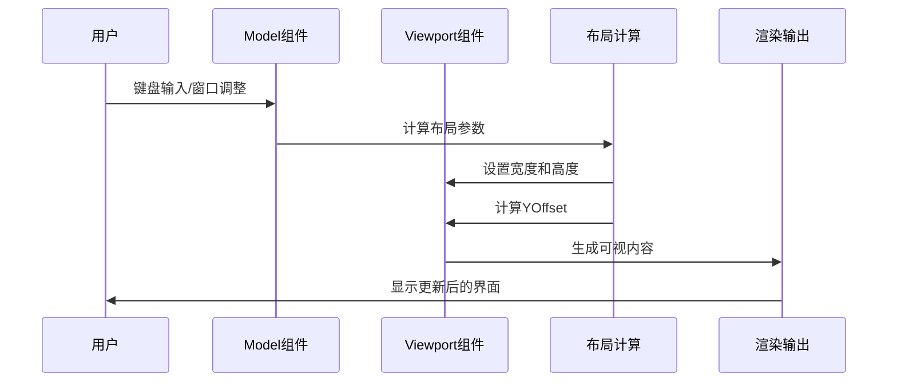

**图表来源**
- [main.go:294-329](file://main.go#L294-L329)
- [main.go:331-335](file://main.go#L331-L335)

##### 关键实现特性

1. **动态布局计算**：根据终端窗口大小动态调整viewport尺寸
2. **智能偏移计算**：将源行偏移转换为视觉行偏移
3. **内容包装**：支持Unicode字符的正确宽度计算

#### 文本换行算法

novel-reader实现了精确的文本换行算法，能够正确处理各种字符集和宽度计算。

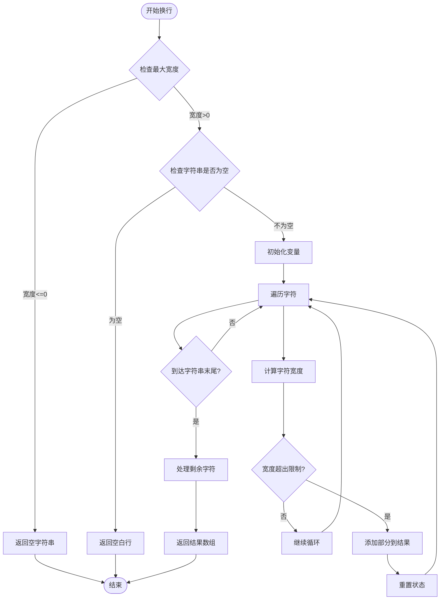

**图表来源**
- [main.go:926-959](file://main.go#L926-L959)
- [main.go:961-967](file://main.go#L961-L967)

##### 换行算法特性

1. **Unicode安全**：使用`lipgloss.Width()`进行正确的字符宽度计算
2. **智能断词**：避免在单词中间截断
3. **性能优化**：使用StringBuilder减少内存分配

#### 视觉行偏移计算

视觉行偏移计算是novel-reader的核心算法之一，负责将源文件的行号转换为viewport中的可视位置。

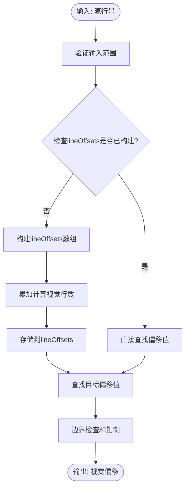

**图表来源**
- [main.go:576-585](file://main.go#L576-L585)
- [main.go:587-597](file://main.go#L587-L597)

**章节来源**
- [main.go:294-329](file://main.go#L294-L329)
- [main.go:926-959](file://main.go#L926-L959)
- [main.go:576-597](file://main.go#L576-L597)

### 章节识别与导航系统

novel-reader实现了智能的章节识别和导航功能，支持中英文章节标题的自动检测。

#### 章节识别算法

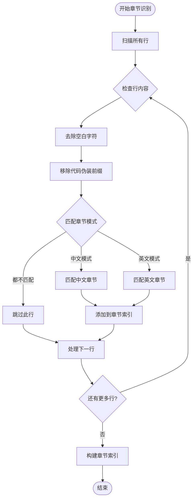

**图表来源**
- [main.go:523-531](file://main.go#L523-L531)
- [main.go:533-543](file://main.go#L533-L543)

##### 正则表达式匹配规则

系统使用两个主要的正则表达式模式来识别章节标题：

1. **中文章节模式**：`^第\s*[0-9零一二三四五六七八九十百千两〇]+\s*[章回节卷]\s*.*`
2. **英文章节模式**：`(?i)^chapter\s+[0-9ivxlcdm]+.*`

这些模式能够识别：
- 中文数字（一、二、三、十、百等）
- 英文罗马数字（i、ii、iii、iv等）
- 章节标识符（章、回、节、卷）

#### 章节索引构建

章节索引构建过程涉及多个优化策略：

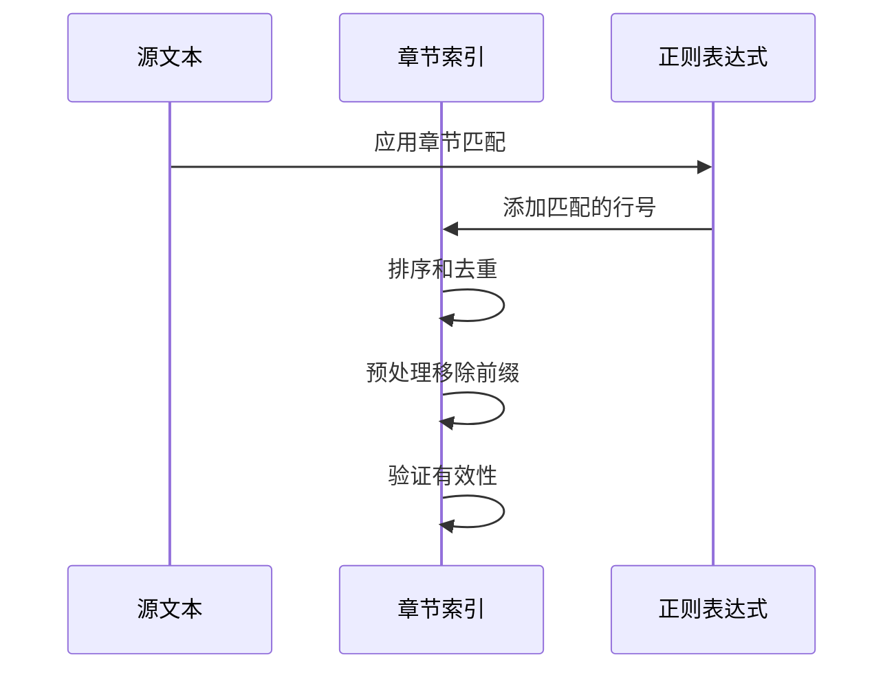

**图表来源**
- [main.go:523-531](file://main.go#L523-L531)
- [main.go:533-543](file://main.go#L533-L543)

#### 章节跳转逻辑

章节跳转功能提供了灵活的导航机制：

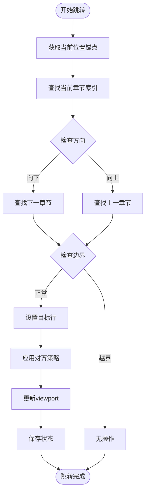

**图表来源**
- [main.go:459-505](file://main.go#L459-L505)
- [main.go:498-504](file://main.go#L498-L504)

**章节来源**
- [main.go:523-543](file://main.go#L523-L543)
- [main.go:459-505](file://main.go#L459-L505)

### 进度保存与恢复机制

novel-reader实现了完整的进度保存和恢复系统，确保用户能够在不同会话间无缝继续阅读。

#### 快照文件格式

快照文件采用JSON格式存储，包含以下关键信息：

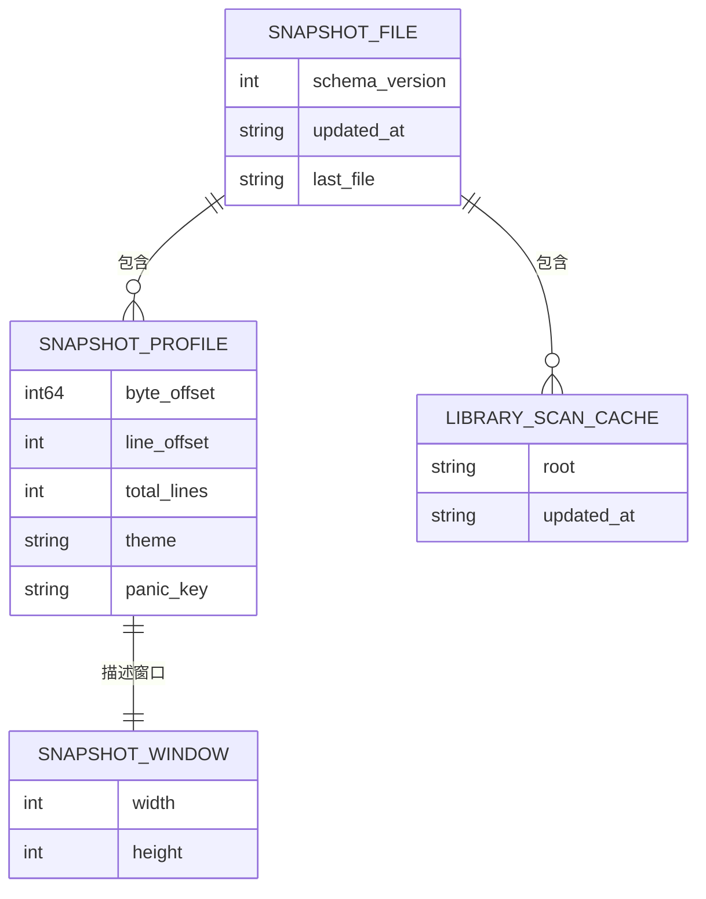

**图表来源**
- [main.go:35-68](file://main.go#L35-L68)
- [main.go:43-54](file://main.go#L43-L54)

##### 快照文件字段说明

| 字段名 | 类型 | 描述 | 示例 |
|--------|------|------|------|
| schema_version | int | 快照格式版本 | 1 |
| updated_at | string | 更新时间戳 | "2024-01-01T12:00:00Z" |
| last_file | string | 最近打开的文件路径 | "/home/user/novel.txt" |
| profiles | map[string]snapshotProfile | 文件级别的进度信息 | - |
| last_library_scan | libraryScanCache | 最近的库扫描缓存 | - |

#### 状态持久化策略

系统采用了多层持久化策略来确保数据安全：

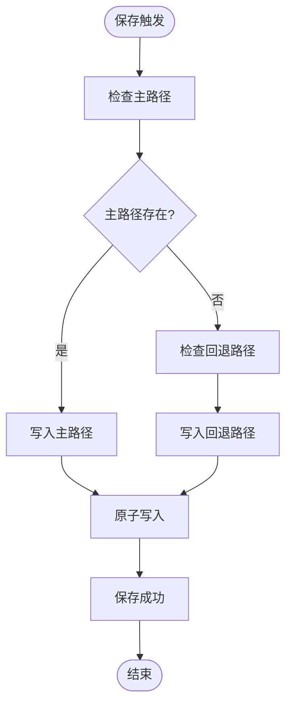

**图表来源**
- [main.go:629-667](file://main.go#L629-L667)
- [main.go:669-675](file://main.go#L669-L675)

##### 原子写入机制

为了防止文件损坏，系统实现了原子写入机制：

1. **临时文件写入**：先写入`.tmp`扩展名的临时文件
2. **原子重命名**：成功写入后使用`os.Rename`进行原子替换
3. **错误处理**：如果写入失败，临时文件会被清理

#### 错误处理机制

系统实现了完善的错误处理策略：

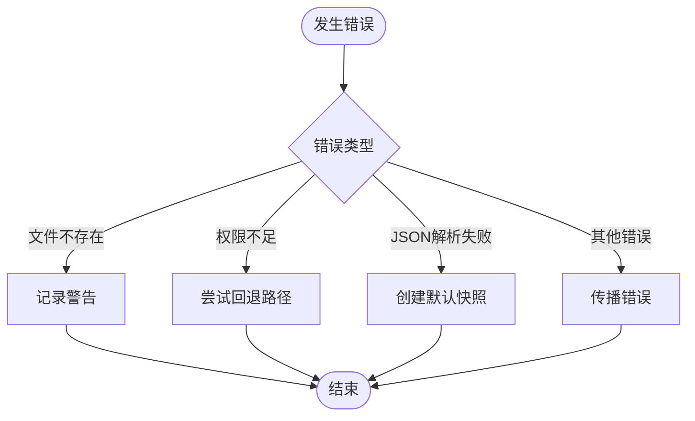

**图表来源**
- [main.go:713-740](file://main.go#L713-L740)
- [main.go:742-764](file://main.go#L742-L764)

**章节来源**
- [main.go:629-667](file://main.go#L629-L667)
- [main.go:713-740](file://main.go#L713-L740)

### 键盘快捷键系统

novel-reader提供了丰富的键盘快捷键支持，涵盖了阅读、导航、模式切换等各个方面。

#### 快捷键映射表

| 快捷键 | 功能 | 说明 |
|--------|------|------|
| j / ↓ | 向下滚动一行 | 基础滚动操作 |
| k / ↑ | 向上滚动一行 | 基础滚动操作 |
| n / ] | 下一章 | 章节跳转 |
| p / [ | 上一章 | 章节跳转 |
| 空格键 | 向下翻页 | 快速浏览 |
| b | 向上翻页 | 快速浏览 |
| g | 跳到开头 | 导航功能 |
| G | 跳到末尾 | 导航功能 |
| Esc / q | 恐慌模式切换 | Boss Key |
| r | 切换日志场景 | 恐慌模式功能 |
| c | 清空日志 | 恐慌模式功能 |
| Ctrl+C | 退出程序 | 程序控制 |

#### 交互流程图

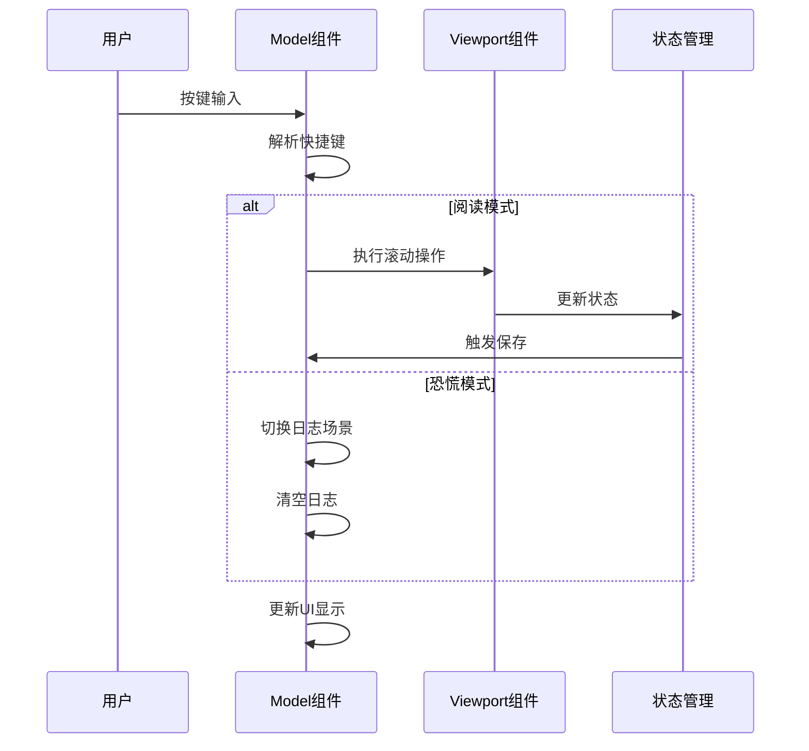

**图表来源**
- [main.go:211-292](file://main.go#L211-L292)
- [main.go:274-280](file://main.go#L274-L280)

**章节来源**
- [main.go:211-292](file://main.go#L211-L292)
- [README.md:37-46](file://README.md#L37-L46)

### 数据源管理系统

novel-reader实现了可扩展的数据源管理架构，支持多种数据源类型。

#### 数据源接口设计

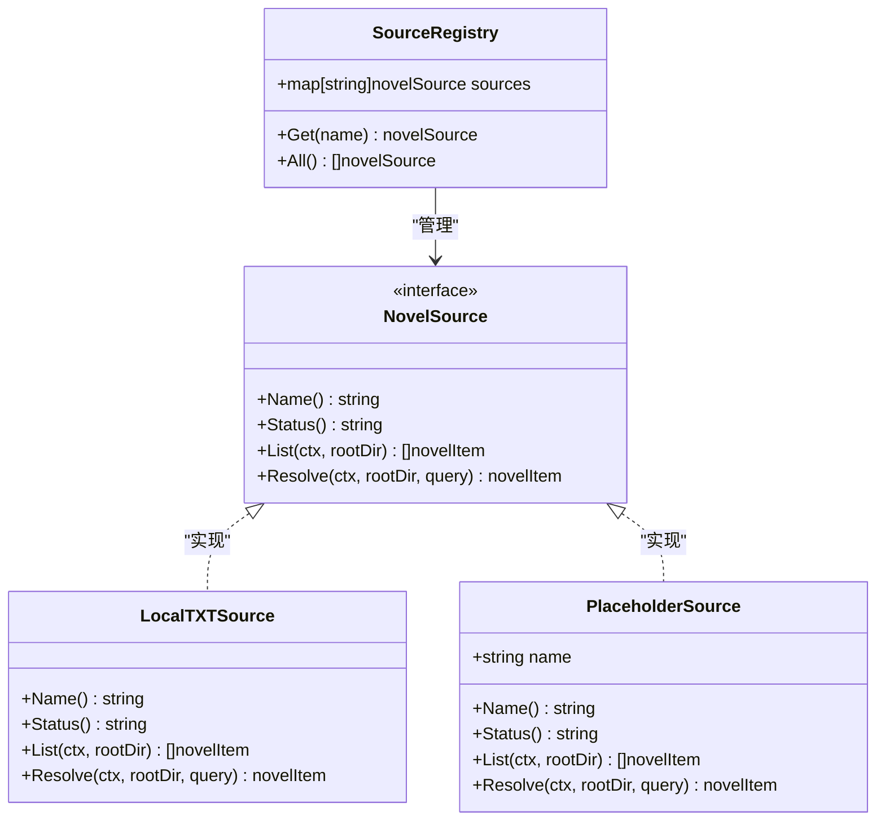

**图表来源**
- [source.go:22-27](file://source.go#L22-L27)
- [source.go:29-111](file://source.go#L29-L111)
- [source.go:128-138](file://source.go#L128-L138)

##### 当前支持的数据源

1. **local源**：当前唯一可用的源，支持项目目录内的TXT文件
2. **gutenberg源**：预留接口，计划支持古腾堡项目
3. **custom源**：预留接口，支持自定义数据源

#### 库扫描与缓存机制

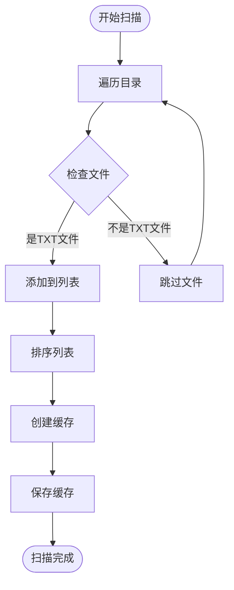

**图表来源**
- [source.go:34-72](file://source.go#L34-L72)
- [main.go:742-764](file://main.go#L742-L764)

**章节来源**
- [source.go:22-111](file://source.go#L22-L111)
- [source.go:128-138](file://source.go#L128-L138)

## 依赖关系分析

novel-reader项目的依赖关系相对简单，主要依赖于Bubble Tea生态系统的几个核心包。

```mermaid
graph TB
subgraph "外部依赖"
A[github.com/charmbracelet/bubbles]
B[github.com/charmbracelet/bubbletea]
C[github.com/charmbracelet/lipgloss]
end
subgraph "标准库"
D[bufio]
E[encoding/json]
F[fmt]
G[math/rand]
H=os]
I[path/filepath]
J[regexp]
K[sort]
L[strings]
M[time]
end
subgraph "项目内部"
N[main.go]
O[cli.go]
P[source.go]
end
N --> A
N --> B
N --> C
N --> D
N --> E
N --> F
N --> G
N --> H
N --> I
N --> J
N --> K
N --> L
N --> M
O --> N
P --> N
```

**图表来源**
- [main.go:3-19](file://main.go#L3-L19)
- [cli.go:3-11](file://cli.go#L3-L11)
- [source.go:3-11](file://source.go#L3-L11)

### 外部依赖分析

| 依赖包 | 版本 | 用途 | 关键功能 |
|--------|------|------|----------|
| bubbletea | 最新版 | TUI框架 | 程序生命周期管理 |
| bubbles | 最新版 | UI组件库 | viewport、progress组件 |
| lipgloss | 最新版 | 样式库 | 终端样式渲染 |
| bufio | 标准库 | 文本读取 | 高效文件读取 |
| encoding/json | 标准库 | 序列化 | 快照文件处理 |
| regexp | 标准库 | 正则表达式 | 章节识别 |
| time | 标准库 | 时间处理 | 快照时间戳 |

**章节来源**
- [main.go:3-19](file://main.go#L3-L19)
- [go.mod](file://go.mod)

## 性能考虑

novel-reader在设计时充分考虑了性能优化，特别是在大文件处理和实时渲染方面。

### 内存优化策略

1. **延迟构建lineOffsets**：只有在需要时才构建行偏移索引
2. **增量更新**：只在必要时重新计算布局
3. **字符串池化**：避免重复的字符串分配

### I/O性能优化

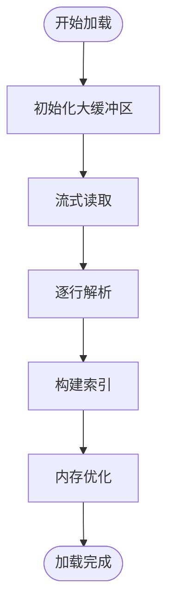

**图表来源**
- [main.go:870-897](file://main.go#L870-L897)
- [main.go:576-585](file://main.go#L576-L585)

### 渲染性能优化

1. **虚拟滚动**：只渲染可见区域的内容
2. **增量更新**：避免全量重绘
3. **宽度预计算**：提前计算文本宽度

### 建议的性能优化方案

1. **引入防抖机制**：减少频繁的状态保存
2. **实现懒加载**：对于超大文件采用分块加载
3. **增加缓存层**：缓存已计算的换行结果

## 故障排除指南

### 常见问题诊断

#### 快照文件相关问题

| 问题症状 | 可能原因 | 解决方案 |
|----------|----------|----------|
| "no resume snapshot found" | 快照文件不存在 | 使用`open`命令打开文件 |
| "resume file missing" | 快照文件被删除 | 检查文件路径是否正确 |
| JSON解析错误 | 快照文件损坏 | 删除损坏文件重新开始 |

#### 文件读取问题

| 问题症状 | 可能原因 | 解决方案 |
|----------|----------|----------|
| "file is outside project root" | 文件路径超出限制 | 将文件移动到项目目录内 |
| "permission denied" | 权限不足 | 检查文件权限设置 |
| "no such file or directory" | 文件不存在 | 确认文件路径正确 |

#### 章节识别问题

| 问题症状 | 可能原因 | 解决方案 |
|----------|----------|----------|
| 章节跳转无效 | 章节标题格式不符 | 检查章节标题格式 |
| 章节索引为空 | 文件中没有章节标题 | 添加符合规范的章节标题 |

**章节来源**
- [USAGE.md:191-248](file://USAGE.md#L191-L248)

### 调试技巧

1. **启用详细日志**：在恐慌模式下观察日志输出
2. **检查终端兼容性**：确认终端支持所需的ANSI转义序列
3. **验证文件编码**：确保TXT文件使用UTF-8编码

## 结论

novel-reader是一个设计精良的命令行小说阅读器，展现了优秀的软件工程实践。系统的主要优势包括：

1. **架构清晰**：采用分层设计，职责分离明确
2. **功能完善**：涵盖了现代阅读器的核心功能
3. **用户体验优秀**：通过Boss Key和伪装界面提供独特的阅读体验
4. **扩展性强**：良好的接口设计支持未来功能扩展

### 技术亮点

- **智能的文本渲染系统**：精确的换行算法和视觉行偏移计算
- **可靠的进度保存机制**：多层持久化策略确保数据安全
- **灵活的章节导航**：支持多种章节标题格式的智能识别
- **优雅的错误处理**：完善的错误恢复和降级机制

### 改进建议

1. **增加配置文件支持**：允许用户自定义主题和快捷键
2. **实现EPUB支持**：扩展对更多格式的支持
3. **引入异步保存**：减少对用户操作的影响
4. **增加单元测试**：提高代码质量和稳定性

novel-reader为命令行阅读器提供了一个优秀的参考实现，其设计理念和实现细节值得学习和借鉴。

## 附录

### API参考

#### 主要函数接口

| 函数名 | 参数 | 返回值 | 描述 |
|--------|------|--------|------|
| initialModel | filePath, lines, lineByte, startLine, err | model | 初始化阅读器模型 |
| runReader | filePath | error | 启动阅读器程序 |
| loadLines | path | ([]string, []int64, error) | 加载TXT文件内容 |
| writeSnapshot | model | error | 保存阅读进度 |
| readSnapshot | path | (snapshotFile, error) | 读取快照文件 |

#### 配置选项

| 环境变量 | 类型 | 默认值 | 描述 |
|----------|------|--------|------|
| NOVEL_READER_CHAPTER_ALIGN | string | "strict" | 章节对齐策略 |
| NOVEL_READER_THEME | string | "dracula" | 主题设置 |

### 开发指南

#### 代码贡献流程

1. Fork项目并创建功能分支
2. 实现新功能或修复bug
3. 编写测试用例
4. 更新文档
5. 提交Pull Request

#### 测试策略

1. **单元测试**：针对核心算法和工具函数
2. **集成测试**：测试完整的用户工作流
3. **性能测试**：评估大文件处理能力
4. **兼容性测试**：验证不同终端的兼容性