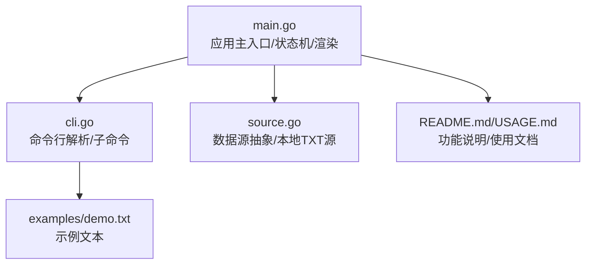
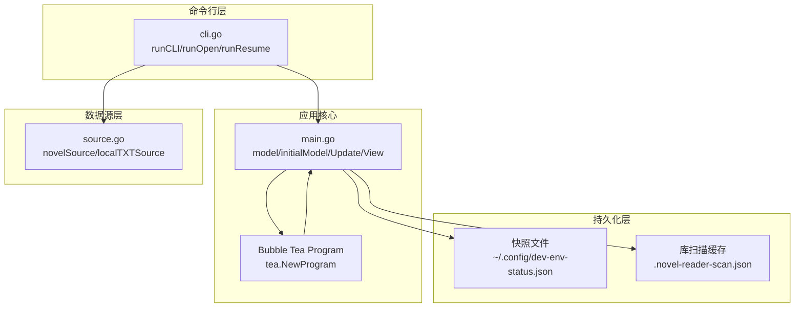
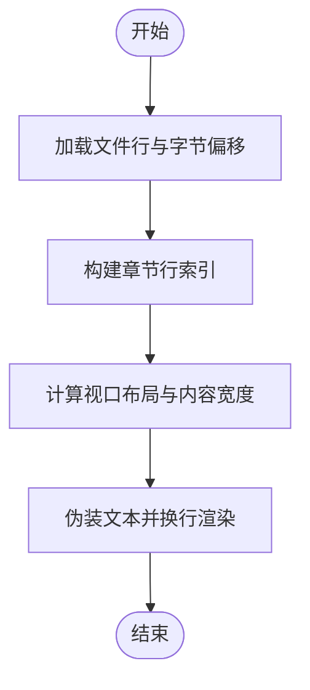
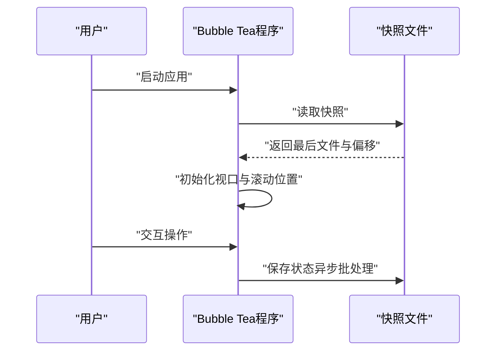
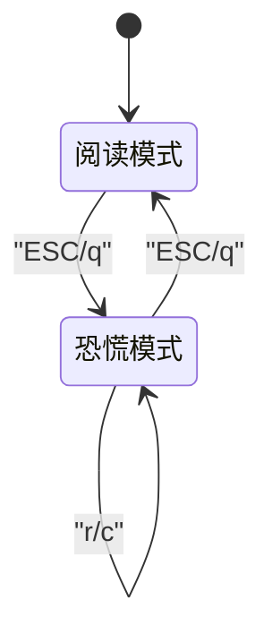
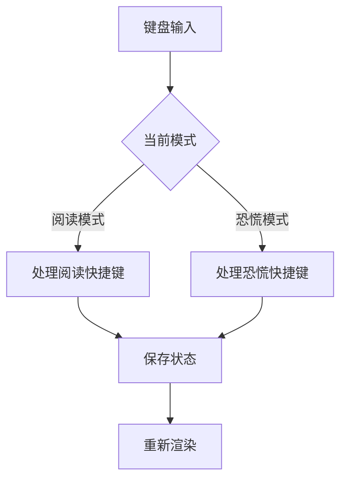
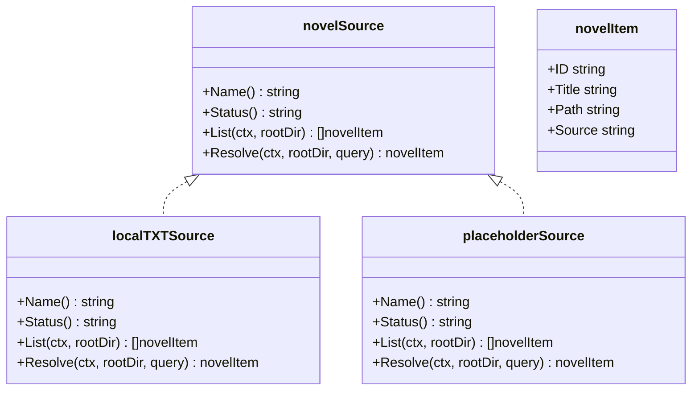
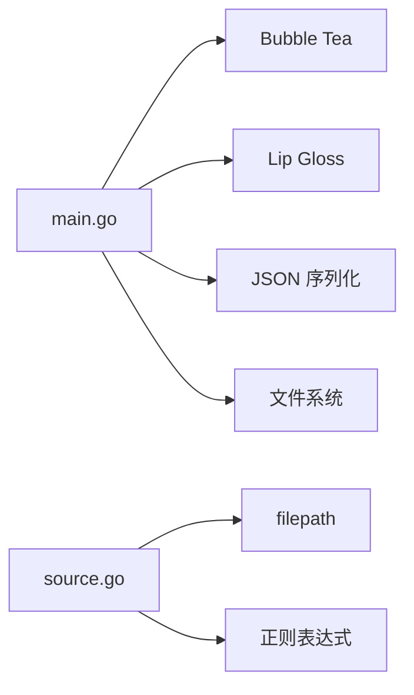

# 核心功能详解

<cite>
**本文档引用的文件**
- [main.go](file://main.go)
- [cli.go](file://cli.go)
- [source.go](file://source.go)
- [README.md](file://README.md)
- [USAGE.md](file://USAGE.md)
- [demo.txt](file://examples/demo.txt)
</cite>

## 目录
1. [简介](#简介)
2. [项目结构](#项目结构)
3. [核心组件](#核心组件)
4. [架构总览](#架构总览)
5. [详细组件分析](#详细组件分析)
6. [依赖关系分析](#依赖关系分析)
7. [性能考虑](#性能考虑)
8. [故障排除指南](#故障排除指南)
9. [结论](#结论)

## 简介
本项目是一个基于 Go 与 Bubble Tea 的命令行小说阅读器，提供 CLI + TUI 的双模式体验。核心功能包括：
- 文本渲染与章节识别
- 进度保存与恢复机制
- Boss Key 功能（日志场景伪装、状态切换、实时日志生成）
- 键盘快捷键系统与用户交互模式
- 状态管理与持久化

## 项目结构
项目采用简洁的单模块设计，主要文件职责如下：
- main.go：应用主入口、Bubble Tea 状态机、渲染逻辑、持久化与恢复
- cli.go：命令行解析与子命令路由
- source.go：数据源抽象与本地 TXT 源实现
- examples/demo.txt：演示用的小说文本
- README.md / USAGE.md：功能说明与使用文档

**图表来源**
- [main.go:1023-1028](file://main.go#L1023-L1028)
- [cli.go:13-44](file://cli.go#L13-L44)
- [source.go:15-27](file://source.go#L15-L27)

**章节来源**
- [main.go:1-1056](file://main.go#L1-L1056)
- [cli.go:1-173](file://cli.go#L1-L173)
- [source.go:1-169](file://source.go#L1-L169)
- [README.md:1-46](file://README.md#L1-L46)
- [USAGE.md:1-248](file://USAGE.md#L1-L248)

## 核心组件
本节深入分析小说阅读引擎的关键组件及其职责。

- 应用状态模型（model）
  - 维护文件路径、行内容与字节偏移映射
  - 管理阅读视口（viewport）、恐慌视口（panic viewport）与进度条
  - 记录窗口尺寸、章节行索引、样式配置
  - 维护恐慌日志缓冲与场景切换

- 章节识别与跳转
  - 通过正则表达式识别中英文章节标题
  - 构建章节行索引，支持上下章跳转与对齐策略

- 文本渲染与换行
  - 将原始文本伪装为注释风格，按可视宽度进行智能换行
  - 计算源行与可视行的双向映射，保证滚动与跳转精度

- 进度保存与恢复
  - 写入 JSON 快照，包含最后打开文件、行偏移、字节偏移、窗口尺寸等
  - 支持用户主目录与项目目录双路径回退策略
  - 使用原子写入（临时文件+重命名）避免中断损坏

- Boss Key 功能
  - ESC/q 切换到伪日志模式，模拟 npm/test/docker 等常见日志场景
  - 实时生成日志，支持场景切换与清空缓冲
  - 切换时自动保存状态，退出时恢复阅读模式

**章节来源**
- [main.go:74-103](file://main.go#L74-L103)
- [main.go:523-531](file://main.go#L523-L531)
- [main.go:533-543](file://main.go#L533-L543)
- [main.go:899-920](file://main.go#L899-L920)
- [main.go:922-967](file://main.go#L922-L967)
- [main.go:629-711](file://main.go#L629-L711)
- [main.go:21-26](file://main.go#L21-L26)
- [main.go:211-292](file://main.go#L211-L292)
- [main.go:337-350](file://main.go#L337-L350)

## 架构总览
整体架构采用 Bubble Tea 的 Model-Update-View 流程，结合自定义的状态机与数据持久化层。

**图表来源**
- [cli.go:13-44](file://cli.go#L13-L44)
- [main.go:1011-1021](file://main.go#L1011-L1021)
- [source.go:29-111](file://source.go#L29-L111)
- [main.go:629-711](file://main.go#L629-L711)
- [main.go:742-764](file://main.go#L742-L764)

## 详细组件分析

### 文本渲染与章节识别
- 章节识别
  - 使用中英文正则匹配章节标题，支持中文“第X章”与英文“Chapter X”
  - 去除代码伪装前缀（如“//”）以避免误判
- 章节索引构建
  - 遍历所有行，记录章节标题所在行号
  - 提供跳转函数，支持“锚点偏移”与“对齐扫描”策略
- 文本伪装与换行
  - 将每行文本添加“// ”前缀，模拟注释风格
  - 按可视宽度进行智能换行，计算每行的视觉行数
- 视口布局
  - 根据终端尺寸计算内容宽度与高度
  - 将源行偏移转换为可视偏移，确保滚动位置准确

**图表来源**
- [main.go:870-897](file://main.go#L870-L897)
- [main.go:523-531](file://main.go#L523-L531)
- [main.go:899-920](file://main.go#L899-L920)
- [main.go:922-967](file://main.go#L922-L967)
- [main.go:294-329](file://main.go#L294-L329)

**章节来源**
- [main.go:106-108](file://main.go#L106-L108)
- [main.go:523-543](file://main.go#L523-L543)
- [main.go:899-920](file://main.go#L899-L920)
- [main.go:922-967](file://main.go#L922-L967)
- [main.go:294-329](file://main.go#L294-L329)

### 进度保存与恢复机制
- 快照结构
  - 包含版本号、更新时间、最后打开文件、各文件的快照配置、库扫描缓存
  - 快照配置包含字节偏移、行偏移、总行数、窗口尺寸、主题与恐慌键
- 写入策略
  - 优先写入用户主目录下的配置文件；若不可写则回退到项目目录的快照文件
  - 使用原子写入（临时文件+重命名）确保一致性
- 恢复流程
  - 启动时自动读取快照，定位最后打开文件与起始行
  - 初始化视口与滚动位置，保持无缝阅读体验

**图表来源**
- [main.go:629-711](file://main.go#L629-L711)
- [main.go:713-740](file://main.go#L713-L740)
- [main.go:847-868](file://main.go#L847-L868)
- [main.go:1011-1021](file://main.go#L1011-L1021)

**章节来源**
- [main.go:35-63](file://main.go#L35-L63)
- [main.go:629-711](file://main.go#L629-L711)
- [main.go:713-740](file://main.go#L713-L740)
- [main.go:847-868](file://main.go#L847-L868)

### Boss Key 功能（日志场景伪装）
- 状态切换
  - ESC/q 在阅读模式与恐慌模式间切换
  - 切换时自动保存状态，确保退出后能恢复
- 日志场景伪装
  - 模拟三种常见日志场景：npm、Go 测试、Docker 构建
  - 实时生成带时间戳的日志行，支持场景切换与清空
- 用户交互
  - r：切换日志场景
  - c：清空当前日志缓冲
  - ESC/q：返回阅读模式

**图表来源**
- [main.go:21-26](file://main.go#L21-L26)
- [main.go:211-292](file://main.go#L211-L292)
- [main.go:337-350](file://main.go#L337-L350)
- [main.go:182-205](file://main.go#L182-L205)

**章节来源**
- [main.go:211-292](file://main.go#L211-L292)
- [main.go:337-350](file://main.go#L337-L350)
- [main.go:182-205](file://main.go#L182-L205)

### 键盘快捷键系统与用户交互
- 阅读模式快捷键
  - j/k：上下滚动一行
  - n/p 或 ]/[：跳转到下一章/上一章
  - Space/b：下/上翻页
  - g/G：跳到开头/末尾
- 恐慌模式快捷键
  - r：切换日志场景
  - c：清空日志缓冲
- 通用快捷键
  - ESC/q：进入/退出恐慌模式
  - Ctrl+C：退出程序（保存状态）

**图表来源**
- [main.go:211-266](file://main.go#L211-L266)
- [main.go:226-235](file://main.go#L226-L235)
- [main.go:214-216](file://main.go#L214-L216)

**章节来源**
- [main.go:211-266](file://main.go#L211-L266)
- [README.md:37-46](file://README.md#L37-L46)
- [USAGE.md:135-167](file://USAGE.md#L135-L167)

### 数据源接口与本地 TXT 源
- 接口设计
  - novelSource 定义名称、状态、列出与解析方法
  - novelItem 描述条目标识、标题、路径与来源
- 本地 TXT 源
  - 支持递归扫描目录，过滤 .txt 文件
  - 支持通过相对路径、ID 或标题解析目标文件
  - 严格限制在项目根目录内访问，防止越权

**图表来源**
- [source.go:15-27](file://source.go#L15-L27)
- [source.go:29-111](file://source.go#L29-L111)
- [source.go:113-126](file://source.go#L113-L126)

**章节来源**
- [source.go:15-27](file://source.go#L15-L27)
- [source.go:29-111](file://source.go#L29-L111)
- [source.go:128-169](file://source.go#L128-L169)

## 依赖关系分析
- Bubble Tea 与 Lip Gloss
  - 使用 Bubble Tea 的 Program 管理状态机与消息循环
  - 使用 Lip Gloss 进行样式渲染与布局计算
- 本地 TXT 源
  - 通过 filepath.WalkDir 递归扫描，过滤 .txt 文件
  - 通过正则与字符串处理实现解析与匹配
- 持久化
  - JSON 序列化快照与库扫描缓存
  - 原子写入避免并发写入导致的数据损坏

**图表来源**
- [main.go:3-19](file://main.go#L3-L19)
- [source.go:3-11](file://source.go#L3-L11)

**章节来源**
- [main.go:3-19](file://main.go#L3-L19)
- [source.go:3-11](file://source.go#L3-L11)

## 性能考虑
- 文本扫描与缓冲
  - 使用 bufio.Scanner 并设置合理缓冲大小，提升大文件读取性能
  - 预分配行与字节偏移切片，减少内存分配
- 换行与布局
  - 预计算每行的视觉行数，避免每次渲染时重复计算
  - 使用二分查找定位可视偏移对应的源行，提高跳转效率
- 持久化
  - 采用原子写入策略，降低磁盘写入开销与失败风险
  - 异步批处理保存状态，避免频繁落盘影响交互流畅性

**章节来源**
- [main.go:870-897](file://main.go#L870-L897)
- [main.go:576-585](file://main.go#L576-L585)
- [main.go:622-627](file://main.go#L622-L627)
- [main.go:669-675](file://main.go#L669-L675)

## 故障排除指南
- 启动提示“no resume snapshot found”
  - 原因：尚未打开过任何文件或快照文件不存在
  - 处理：使用 open 命令打开指定文件后再尝试 resume
- “file is outside project root”
  - 原因：当前版本的 local 源仅允许读取项目目录内的 txt 文件
  - 处理：将小说文件放入项目目录或其子目录后再执行 open
- “source xxx is reserved only”
  - 原因：指定了预留数据源（如 gutenberg 或 custom），当前版本尚未实现
  - 处理：使用 --source local 或省略 --source
- “no scan cache found”
  - 原因：直接使用 open <序号>，但当前还没有扫描缓存
  - 处理：先执行 library scan，再使用 open <序号>
- 中文显示异常或乱码
  - 建议：确认文本文件为 UTF-8 编码，更换支持完整 Unicode 的终端与字体
- 运行后没有看到边框或颜色
  - 原因：终端主题或配色能力差异
  - 处理：更换终端主题（如 Dracula/Monokai），确认终端支持 256 色或 True Color

**章节来源**
- [USAGE.md:191-248](file://USAGE.md#L191-L248)

## 结论
novel-reader 通过简洁而高效的架构实现了“低存在感”的阅读体验。其核心优势在于：
- 基于 Bubble Tea 的响应式 UI 与精确的文本渲染
- 完备的进度保存与恢复机制，确保无缝阅读
- Boss Key 功能提供安全的隐私保护
- 清晰的命令行接口与可扩展的数据源抽象

未来可进一步增强的方向包括：引入配置文件支持、增加 EPUB 支持、优化异步保存策略以及补充测试用例与性能指标。