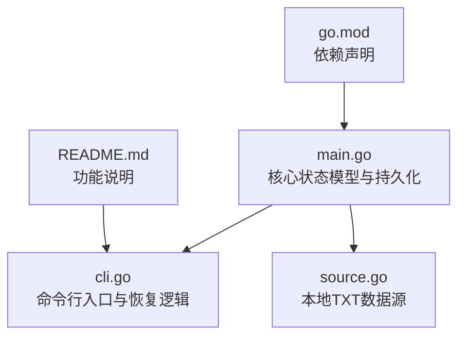
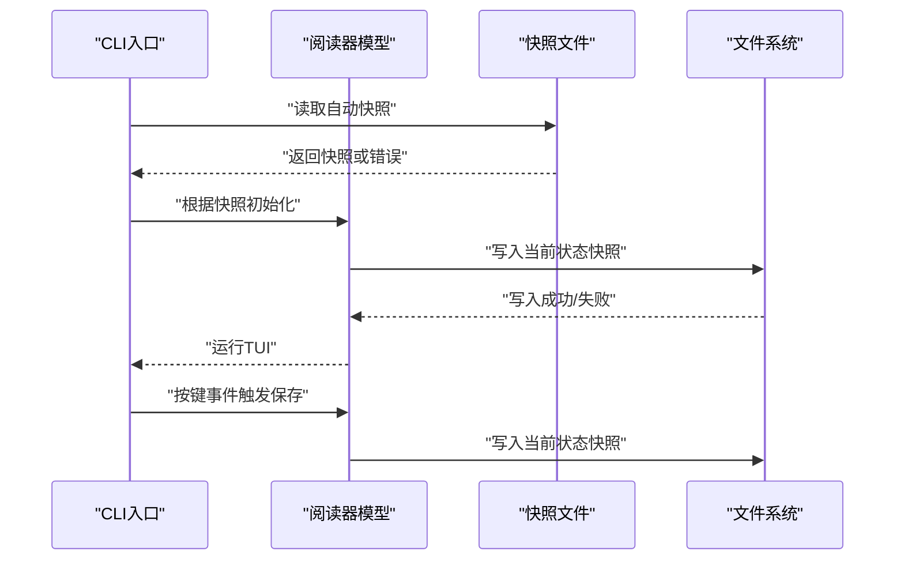
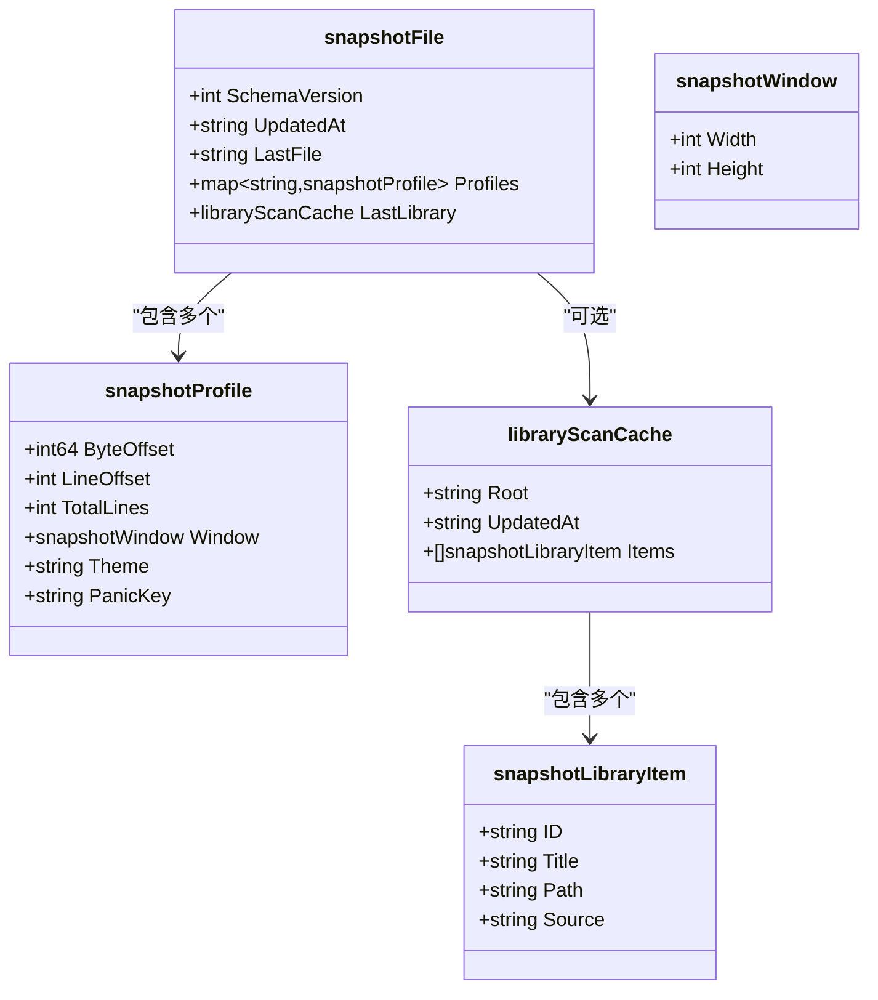
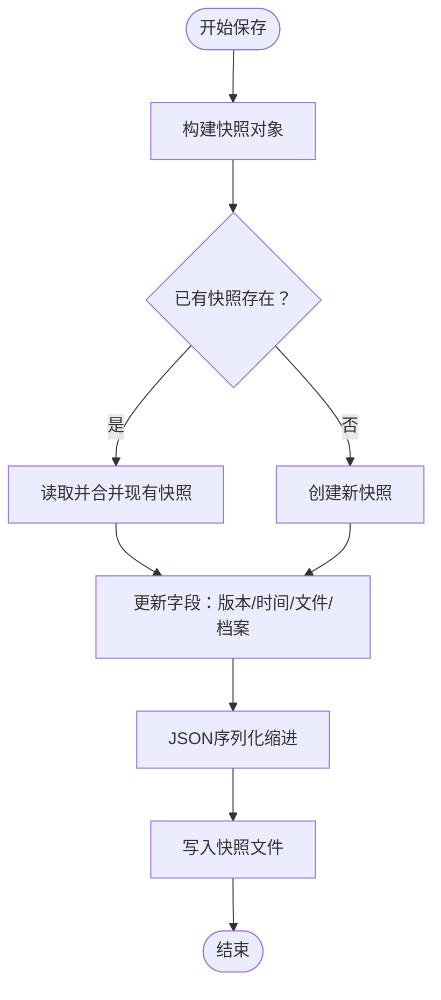
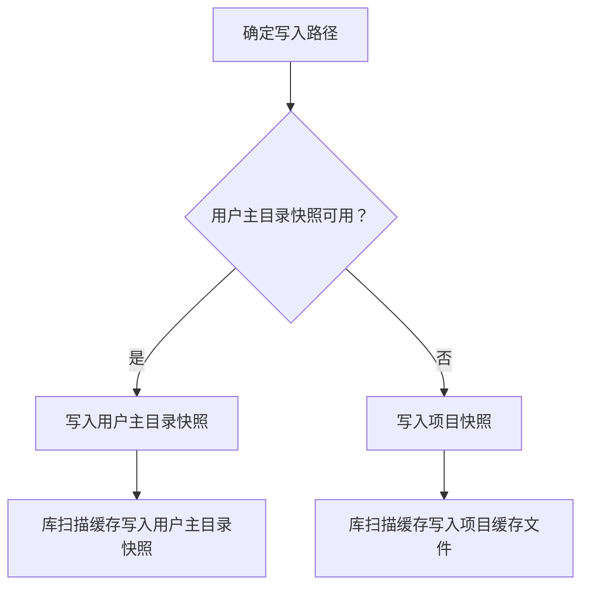
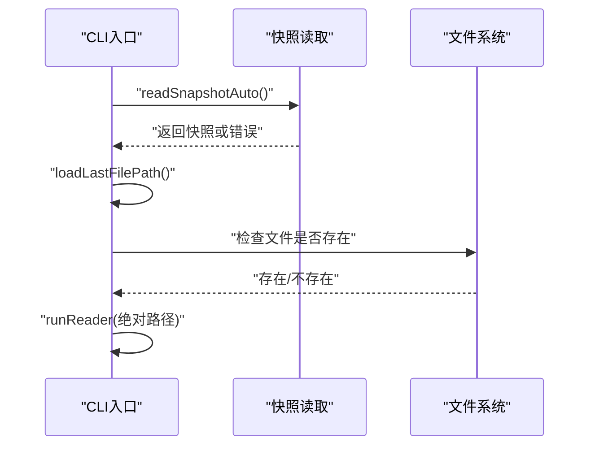
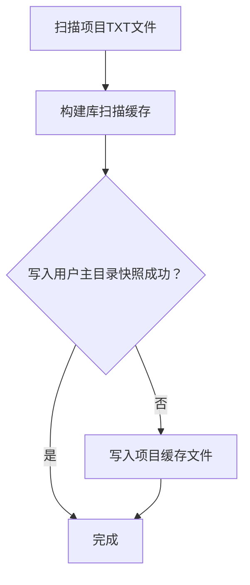
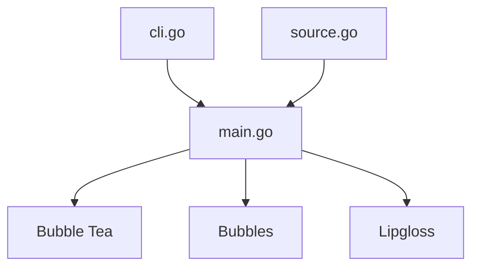

# 状态管理与持久化

<cite>
**本文引用的文件**
- [main.go](file://main.go)
- [cli.go](file://cli.go)
- [source.go](file://source.go)
- [go.mod](file://go.mod)
- [README.md](file://README.md)
</cite>

## 目录
1. [简介](#简介)
2. [项目结构](#项目结构)
3. [核心组件](#核心组件)
4. [架构总览](#架构总览)
5. [详细组件分析](#详细组件分析)
6. [依赖关系分析](#依赖关系分析)
7. [性能考量](#性能考量)
8. [故障排除指南](#故障排除指南)
9. [结论](#结论)
10. [附录](#附录)

## 简介
本文件面向novel-reader的状态管理与持久化系统，聚焦以下目标：
- 深入解释快照文件的数据结构设计，包括snapshotFile、snapshotProfile和snapshotWindow等核心数据模型。
- 详细说明进度保存机制，包括JSON序列化策略、原子写入操作和错误恢复机制。
- 解释配置文件的存储位置选择，包括用户主目录优先和项目目录回退策略。
- 提供状态恢复的完整流程，包括文件读取、数据验证和错误处理。
- 包含具体的配置格式示例和故障排除指南。

## 项目结构
novel-reader采用单一可执行程序的组织方式，核心逻辑集中在main.go中，CLI入口在cli.go，数据源解析在source.go，模块依赖在go.mod中声明，功能说明在README.md中给出。

图表来源
- [main.go:1-1056](file://main.go#L1-L1056)
- [cli.go:1-173](file://cli.go#L1-L173)
- [source.go:1-169](file://source.go#L1-L169)
- [go.mod:1-34](file://go.mod#L1-L34)
- [README.md:1-46](file://README.md#L1-L46)

章节来源
- [main.go:1-1056](file://main.go#L1-L1056)
- [cli.go:1-173](file://cli.go#L1-L173)
- [source.go:1-169](file://source.go#L1-L169)
- [go.mod:1-34](file://go.mod#L1-L34)
- [README.md:1-46](file://README.md#L1-L46)

## 核心组件
本系统围绕“状态快照”进行设计，核心数据模型如下：
- snapshotFile：顶层快照容器，包含版本号、更新时间、最后打开文件、用户配置档案集合以及最近一次库扫描缓存。
- snapshotProfile：针对单个文件的阅读状态档案，记录字节偏移、行偏移、总行数、窗口尺寸、主题与恐慌键等。
- snapshotWindow：窗口尺寸信息，用于恢复终端布局。
- libraryScanCache：库扫描缓存，记录扫描根目录、更新时间与条目列表。
- snapshotLibraryItem：库扫描条目，包含ID、标题、路径与来源。

这些模型通过JSON进行序列化与反序列化，确保跨平台与可读性。

章节来源
- [main.go:35-68](file://main.go#L35-L68)
- [main.go:43-54](file://main.go#L43-L54)

## 架构总览
novel-reader的状态管理由“读取-计算-写入-回放”四个阶段构成：
- 读取：启动时自动尝试从用户主目录快照文件与项目快照文件中读取。
- 计算：根据当前模型状态生成新的快照，合并现有快照与当前状态。
- 写入：优先写入用户主目录快照文件；若失败则回退到项目快照文件。
- 回放：恢复时加载最后打开文件路径与该文件的起始行偏移，进入阅读界面。

图表来源
- [cli.go:54-66](file://cli.go#L54-L66)
- [main.go:622-667](file://main.go#L622-L667)
- [main.go:713-740](file://main.go#L713-L740)

## 详细组件分析

### 快照数据结构设计
- snapshotFile
  - 字段：SchemaVersion、UpdatedAt、LastFile、Profiles、LastLibrary。
  - 语义：统一承载版本控制、更新时间戳、最近文件、每个文件的阅读档案以及库扫描缓存。
- snapshotProfile
  - 字段：ByteOffset、LineOffset、TotalLines、Window、Theme、PanicKey。
  - 语义：记录单文件的精确阅读位置与界面偏好。
- snapshotWindow
  - 字段：Width、Height。
  - 语义：恢复终端窗口大小，保证视口布局一致。
- libraryScanCache
  - 字段：Root、UpdatedAt、Items。
  - 语义：缓存库扫描结果，支持后续通过序号快速打开。
- snapshotLibraryItem
  - 字段：ID、Title、Path、Source。
  - 语义：库扫描条目的最小单元。

图表来源
- [main.go:35-68](file://main.go#L35-L68)
- [main.go:43-54](file://main.go#L43-L54)

章节来源
- [main.go:35-68](file://main.go#L35-L68)
- [main.go:43-54](file://main.go#L43-L54)

### 进度保存机制
- 触发时机：初始化、按键事件、窗口尺寸变化、退出时均会触发保存。
- 序列化策略：使用JSON缩进格式，便于人类阅读与版本控制对比。
- 原子写入：通过临时文件+重命名实现，避免部分写入导致的损坏。
- 错误恢复：保存失败不影响运行，但可能导致下次恢复位置不准确；建议检查磁盘权限与空间。

图表来源
- [main.go:629-667](file://main.go#L629-L667)
- [main.go:669-675](file://main.go#L669-L675)
- [main.go:727-740](file://main.go#L727-L740)

章节来源
- [main.go:622-667](file://main.go#L622-L667)
- [main.go:669-675](file://main.go#L669-L675)
- [main.go:727-740](file://main.go#L727-L740)

### 配置文件存储位置与回退策略
- 用户主目录优先：位于用户主目录下的配置路径，适合多项目共享状态。
- 项目目录回退：当用户主目录不可写时，回退到项目根目录的快照文件。
- 库扫描缓存也遵循相同策略：优先写入用户主目录快照文件，否则写入项目缓存文件。

图表来源
- [main.go:677-711](file://main.go#L677-L711)
- [main.go:808-826](file://main.go#L808-L826)

章节来源
- [main.go:677-711](file://main.go#L677-L711)
- [main.go:808-826](file://main.go#L808-L826)

### 状态恢复流程
- 自动读取：启动时优先尝试读取用户主目录快照，失败则尝试项目快照。
- 最后文件恢复：从快照中提取LastFile，若为空则提示无恢复快照。
- 起始行恢复：根据文件路径查找对应档案的LineOffset作为起始行。
- 打开文件：将相对路径转换为绝对路径后打开，若不存在则提示缺失。

图表来源
- [main.go:713-740](file://main.go#L713-L740)
- [main.go:847-856](file://main.go#L847-L856)
- [cli.go:54-66](file://cli.go#L54-L66)

章节来源
- [main.go:713-740](file://main.go#L713-L740)
- [main.go:847-856](file://main.go#L847-L856)
- [cli.go:54-66](file://cli.go#L54-L66)

### 库扫描缓存
- 保存：将扫描结果封装为libraryScanCache，优先写入用户主目录快照文件，否则写入项目缓存文件。
- 加载：优先从用户主目录快照读取，失败则从项目缓存文件读取。
- 使用：通过“library scan”命令生成缓存，随后可用“open <序号>”直接打开对应文件。

图表来源
- [source.go:34-72](file://source.go#L34-L72)
- [main.go:742-764](file://main.go#L742-L764)
- [main.go:790-806](file://main.go#L790-L806)
- [main.go:816-845](file://main.go#L816-L845)

章节来源
- [source.go:34-72](file://source.go#L34-L72)
- [main.go:742-764](file://main.go#L742-L764)
- [main.go:790-806](file://main.go#L790-L806)
- [main.go:816-845](file://main.go#L816-L845)

## 依赖关系分析
- 外部依赖：Bubble Tea用于TUI框架，Bubbles用于进度条与视口，Lipgloss用于样式渲染。
- 内部模块：main.go承担核心状态与持久化逻辑；cli.go负责命令行入口与恢复；source.go提供本地TXT数据源能力。

图表来源
- [go.mod:5-9](file://go.mod#L5-L9)
- [main.go:15-18](file://main.go#L15-L18)

章节来源
- [go.mod:1-34](file://go.mod#L1-L34)
- [main.go:15-18](file://main.go#L15-L18)

## 性能考量
- JSON序列化：使用缩进格式，便于人类阅读，但会增加文件体积；对频繁保存的场景可考虑二进制或更紧凑的文本格式。
- 原子写入：通过临时文件+重命名减少锁竞争与部分写入风险，提升可靠性。
- I/O缓冲：读取大文件时使用较大的扫描缓冲区，有助于提升读取性能。
- 视口布局：通过预计算行偏移与视觉行数，降低渲染时的计算成本。

## 故障排除指南
- 无法恢复：检查用户主目录快照文件是否存在且可读；若不存在，确认项目快照文件是否存在。
- 保存失败：检查用户主目录所在分区是否可写；必要时允许写入权限或改用项目快照。
- 库扫描缓存无效：确认“library scan”已成功执行且缓存未被删除；重新扫描后再次尝试。
- 文件路径问题：恢复时若为相对路径，需确保与项目根目录拼接后仍指向有效文件；否则请使用绝对路径或重新扫描。
- 权限不足：在某些系统上，用户主目录快照可能需要手动创建目录并赋予写权限。

章节来源
- [main.go:713-740](file://main.go#L713-L740)
- [main.go:693-711](file://main.go#L693-L711)
- [main.go:790-806](file://main.go#L790-L806)
- [cli.go:54-66](file://cli.go#L54-L66)

## 结论
novel-reader的状态管理与持久化系统以“快照文件”为核心，结合JSON序列化、原子写入与双路径回退策略，实现了可靠的状态保存与恢复。通过明确的数据模型与清晰的流程图，开发者可以轻松理解并扩展该系统，例如引入增量快照、压缩序列化或更丰富的恢复选项。

## 附录

### 配置格式示例（概念性描述）
- 快照文件顶层字段
  - schema_version：整数，快照版本号。
  - updated_at：字符串，ISO 8601时间戳。
  - last_file：字符串，上次打开的文件路径。
  - profiles：对象映射，键为文件路径，值为该文件的阅读档案。
  - last_library：可选对象，包含库扫描缓存。
- 文件档案字段
  - byte_offset：整数，当前行对应的字节偏移。
  - line_offset：整数，当前行索引。
  - total_lines：整数，文件总行数。
  - window：对象，包含width与height。
  - theme：字符串，界面主题名称。
  - panic_key：字符串，恐慌模式按键。
- 库扫描缓存字段
  - root：字符串，扫描根目录。
  - updated_at：字符串，ISO 8601时间戳。
  - items：数组，每个元素为库扫描条目。

章节来源
- [main.go:35-68](file://main.go#L35-L68)
- [main.go:43-54](file://main.go#L43-L54)