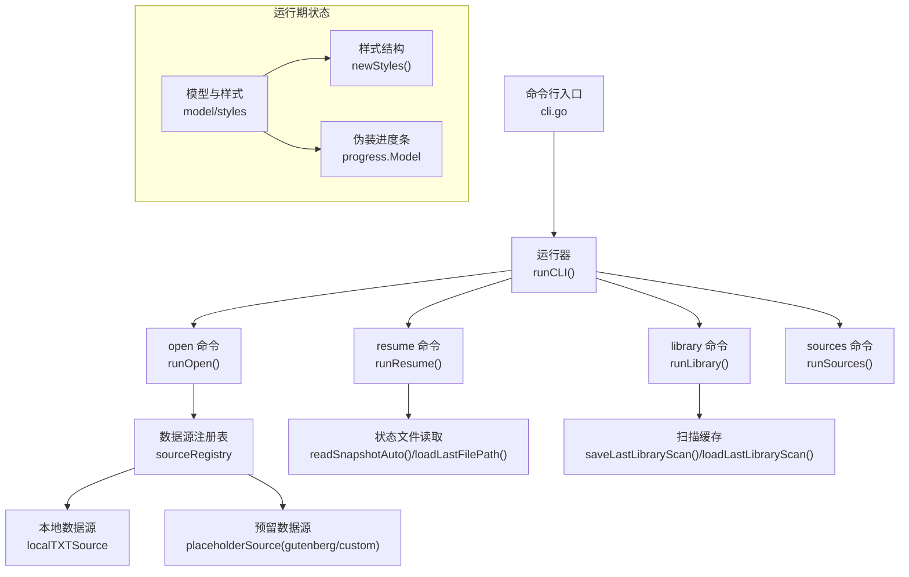
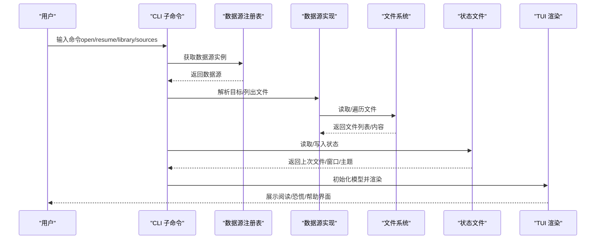
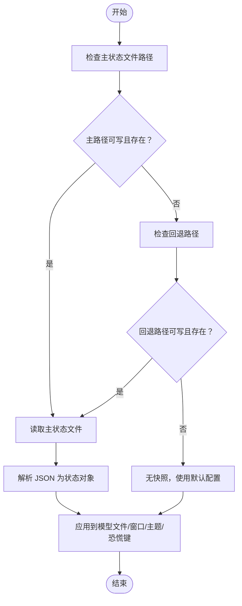
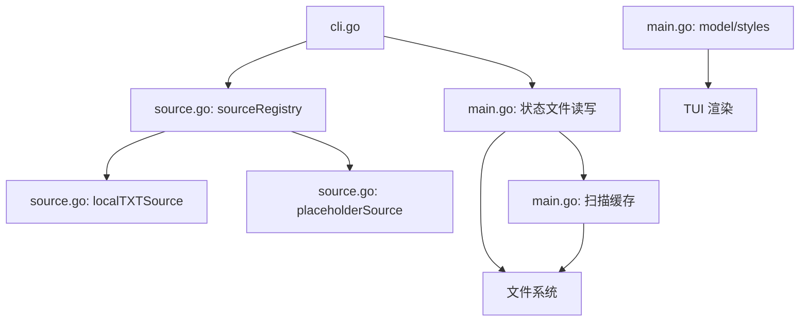

# 配置与自定义

<cite>
**本文引用的文件**
- [README.md](file://README.md)
- [USAGE.md](file://USAGE.md)
- [SDD.md](file://SDD.md)
- [main.go](file://main.go)
- [cli.go](file://cli.go)
- [source.go](file://source.go)
- [examples/demo.txt](file://examples/demo.txt)
</cite>

## 目录
1. [简介](#简介)
2. [项目结构](#项目结构)
3. [核心组件](#核心组件)
4. [架构总览](#架构总览)
5. [详细组件分析](#详细组件分析)
6. [依赖关系分析](#依赖关系分析)
7. [性能考量](#性能考量)
8. [故障排查指南](#故障排查指南)
9. [结论](#结论)
10. [附录](#附录)

## 简介
本章节面向希望为 novel-reader 进行配置与自定义的用户与开发者，系统说明配置文件格式与位置、默认配置与用户自定义配置、主题与样式定制选项、环境变量配置与使用场景、进度保存与恢复机制、配置优先级与覆盖规则，并提供实际示例与自定义案例，帮助你在不修改源码的前提下获得更贴合个人习惯的阅读体验。

## 项目结构
novel-reader 采用命令行入口 + Bubble Tea TUI 的结构，核心逻辑集中在单一可执行文件中，同时通过 CLI 子命令组织功能。配置与自定义主要体现在以下方面：
- 状态持久化：通过 JSON 文件记录阅读进度、窗口尺寸、主题与恐慌键等信息。
- 环境变量：通过环境变量影响章节跳转策略等行为。
- 样式与主题：通过内置样式结构与主题字段预留，为后续扩展提供接口。
- 数据源：通过注册表管理本地与预留的数据源，便于扩展。

图表来源
- [cli.go:13-44](file://cli.go#L13-L44)
- [cli.go:68-122](file://cli.go#L68-L122)
- [cli.go:124-156](file://cli.go#L124-L156)
- [source.go:128-169](file://source.go#L128-L169)
- [main.go:847-868](file://main.go#L847-L868)
- [main.go:742-795](file://main.go#L742-L795)
- [main.go:137-180](file://main.go#L137-L180)
- [main.go:120-135](file://main.go#L120-L135)

章节来源
- [README.md:1-46](file://README.md#L1-L46)
- [USAGE.md:1-248](file://USAGE.md#L1-L248)
- [SDD.md:14-48](file://SDD.md#L14-L48)

## 核心组件
- 状态持久化与恢复
  - 状态文件路径与回退策略：优先写入用户配置目录，不可写时回退到项目目录。
  - 持久化内容：最近文件路径、行偏移与字节偏移、窗口尺寸、主题与恐慌键等。
  - 读写策略：原子写入（临时文件 + 重命名），尽量避免中断导致的损坏。
- 环境变量
  - 章节跳转策略：通过环境变量控制跳转后是否强制校正章节标题位于可视顶部。
- 样式与主题
  - 内置样式结构：统一管理边框、头部、底部、正文、弱化、警告与错误行样式。
  - 主题字段预留：状态文件中包含主题字段，当前默认值为内置主题名称。
- 数据源
  - 注册表：管理本地与预留数据源，支持查询与解析目标资源。
  - 本地数据源：扫描项目目录及其子目录下的 .txt 文件，支持通过路径、序号或标题打开。

章节来源
- [USAGE.md:168-189](file://USAGE.md#L168-L189)
- [main.go:629-667](file://main.go#L629-L667)
- [main.go:677-711](file://main.go#L677-L711)
- [main.go:120-135](file://main.go#L120-L135)
- [main.go:658](file://main.go#L658)
- [source.go:128-169](file://source.go#L128-L169)
- [source.go:34-111](file://source.go#L34-L111)

## 架构总览
novel-reader 的配置与自定义围绕“状态文件 + 环境变量 + 样式结构 + 数据源注册表”展开。运行期通过 CLI 子命令解析用户意图，结合状态文件进行恢复，按需加载数据源并渲染 TUI。

图表来源
- [cli.go:13-44](file://cli.go#L13-L44)
- [source.go:128-169](file://source.go#L128-L169)
- [main.go:677-711](file://main.go#L677-L711)
- [main.go:137-180](file://main.go#L137-L180)

## 详细组件分析

### 状态持久化与恢复
- 状态文件路径
  - 主路径：用户配置目录下的 JSON 文件。
  - 回退路径：项目目录下的 JSON 文件。
- 写入策略
  - 使用临时文件 + 重命名的方式，避免部分写入导致损坏。
- 读取策略
  - 优先读取主路径；若失败则尝试回退路径；若仍失败则视为无快照。
- 持久化内容
  - 最近文件路径、行偏移与字节偏移、窗口尺寸、主题与恐慌键等。
- 恢复流程
  - 通过恢复命令读取最近文件路径，检查文件是否存在，然后以起始行偏移初始化模型。

图表来源
- [main.go:677-711](file://main.go#L677-L711)
- [main.go:713-740](file://main.go#L713-L740)
- [main.go:847-868](file://main.go#L847-L868)

章节来源
- [USAGE.md:168-189](file://USAGE.md#L168-L189)
- [main.go:629-667](file://main.go#L629-L667)
- [main.go:677-711](file://main.go#L677-L711)
- [main.go:713-740](file://main.go#L713-L740)
- [main.go:847-868](file://main.go#L847-L868)

### 环境变量与使用场景
- 章节跳转策略
  - 通过环境变量控制章节跳转后的对齐策略：
    - 严格模式：跳转后强制校正，确保章节标题位于可视区域顶部。
    - 宽松模式：按章节索引直接跳转，不做额外校正。
  - 使用场景：在不同阅读偏好下，平衡“标题始终可见”与“跳转速度”。

章节来源
- [USAGE.md:148-156](file://USAGE.md#L148-L156)

### 主题与样式定制
- 样式结构
  - 内置样式结构包含边框、头部、底部、正文、弱化、警告与错误行样式，统一管理前景色与边框。
- 主题字段
  - 状态文件中包含主题字段，当前默认值为内置主题名称。
- 自定义建议
  - 当前版本未提供独立配置文件，建议通过后续版本扩展：
    - 新增主题配置文件（如 JSON/TOML），支持颜色方案、字体大小与布局参数。
    - 通过环境变量或配置文件覆盖默认样式与主题字段。
  - 为避免破坏“低存在感”伪装效果，建议保持较低对比度与中性色调。

章节来源
- [main.go:120-135](file://main.go#L120-L135)
- [main.go:658](file://main.go#L658)
- [SDD.md:227-243](file://SDD.md#L227-L243)

### 数据源与扫描缓存
- 数据源注册表
  - 管理本地与预留数据源，支持查询与解析目标资源。
- 本地数据源
  - 扫描项目目录及其子目录下的 .txt 文件，支持通过路径、序号或标题打开。
- 扫描缓存
  - 保存最近一次扫描结果，支持通过序号直接打开。
  - 优先写入状态文件中的缓存字段，失败时回退到项目目录缓存文件。

章节来源
- [source.go:128-169](file://source.go#L128-L169)
- [source.go:34-111](file://source.go#L34-L111)
- [main.go:742-795](file://main.go#L742-L795)
- [main.go:808-845](file://main.go#L808-L845)

### CLI 与命令行为
- 子命令
  - help/sources/resume/open/library 等子命令，分别提供帮助、数据源列表、恢复、打开与扫描功能。
- 兼容模式
  - 当首个参数不是子命令或标志时，CLI 会将其视为 open 命令的目标。
- 打开命令
  - 支持通过路径、序号或标题打开文件，支持指定数据源（当前仅 local 可用）。

章节来源
- [cli.go:13-44](file://cli.go#L13-L44)
- [cli.go:68-122](file://cli.go#L68-L122)
- [cli.go:124-156](file://cli.go#L124-L156)
- [USAGE.md:57-66](file://USAGE.md#L57-L66)

## 依赖关系分析
- CLI 依赖数据源注册表与文件系统，用于解析目标与列出文件。
- 模型依赖样式结构与进度组件，用于渲染阅读与恐慌界面。
- 状态文件依赖文件系统，用于读写 JSON 快照。
- 扫描缓存依赖状态文件与项目目录，用于持久化与回退。

图表来源
- [cli.go:13-44](file://cli.go#L13-L44)
- [source.go:128-169](file://source.go#L128-L169)
- [main.go:677-711](file://main.go#L677-L711)
- [main.go:742-795](file://main.go#L742-L795)

章节来源
- [cli.go:13-44](file://cli.go#L13-L44)
- [source.go:128-169](file://source.go#L128-L169)
- [main.go:677-711](file://main.go#L677-L711)
- [main.go:742-795](file://main.go#L742-L795)

## 性能考量
- 状态保存策略
  - 使用原子写入减少损坏风险；在频繁滚动、窗口变化与状态切换时触发保存，避免过度落盘。
- 布局与渲染
  - 通过预计算行偏移与视觉行数，减少每次渲染的计算量。
- 伪装与体验
  - 伪装进度条与日志流在不影响核心功能的前提下提升“低存在感”。

章节来源
- [USAGE.md:187-189](file://USAGE.md#L187-L189)
- [main.go:576-597](file://main.go#L576-L597)
- [main.go:141-147](file://main.go#L141-L147)

## 故障排查指南
- 无恢复快照
  - 现象：恢复命令提示无快照。
  - 处理：先打开一个文件，再执行恢复命令。
- open 提示文件超出项目根目录
  - 现象：本地数据源仅允许读取项目目录内的 .txt 文件。
  - 处理：将小说文件放入项目目录或其子目录后再执行 open。
- open 提示数据源为预留状态
  - 现象：指定了预留数据源（如 gutenberg 或 custom）。
  - 处理：使用本地数据源或省略 --source。
- open 提示无扫描缓存
  - 现象：直接使用序号打开但尚未扫描。
  - 处理：先执行扫描命令，再使用序号打开。
- 中文显示异常或乱码
  - 建议：确认文本文件为 UTF-8 编码，更换支持完整 Unicode 的终端与字体。
- 边框或颜色不显示
  - 原因：终端主题或配色能力差异。
  - 处理：更换终端主题（如 Dracula/Monokai），确认终端支持 256 色或 True Color。

章节来源
- [USAGE.md:191-235](file://USAGE.md#L191-L235)

## 结论
novel-reader 当前版本通过状态文件与环境变量实现了基本的配置与自定义能力：状态持久化与恢复、章节跳转策略控制、样式与主题字段预留。对于更丰富的配置需求（如独立配置文件、主题与键位定制、日志模板等），建议参考后续扩展路线逐步完善。在现有基础上，用户可通过环境变量与状态文件实现较为灵活的个性化体验。

## 附录

### 配置文件格式与位置
- 状态文件
  - 主路径：用户配置目录下的 JSON 文件。
  - 回退路径：项目目录下的 JSON 文件。
  - 写入策略：临时文件 + 重命名，避免损坏。
  - 保存内容：最近文件路径、行偏移与字节偏移、窗口尺寸、主题与恐慌键等。
- 扫描缓存
  - 保存最近一次扫描结果，支持通过序号直接打开。
  - 优先写入状态文件中的缓存字段，失败时回退到项目目录缓存文件。

章节来源
- [USAGE.md:168-189](file://USAGE.md#L168-L189)
- [main.go:677-711](file://main.go#L677-L711)
- [main.go:742-795](file://main.go#L742-L795)
- [main.go:808-845](file://main.go#L808-L845)

### 环境变量说明与使用场景
- 章节跳转策略
  - 严格模式：跳转后强制校正，确保章节标题位于可视区域顶部。
  - 宽松模式：按章节索引直接跳转，不做额外校正。
  - 使用场景：在不同阅读偏好下平衡“标题始终可见”与“跳转速度”。

章节来源
- [USAGE.md:148-156](file://USAGE.md#L148-L156)

### 主题与样式定制选项
- 样式结构
  - 统一管理边框、头部、底部、正文、弱化、警告与错误行样式。
- 主题字段
  - 状态文件中包含主题字段，当前默认值为内置主题名称。
- 自定义建议
  - 建议通过后续版本扩展独立配置文件，支持颜色方案、字体大小与布局参数，并通过环境变量或配置文件覆盖默认样式与主题字段。

章节来源
- [main.go:120-135](file://main.go#L120-L135)
- [main.go:658](file://main.go#L658)
- [SDD.md:227-243](file://SDD.md#L227-L243)

### 进度保存与恢复配置
- 保存触发时机
  - 阅读滚动、窗口变化、状态切换时触发保存。
- 恢复流程
  - 通过恢复命令读取最近文件路径，检查文件是否存在，然后以起始行偏移初始化模型。
- 示例
  - 使用恢复命令恢复上次阅读位置。

章节来源
- [USAGE.md:187-189](file://USAGE.md#L187-L189)
- [main.go:629-667](file://main.go#L629-L667)
- [main.go:847-868](file://main.go#L847-L868)

### 实际配置示例与自定义案例
- 使用环境变量控制章节跳转策略
  - 示例：通过环境变量设置章节跳转策略后打开文件。
- 通过状态文件实现跨会话恢复
  - 示例：打开文件后退出，再次使用恢复命令恢复阅读位置。
- 通过扫描缓存加速打开
  - 示例：先扫描项目目录，再使用序号打开对应文件。

章节来源
- [USAGE.md:148-156](file://USAGE.md#L148-L156)
- [USAGE.md:129-132](file://USAGE.md#L129-L132)
- [examples/demo.txt:1-15](file://examples/demo.txt#L1-L15)

### 配置优先级与覆盖规则
- 状态文件优先级
  - 优先读取主路径状态文件；若失败则尝试回退路径；若仍失败则视为无快照。
- 扫描缓存优先级
  - 优先写入状态文件中的缓存字段；若失败则回退到项目目录缓存文件。
- 主题与样式覆盖
  - 当前版本通过内置样式结构与主题字段预留，建议通过后续版本扩展独立配置文件以实现覆盖。

章节来源
- [main.go:677-711](file://main.go#L677-L711)
- [main.go:742-795](file://main.go#L742-L795)
- [main.go:808-845](file://main.go#L808-L845)
- [main.go:120-135](file://main.go#L120-L135)
- [main.go:658](file://main.go#L658)