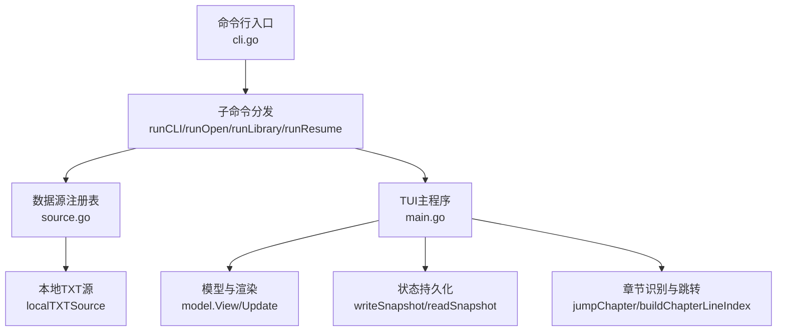
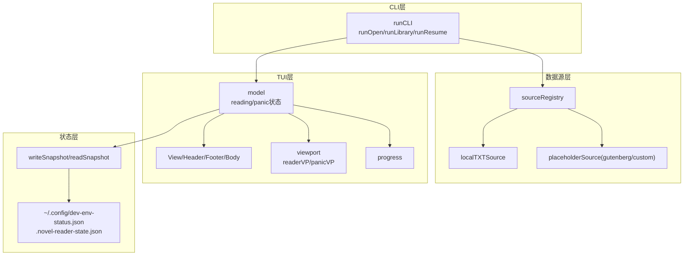
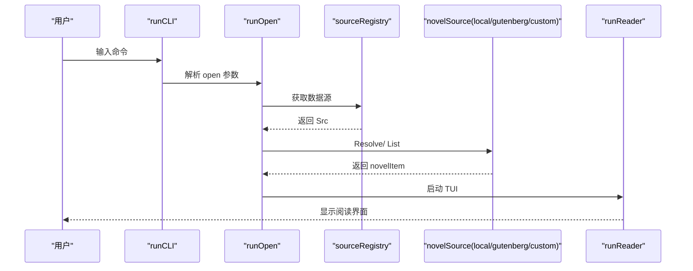
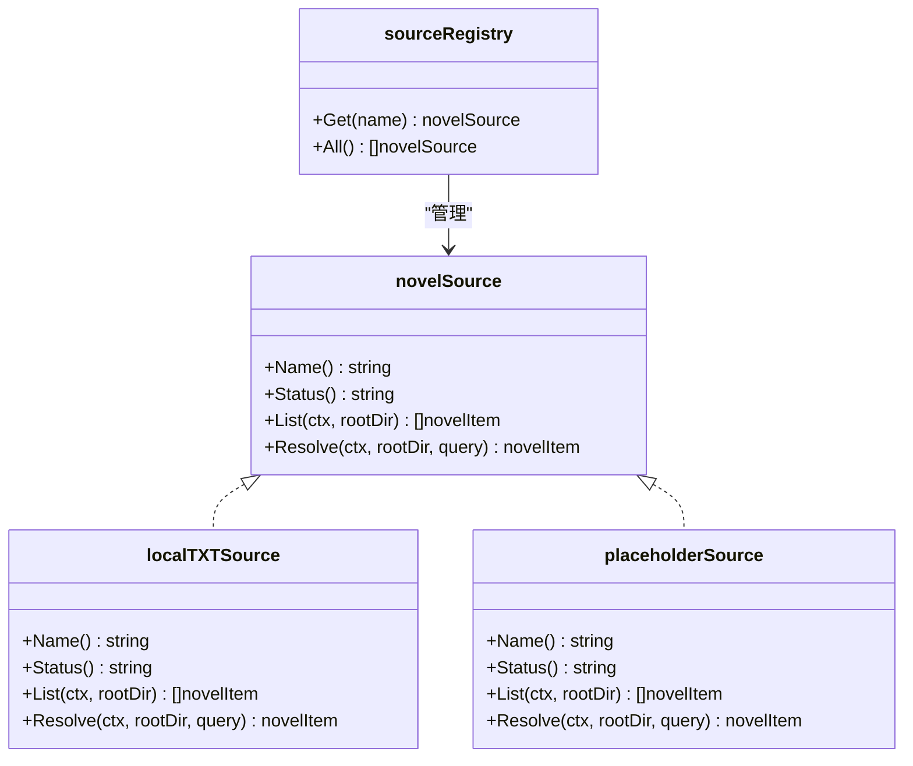
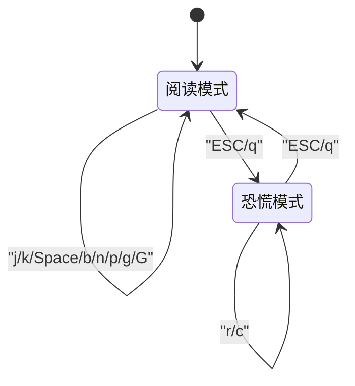
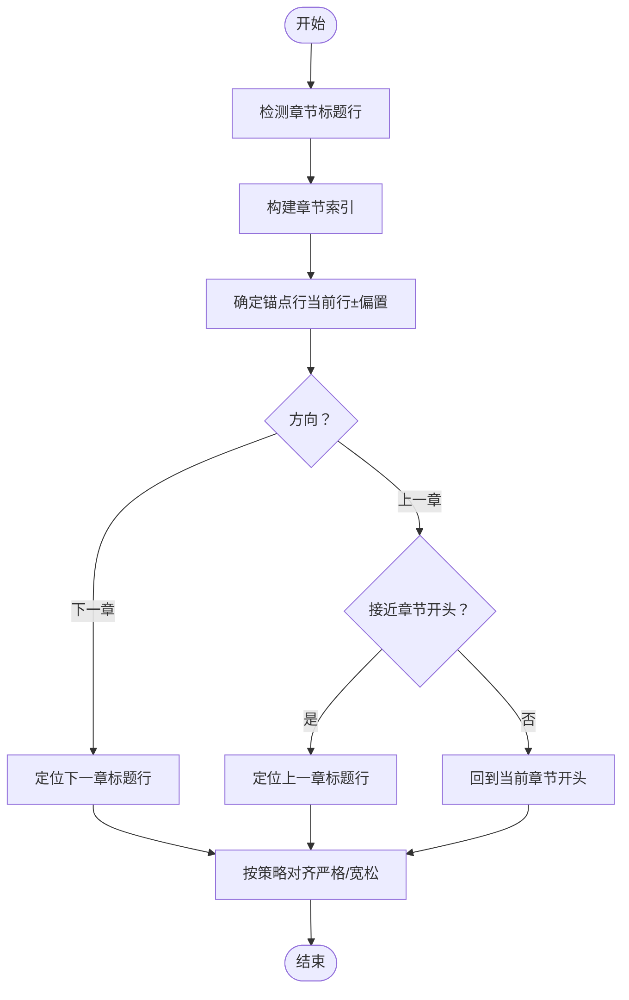
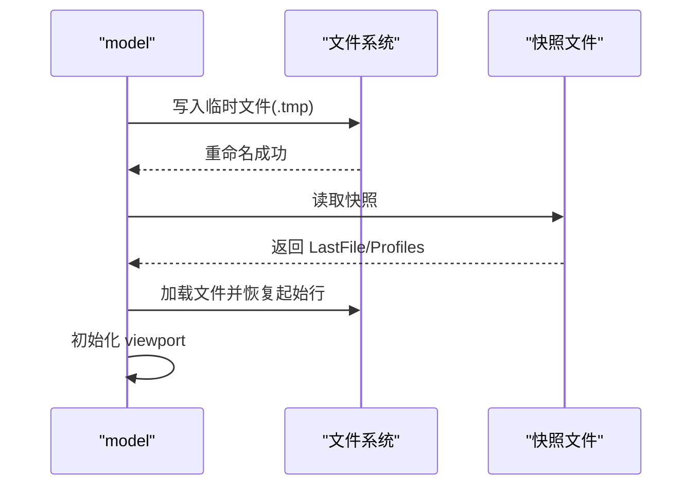
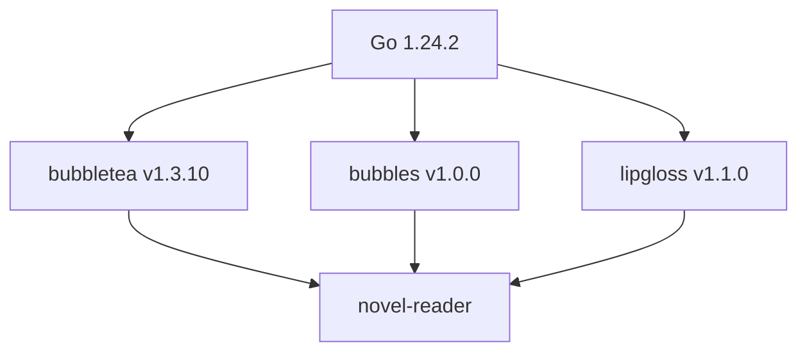

# 项目概述

<cite>
**本文引用的文件**
- [README.md](file://README.md)
- [USAGE.md](file://USAGE.md)
- [main.go](file://main.go)
- [cli.go](file://cli.go)
- [source.go](file://source.go)
- [examples/demo.txt](file://examples/demo.txt)
- [go.mod](file://go.mod)
</cite>

## 目录
1. [简介](#简介)
2. [项目结构](#项目结构)
3. [核心组件](#核心组件)
4. [架构总览](#架构总览)
5. [详细组件分析](#详细组件分析)
6. [依赖关系分析](#依赖关系分析)
7. [性能考量](#性能考量)
8. [故障排查指南](#故障排查指南)
9. [结论](#结论)
10. [附录](#附录)

## 简介
novel-reader 是一个基于 Go 语言与 Bubble Tea 框架的命令行小说阅读器（CLI + TUI）。它的核心设计理念是“低存在感”的隐身阅读体验：阅读界面伪装成开发环境的状态输出，配合 Boss Key（恐慌键）可在任意时刻切换到伪日志模式，从而在需要时隐藏阅读痕迹。项目采用子命令式 CLI，支持本地 TXT 文本源，具备自动恢复、进度保存、章节识别与跳转、以及可扩展的数据源接口。

- 项目定位：MVP 版本，聚焦 CLI 子命令、本地 TXT 源、Boss Key 切换与状态持久化。
- 目标用户：偏好终端、追求“隐身阅读”的读者；需要在办公环境中快速切换阅读与工作状态的用户。
- 使用场景：在终端中阅读本地 TXT 小说，利用 Boss Key 快速隐藏阅读痕迹，结合自动恢复功能无缝续读。

**章节来源**
- [README.md:1-46](file://README.md#L1-L46)
- [USAGE.md:3-10](file://USAGE.md#L3-L10)

## 项目结构
项目采用“入口 + CLI 分发 + TUI 渲染 + 数据源抽象”的分层组织方式，核心文件如下：
- main.go：TUI 应用主程序、模型定义、渲染与事件处理、状态持久化、章节解析与可视偏移计算。
- cli.go：命令行入口与子命令分发，负责解析 open/resume/library/sources 等命令。
- source.go：数据源抽象与注册表，当前实现 local 源，预留 gutenberg/custom。
- examples/demo.txt：演示用的 TXT 小说示例，用于验证章节识别与阅读体验。
- go.mod：模块与依赖声明，使用 Bubble Tea、Bubbles、Lipgloss 等生态组件。

**图表来源**
- [cli.go:13-44](file://cli.go#L13-L44)
- [source.go:128-169](file://source.go#L128-L169)
- [main.go:74-103](file://main.go#L74-L103)

**章节来源**
- [main.go:1-1056](file://main.go#L1-L1056)
- [cli.go:1-173](file://cli.go#L1-L173)
- [source.go:1-169](file://source.go#L1-L169)
- [go.mod:1-34](file://go.mod#L1-L34)

## 核心组件
- CLI 子命令体系
  - open：打开指定 TXT 文件或库内序号，支持 --source 参数（当前仅 local 可用）。
  - resume：从上次保存的快照恢复阅读。
  - library scan：扫描项目目录下的 TXT 文件并缓存结果，便于后续按序号打开。
  - sources：列出可用数据源及其状态（local 活跃，gutenberg/custom 预留）。
  - help：打印帮助信息。
- TUI 模型与渲染
  - 两种状态：阅读模式（reading）与恐慌模式（boss panic）。
  - 阅读模式：使用 viewport 实现行滚动、翻页、章节跳转；底部进度条伪装为“Compiling assets”。
  - 恐慌模式：切换到伪日志视图，支持场景切换（r）与清空（c），再次按 ESC/q 返回阅读。
- 数据源抽象
  - novelSource 接口：Name/Status/List/Resolve。
  - localTXTSource：扫描并解析项目目录下的 .txt 文件，支持相对路径与标题匹配。
  - 预留接口：gutenberg/custom，当前未实现。
- 状态持久化
  - 快照文件：dev-env-status.json（优先写入 ~/.config），回退至项目目录 .novel-reader-state.json。
  - 写入策略：原子写（tmp + rename），避免中断导致损坏。
  - 保存内容：最近文件路径、行偏移与字节偏移、窗口尺寸、主题与恐慌键信息（预留）。

**章节来源**
- [cli.go:13-173](file://cli.go#L13-L173)
- [source.go:15-169](file://source.go#L15-L169)
- [main.go:35-103](file://main.go#L35-L103)
- [main.go:629-711](file://main.go#L629-L711)

## 架构总览
novel-reader 的整体架构围绕“CLI 命令 -> 数据源解析 -> TUI 渲染 -> 状态持久化”的链路展开。CLI 层负责参数解析与命令分发；数据源层负责文件发现与解析；TUI 层负责交互与渲染；状态层负责跨会话的进度恢复。

**图表来源**
- [cli.go:13-173](file://cli.go#L13-L173)
- [source.go:128-169](file://source.go#L128-L169)
- [main.go:74-103](file://main.go#L74-L103)
- [main.go:629-711](file://main.go#L629-L711)

## 详细组件分析

### CLI 子命令与命令分发
- runCLI：根据参数分发到 help/sources/resume/open/library 等命令；若首个参数非子命令且非 flag，则视为兼容模式的 open。
- runOpen：解析 --source 与目标参数，校验数据源状态，支持按序号打开（依赖 library scan 缓存）。
- runLibrary：扫描目录并列出 .txt 文件，保存扫描缓存；支持按序号打开。
- runResume：从快照读取上次文件路径并启动阅读器。
- printHelp：输出 CLI 使用说明。

**图表来源**
- [cli.go:13-173](file://cli.go#L13-L173)
- [source.go:128-169](file://source.go#L128-L169)
- [main.go:1011-1021](file://main.go#L1011-L1021)

**章节来源**
- [cli.go:13-173](file://cli.go#L13-L173)

### 数据源抽象与注册表
- novelSource 接口：统一名称、状态、列举与解析能力。
- localTXTSource：遍历目录，过滤 .txt，生成 ID/标题/路径；支持相对路径与标题匹配；限制仅允许项目根内文件。
- placeholderSource：为 gutenberg/custom 预留占位，当前返回“保留未实现”。

**图表来源**
- [source.go:22-169](file://source.go#L22-L169)

**章节来源**
- [source.go:15-169](file://source.go#L15-L169)

### TUI 模型与渲染（阅读/恐慌双态）
- 状态机：reading 与 boss panic 两种状态，ESC/q 在两者间切换。
- 阅读模式：
  - viewport 渲染正文，支持 j/k 行滚动、Space/b 翻页、n/p 或 ]/[ 章节跳转、g/G 跳转首尾。
  - 进度条伪装为“Compiling assets”，百分比由当前行位置决定。
  - 章节识别：通过正则匹配中英文章节标题，支持章节对齐策略（严格/宽松）。
- 恐慌模式：
  - 伪日志流持续追加，支持场景切换（r）与清空（c）。
  - 再次 ESC/q 返回阅读模式。
- 视图布局：header/footer/body 三段式，边框与样式通过 Lipgloss 统一风格。

**图表来源**
- [main.go:21-26](file://main.go#L21-L26)
- [main.go:211-292](file://main.go#L211-L292)

**章节来源**
- [main.go:21-292](file://main.go#L21-L292)

### 章节识别与跳转算法
- 章节标题识别：中英文正则匹配，支持去除代码伪装前缀（如“//”）。
- 章节索引构建：遍历文本行，记录章节标题所在行号。
- 跳转策略：
  - 下一章：直接跳到下一章节标题行。
  - 上一章：若当前行接近当前章节开头，则跳到上一章；否则先回到当前章节开头。
- 对齐策略（环境变量控制）：
  - strict：跳转后强制校正，确保可见顶部是章节标题。
  - lenient：按章节索引直接跳转。

**图表来源**
- [main.go:523-543](file://main.go#L523-L543)
- [main.go:459-505](file://main.go#L459-L505)

**章节来源**
- [main.go:523-543](file://main.go#L523-L543)
- [main.go:459-505](file://main.go#L459-L505)

### 状态持久化与恢复
- 快照结构：包含 schema 版本、更新时间、最近文件、各文件的快照档案、最后库扫描缓存。
- 写入策略：优先写入 ~/.config/dev-env-status.json；若失败则回退到项目目录 .novel-reader-state.json；使用临时文件写入再重命名，降低中断风险。
- 恢复流程：启动时读取快照，恢复文件路径与起始行；打开文件后立即进入 TUI 并初始化 viewport。

**图表来源**
- [main.go:629-711](file://main.go#L629-L711)
- [main.go:713-740](file://main.go#L713-L740)

**章节来源**
- [main.go:629-711](file://main.go#L629-L711)
- [main.go:713-740](file://main.go#L713-L740)

## 依赖关系分析
- 技术栈与选择理由
  - Bubble Tea：用于构建响应式 TUI，事件驱动、状态机友好，适合 CLI+TUI 应用。
  - Bubbles：提供 viewport、progress 等 UI 组件，简化复杂视图与进度条实现。
  - Lipgloss：轻量级样式工具，提供统一的边框、颜色与排版风格。
  - Go 标准库：os、bufio、encoding/json、regexp、sort、strings、time 等，保证跨平台与简洁性。
- 外部依赖与版本
  - go 1.24.2
  - github.com/charmbracelet/bubbletea v1.3.10
  - github.com/charmbracelet/bubbles v1.0.0
  - github.com/charmbracelet/lipgloss v1.1.0

**图表来源**
- [go.mod:3-9](file://go.mod#L3-L9)

**章节来源**
- [go.mod:1-34](file://go.mod#L1-L34)

## 性能考量
- 文本加载与缓冲
  - 使用带缓冲的 Scanner，设置最大行长度与缓冲上限，兼顾内存占用与大文件读取稳定性。
- 可视行偏移计算
  - 预构建行到可视行偏移表，使用二分查找定位当前可视行对应的源行，提升滚动与跳转效率。
- 章节索引
  - 仅在加载时扫描一次章节标题，后续跳转直接使用索引，避免重复匹配。
- 恐慌模式日志更新
  - 使用随机间隔的 tick 控制日志追加频率，避免过于频繁的 UI 更新。
- 状态保存
  - 保存时机：滚动、窗口变化、状态切换、退出时触发；采用异步命令封装，减少阻塞。

**章节来源**
- [main.go:870-897](file://main.go#L870-L897)
- [main.go:576-585](file://main.go#L576-L585)
- [main.go:614-627](file://main.go#L614-L627)
- [main.go:281-282](file://main.go#L281-L282)

## 故障排查指南
- 启动提示 no resume snapshot found
  - 原因：尚未打开过文件或快照文件不存在。
  - 处理：先打开一个 TXT 文件，再执行 resume。
- open 提示 file is outside project root
  - 原因：当前版本 local 源仅允许读取项目目录内的 txt 文件。
  - 处理：将小说文件放入项目目录或其子目录后再 open。
- open 提示 source xxx is reserved only
  - 原因：指定了预留数据源（如 gutenberg 或 custom），当前版本尚未实现。
  - 处理：使用 --source local 或省略 --source。
- open 提示 no scan cache found
  - 原因：直接使用 open <序号>，但尚未执行 library scan。
  - 处理：先执行 library scan，再按序号打开。
- 中文显示异常或乱码
  - 建议：确认文本文件为 UTF-8 编码，更换支持完整 Unicode 的终端与字体。
- 运行后没有看到边框或颜色
  - 原因：终端主题或配色能力差异。
  - 处理：更换终端主题（如 Dracula/Monokai），确认终端支持 256 色或 True Color。

**章节来源**
- [USAGE.md:191-248](file://USAGE.md#L191-L248)

## 结论
novel-reader 以“隐身阅读 + Boss Key + 自动恢复”为核心价值主张，通过 CLI 子命令与 TUI 交互实现低干扰的阅读体验。其设计强调简洁、可扩展与跨平台兼容：数据源抽象预留了未来接入更多来源的空间；状态持久化采用原子写策略保障可靠性；章节识别与可视偏移计算提升了阅读流畅度。对于初学者，项目提供了清晰的命令与按键说明；对于有经验的开发者，其模块化结构与事件驱动模型便于二次开发与功能扩展。

## 附录

### 功能清单
- 子命令式 CLI：open、resume、library scan、sources、help。
- 本地 TXT 源：默认扫描项目目录及子目录中的 .txt 文件。
- TXT 阅读：j/k 行滚动，Space/b 翻页，n/p 或 ]/[ 章节跳转，g/G 跳转首尾。
- Boss Key：Esc/q 一键切换到伪日志模式，再次 ESC/q 返回阅读；r 切换日志场景，c 清空当前日志。
- 伪装进度条：底部以“Compiling assets xx%”形式展示阅读进度。
- 自动恢复：保存到 ~/.config/dev-env-status.json，下次启动可 resume。
- 数据源接口预留：gutenberg、custom 作为保留扩展点。

**章节来源**
- [README.md:7-14](file://README.md#L7-L14)
- [USAGE.md:133-167](file://USAGE.md#L133-L167)

### 系统要求
- 操作系统：macOS / Linux（Windows 理论可运行，建议在 WSL 或兼容终端中使用）。
- Go 版本：1.24.2 或更高（以 go.mod 为准）。
- 终端：支持 ANSI 的终端（iTerm2、Warp、Terminal、Alacritty 等）。

**章节来源**
- [USAGE.md:11-14](file://USAGE.md#L11-L14)
- [go.mod:3](file://go.mod#L3)

### 使用示例（路径）
- 查看帮助：[USAGE.md:32-36](file://USAGE.md#L32-L36)
- 直接打开指定文本：[USAGE.md:38-48](file://USAGE.md#L38-L48)
- 恢复上次阅读：[USAGE.md:68-72](file://USAGE.md#L68-L72)
- 扫描本地书库：[USAGE.md:77-93](file://USAGE.md#L77-L93)
- 查看数据源列表：[USAGE.md:95-99](file://USAGE.md#L95-L99)
- 兼容启动方式：[USAGE.md:105-114](file://USAGE.md#L105-L114)
- 按序号打开：[USAGE.md:116-127](file://USAGE.md#L116-L127)