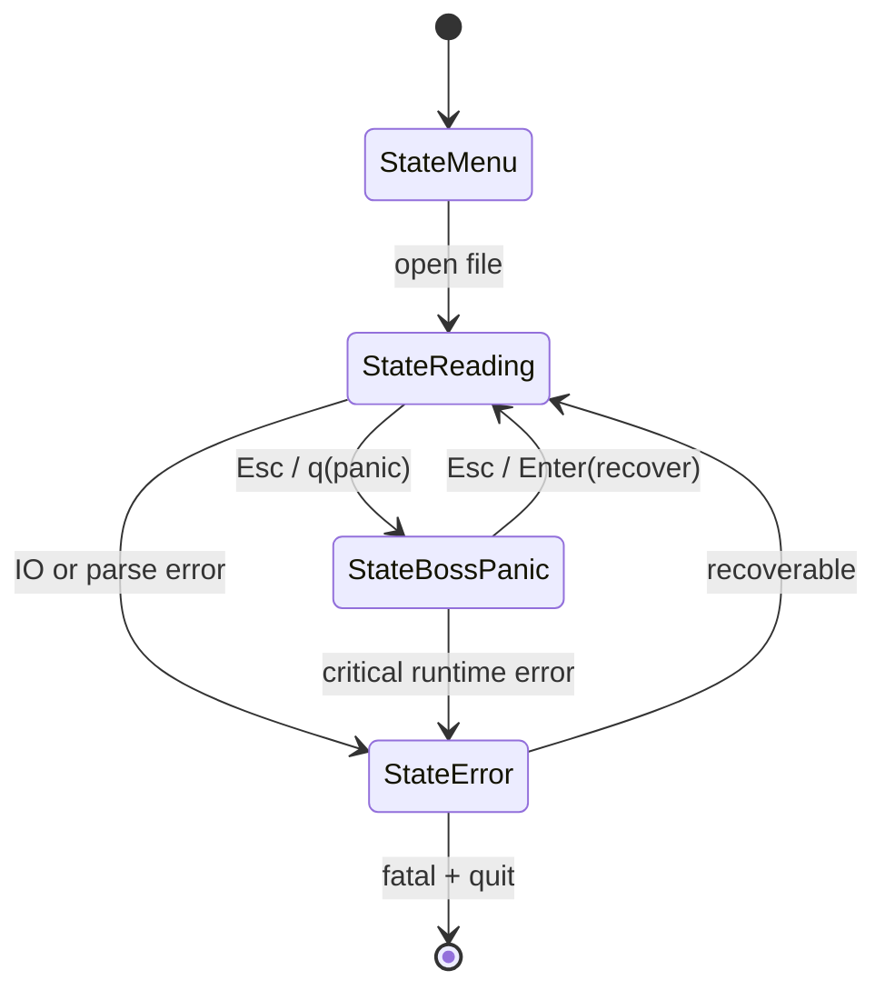
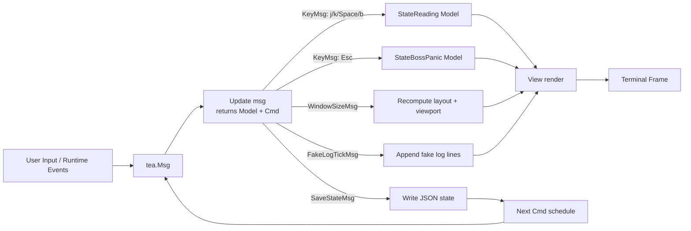

# 软件设计文档（SDD）

## 项目名称
Novel Reader（终端隐身阅读器）

## 文档元信息
- 版本：v1.0（Production-Ready 设计稿）
- 日期：2026-06-10
- 目标读者：Go 开发工程师、TUI 架构师、测试与运维
- 技术基线：Go 1.22+、Bubble Tea、Lip Gloss、Bubbles（viewport/progress）

---

## 1. 执行摘要与系统架构

### 1.1 项目目标
该系统是一个高度伪装的终端小说阅读器，核心目标是：
1. 在开发者终端环境中视觉上“无异常”，看起来像构建日志、测试输出或文档浏览。
2. 支持一键恐慌切换（Boss Key），瞬时切换到“真实感极高”的伪日志流界面。
3. 保证阅读流畅与低延迟，避免大文件或窗口变化导致卡顿。
4. 在本地隐式持久化阅读进度，重启后快速恢复。

### 1.2 启动流程总览
Go 可执行文件启动后进入 Bubble Tea 事件循环，采用 Elm 架构（Model-Update-View）：
1. 解析 CLI 参数与配置（输入文件路径、伪装模式、panic 键位）。
2. 加载本地状态文件（~/.config/dev-env-status.json），恢复最近阅读点。
3. 初始化主 Model（ReaderState、viewport、progress、样式、缓存）。
4. 启动 Bubble Tea Program，进入 Init -> Update/View 循环。
5. 根据状态渲染：阅读态或恐慌态。

### 1.3 架构分层
系统按职责划分为五层：
1. 表现层（View）：Lip Gloss 负责样式与布局拼装。
2. 交互层（Update）：处理键盘、窗口尺寸、定时器、自定义消息。
3. 状态层（Model）：维护阅读状态、伪日志状态、布局尺寸与缓存。
4. 数据层（Reader/Storage）：文件流读取、分页缓存、进度持久化。
5. 基础层（Runtime）：Bubble Tea 程序循环、并发通道、命令调度。

### 1.4 Elm 架构与功能映射
1. Model
承载全量 UI 与业务状态：当前阅读文件、滚动位置、伪日志缓冲、伪进度、窗口尺寸、主题配置、持久化上下文。

2. Update
输入为消息（KeyMsg、WindowSizeMsg、自定义 LogTickMsg、SaveStateMsg），输出为新模型和下一步命令（tea.Cmd）。

3. View
纯函数式渲染：根据当前 ReaderState 切换阅读视图或伪日志视图，保持可预测和可测试。

---

## 2. 组件设计（Elm Model）

### 2.1 核心状态枚举
定义 ReaderState：
1. StateMenu：文件选择/最近历史列表（可选启用）。
2. StateReading：主阅读态。
3. StateBossPanic：恐慌态（伪日志流）。

可扩展状态：
1. StateHelp：快捷键提示。
2. StateError：错误展示（文件不可读、解析失败）。

### 2.2 主 Model 结构（字段设计）
建议 Model 关键字段如下：

1. 全局控制字段
- state：当前 ReaderState
- width, height：终端当前尺寸
- ready：窗口是否完成首次尺寸初始化
- err：最近错误对象（用于 StateError 或底部状态栏）

2. 阅读子模型
- viewport：viewport.Model，负责正文滚动
- filePath：当前文件路径
- fileType：txt/epub（未来可扩展 markdown）
- contentLines：正文行切片（可为分页窗口缓存，不必全量常驻）
- lineOffset：当前顶部行索引
- byteOffset：当前文件字节偏移（恢复精度更高）
- totalLines：已知总行数（未知时可懒加载估算）
- linesPerPage：当前窗口可显示行数
- wrappedWidth：正文换行宽度

3. 伪装进度子模型
- progress：progress.Model
- progressValue：0.0 ~ 1.0
- progressLabel：如 Compiling assets 或 Resolving modules
- progressMode：与阅读进度映射策略（线性、章节权重）

4. 恐慌态子模型
- panicEnabled：当前是否启用伪日志流
- fakeLogProfile：日志模板类型（npm/go test/docker build）
- fakeLogLines：当前伪日志缓冲（环形缓冲）
- fakeLogCursor：当前模板游标
- fakeTickerInterval：日志注入节奏（建议 60ms~180ms 抖动）
- fakeDoneRatio：伪日志完成度，用于显示“收尾成功”或“失败重试”

5. 样式与布局字段
- styles：集中管理的 Lip Gloss 样式集（header/body/footer/border/muted/warn）
- themeName：Dracula/Monokai/Adaptive
- headerHeight/footerHeight：固定区块高度
- bodyWidth/bodyHeight：正文区尺寸

6. 持久化字段
- sessionID：当前会话标识
- dirtySinceLastSave：是否有未落盘状态变更
- lastSavedAt：最近保存时间
- stateFilePath：默认 ~/.config/dev-env-status.json

### 2.3 子模块职责边界
1. ReaderEngine
- 按需读取文件、分页切片、换行预处理、估算总进度。

2. PanicEngine
- 管理伪日志模板、生成节奏、随机扰动与终止条件。

3. StorageEngine
- 读写 JSON 状态文件，处理原子落盘、损坏恢复与版本迁移。

4. StyleEngine
- 根据终端能力（truecolor/256color）降级调色，保证“低存在感”。

---

## 3. Update 循环与消息流（状态机）

### 3.1 消息类型
1. Bubble Tea 内置消息
- tea.KeyMsg
- tea.WindowSizeMsg
- tea.TickMsg（可用于周期任务）

2. 自定义消息
- FakeLogTickMsg：注入一条或多条伪日志
- SaveStateMsg：触发状态落盘
- ReaderChunkLoadedMsg：后台加载大文件片段完成
- PanicProfileSwitchedMsg：切换伪日志模板

### 3.2 键位映射策略（建议默认）
1. 阅读控制
- j / Down：向下滚动一行
- k / Up：向上滚动一行
- Space：下一页
- b：上一页
- g / G：首行 / 末行（可选）

2. 恐慌开关
- Esc：立即进入 StateBossPanic
- q：可配置为同 Esc，或在恐慌态中退出程序（由配置决定）

3. 全局
- Ctrl+C：安全退出并触发最终保存

### 3.3 状态迁移规则
1. StateReading -> StateBossPanic
- 触发：Esc 或配置中的 panic key
- 行为：
  - 立即冻结阅读交互输入。
  - 启动 fake log ticker 命令链。
  - 保留阅读上下文，不丢失 lineOffset/byteOffset。

2. StateBossPanic -> StateReading
- 触发：再次 Esc 或指定恢复键（如 Enter）
- 行为：
  - 停止伪日志注入。
  - 恢复 viewport 到切换前滚动位置。

3. 任意状态 -> StateError
- 触发：IO 错误、解析错误、状态文件写入失败（严重）
- 行为：
  - 显示低干扰错误栏。
  - 保留主循环可恢复能力。

### 3.4 WindowSizeMsg 处理细则
收到 tea.WindowSizeMsg 后：
1. 更新 width/height。
2. 重新计算 header/footer/body 高度。
3. 计算 wrappedWidth（总宽 - 左右边距 - border 开销）。
4. 重新设置 viewport 宽高并触发正文重排。
5. 重算 linesPerPage，并尽量保持“视觉阅读位置不跳变”。

### 3.5 自定义 Cmd 并发策略
1. Fake Log 生成
- 通过 tea.Tick 或 channel 包装命令循环。
- 每次 tick 输出 FakeLogTickMsg，追加 1~3 行伪日志。
- 使用轻量随机抖动，模拟真实构建输出节奏。

2. 状态保存
- 使用防抖策略（如 2 秒内多次滚动只保存一次）。
- 关键事件强制保存：切换文件、退出、恐慌切换前后。

3. 大文件读取
- 后台 goroutine 分块读取，主线程仅接收 ReaderChunkLoadedMsg 更新缓存。

---

## 4. 布局与 Lip Gloss 样式规范

### 4.1 布局分区
界面由三段组成：
1. Header（伪装状态栏）
- 显示类似任务上下文：Task: doc-indexing / Build target: reader-core

2. Body（主体）
- StateReading：正文 viewport
- StateBossPanic：伪日志 viewport（可复用同一 viewport，减少重建）

3. Footer（伪装进度与提示）
- 使用 progress 组件伪装为构建进度，不出现阅读词汇。

布局实现建议：
1. 使用 lipgloss.JoinVertical 将 Header + Body + Footer 拼接。
2. 在 Footer 内使用 lipgloss.JoinHorizontal 拼接进度条、任务标签、短状态码。

### 4.2 视觉伪装策略
1. 文案伪装
- 避免出现 chapter、novel、reading 等明显词。
- 使用 compile、index、scan、verify、resolve 等术语。

2. 对比度控制
- 主文本采用 muted 前景色，避免“文学排版感”。
- 重要状态（错误/完成）仅轻微提亮，不用高饱和警示色。

3. 结构伪装
- 添加细边框或分隔线模拟日志面板。
- 维持固定宽度前缀（时间戳、模块名）增强真实感。

### 4.3 配色建议（示例）
1. Dracula 风格
- 背景：#282A36
- 主文本：#6272A4
- 次文本：#7080B5
- 高亮：#8BE9FD（低频使用）

2. Monokai 风格
- 背景：#272822
- 主文本：#75715E
- 次文本：#8F908A
- 高亮：#A6E22E（仅状态点缀）

3. 自适应策略
- 优先检测终端色彩能力。
- truecolor 可用完整主题；256color 使用近似色映射；低色终端回退灰阶。

### 4.4 Mock UI Boundary（窗口切分规范）
推荐高度分配：
1. Header：1~2 行
2. Body：height - header - footer
3. Footer：2 行（进度条 + 状态信息）

推荐宽度分配：
1. Body 使用 100% 可用宽度，左右留 1~2 字符内边距。
2. Footer 分为 70% 进度区 + 30% 状态区（超窄屏时自动堆叠）。

---

## 5. 数据层与存储规范

### 5.1 状态文件路径
默认：~/.config/dev-env-status.json

设计原则：
1. 隐蔽：文件名与内容看起来像普通开发环境状态。
2. 紧凑：字段精简，避免无用冗余。
3. 可迁移：包含 schema_version。

### 5.2 JSON Schema（建议）
```json
{
  "schema_version": 1,
  "updated_at": "2026-06-10T11:30:45Z",
  "last_file": "/path/to/book.txt",
  "profiles": {
    "/path/to/book.txt": {
      "byte_offset": 183245,
      "line_offset": 5230,
      "total_lines": 12890,
      "window": {
        "width": 142,
        "height": 40
      },
      "theme": "dracula",
      "panic_key": "esc",
      "progress_mode": "linear"
    }
  }
}
```

### 5.3 读写策略与可靠性
1. 读取
- 启动时尝试读取；若文件缺失则使用默认配置。
- JSON 损坏时进入降级恢复并写回新文件。

2. 写入
- 采用临时文件 + rename 原子替换，避免崩溃导致半写入。
- 使用防抖保存，降低磁盘抖动。

3. 并发安全
- 持久化操作经单线程队列或互斥控制，避免并发写覆盖。

### 5.4 大文件读取性能设计
1. TXT 文件
- 使用 bufio.Reader 分块读取，按行切片进入环形缓存。
- 初始只加载首屏附近内容，后台预读下一窗口。

2. EPUB 文件
- 解析容器与章节索引后，按章节惰性解压和转换纯文本。
- 仅保留当前章节与相邻章节缓存，防止内存膨胀。

3. 防帧率抖动策略
- 所有重 IO 在 goroutine 执行。
- Update 中只做轻量状态替换，避免大规模字符串拼接。
- View 阶段复用已计算文本块，减少重复 wrap。

---

## 6. 状态机与消息流图

### 6.1 高层状态图（Mermaid）


### 6.2 Elm 消息流图（Mermaid）


### 6.3 恐慌态日志流水线
```text
Panic Key Pressed
  -> Update switches state to StateBossPanic
  -> Schedules FakeLogTick Cmd
  -> Tick emits FakeLogTickMsg periodically
  -> Update appends realistic log lines to ring buffer
  -> View renders latest N lines as build/test output
  -> Optional completion branch: success/failure narrative
```

---

## 7. 性能、帧率与隐身性保障

### 7.1 性能目标（建议 SLO）
1. 常规滚动输入响应：P95 < 16ms
2. 窗口 resize 恢复稳定：P95 < 80ms
3. 恐慌切换首帧展示：P95 < 50ms
4. 状态保存不阻塞主循环：单次写入不进入渲染关键路径

### 7.2 关键优化点
1. View 最小化重绘
- 仅在状态变化时更新必要字符串片段。

2. 日志缓冲环
- fakeLogLines 使用定长环形缓冲，避免无限增长。

3. 预计算与复用
- 常见前缀（时间戳模板、模块名）缓存复用。

4. 异步 IO
- Reader 和 Storage 均异步执行，通过 Msg 回传结果。

### 7.3 绝对隐身策略
1. 命名隐身
- 可执行名、状态文件名、日志标签均采用开发语义。

2. 行为隐身
- 启动界面不出现欢迎词或品牌信息。
- 退出前不弹显眼确认框。

3. 视觉隐身
- 默认低饱和、低对比。
- 进度条文案固定为工程任务。

---

## 8. 容错与测试设计

### 8.1 容错
1. 文件不存在：降级到 StateMenu 或错误栏提示。
2. 编码异常：尝试 UTF-8 容错解码，失败段落替换为占位。
3. 状态文件损坏：自动备份后重建。
4. ticker 泄漏：离开 StateBossPanic 时必须取消后续 tick 命令。

### 8.2 测试建议
1. 单元测试
- 状态迁移测试（Esc 触发恐慌、恢复键返回）。
- WindowSizeMsg 布局计算测试。
- 进度映射准确性测试（byteOffset -> progressValue）。

2. 集成测试
- 大文件滚动稳定性。
- 恐慌态日志连续性与退出清理。
- 状态持久化跨重启恢复。

3. 视觉回归
- 在常见终端主题下截图比对，验证伪装一致性。

---

## 9. 里程碑与扩展路线

### 9.1 MVP 范围
1. TXT 阅读 + 滚动 + 持久化。
2. ESC 恐慌切换 + 至少 2 套伪日志模板。
3. 伪装进度条与基础主题。

### 9.2 后续增强
1. EPUB 完整支持（目录跳转、章节缓存）。
2. 多配置档案（按工作场景切换伪装风格）。
3. 可插拔日志模板引擎（JSON 驱动模板）。

---

## 10. 结论
本设计以 Bubble Tea 的 Elm 架构为核心，通过严格状态机、异步 IO、低干扰渲染和伪装优先视觉规范，确保系统在“可用性、性能、隐身性”三者之间取得工程级平衡。该方案可直接指导生产实现，并可通过模块化扩展平滑演进至 EPUB、多主题和更强的日志伪装能力。